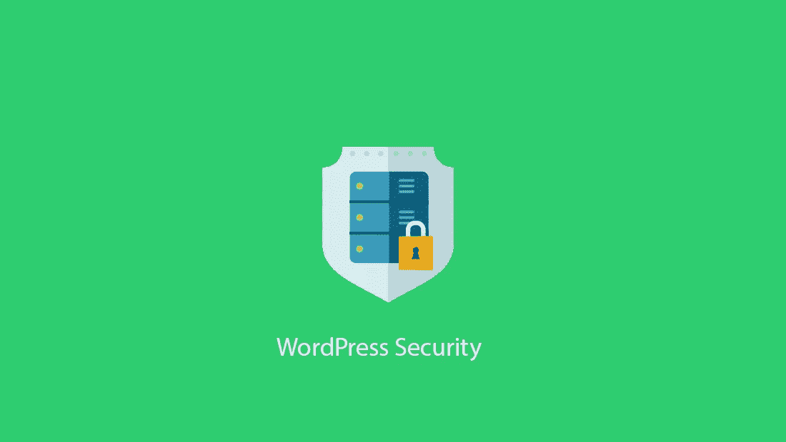
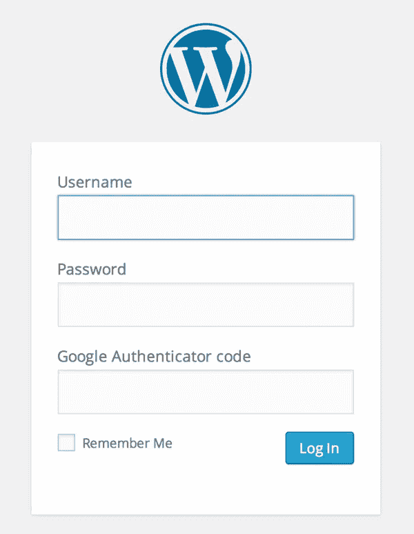
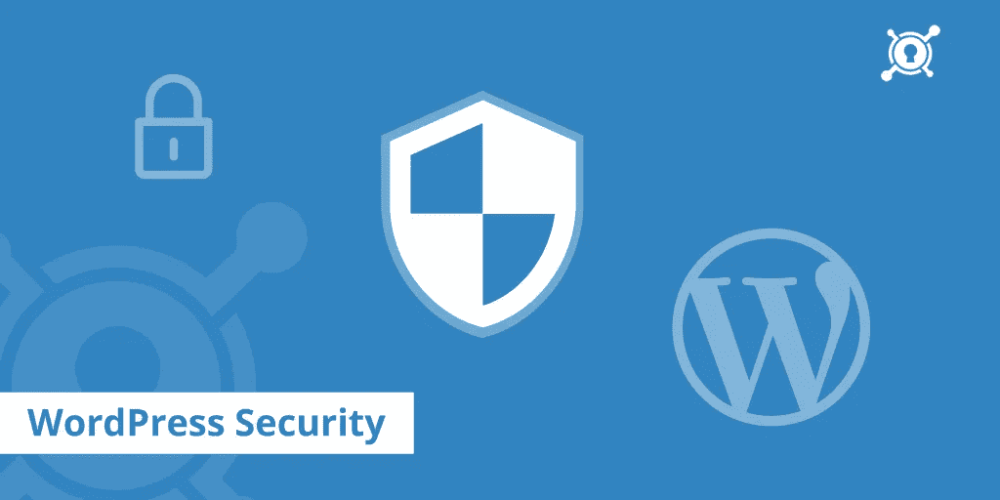
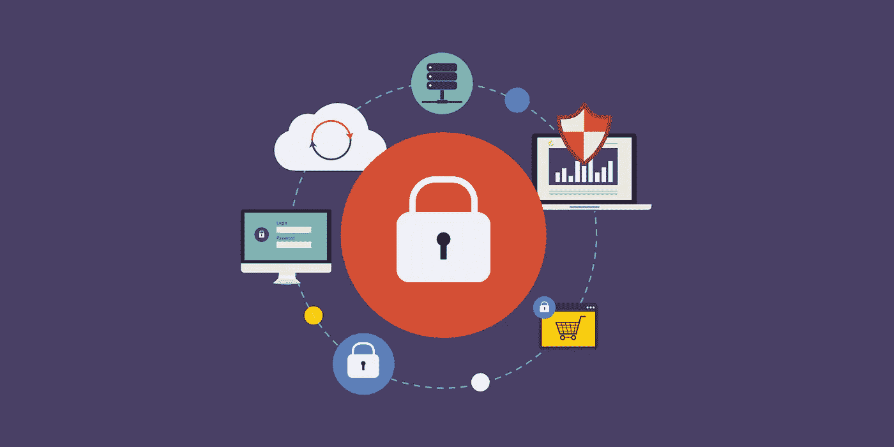

# 创建安全的 WordPress 站点

> 原文：<https://medium.com/visualmodo/make-secure-wordpress-sites-38e05d3b32b?source=collection_archive---------1----------------------->

## 简单的步骤

用简单的步骤创建安全的 WordPress 站点，WordPress 总是受到攻击！是的，你没听错，作为一个博客作者和开发者，保护 WordPress 是你的职责。超过 3%的网站由 WordPress 支持，所以了解如何保护你的网站是非常重要的。

许多网站开发者已经承认 WordPress 存在安全问题，但是这延伸到了哪里呢？你如何加强 WordPress 的安全性？我们将向你展示保护网站安全的 7 个终极步骤。

# WordPress 安全吗？

WordPress 的安全漏洞事件已经在广播了。最近几年，WordPress 的两个主要安全漏洞已经被报道了。然而，WordPress 可能会变得像其他 CMS 一样安全，即 Drupal 或 Magento，这主要是网站所有者、开发者和 WordPress 维护服务提供商的责任。

如果你没有尽到你的责任，那么没有人能保证你的 WordPress 网站的安全。

# 谁在攻击 WordPress 网站？

当你试图阻止 WordPress 黑客攻击时，你需要了解网站黑客的想法。谁对你的网站感兴趣？谁是网站可能的攻击者？一般来说，攻击 WordPress 站点的实体有三种类型。单个 Bot: Bot 是黑客设计的单个程序。它在 WordPress 网站上寻找已知的漏洞。boot 方法是一种简单的攻击，可以攻击少量站点。

僵尸网络:僵尸网络是运行在大量机器上的程序的多个版本，目的是同时攻击大量网站。大多数 WordPress 黑客攻击是由僵尸网络引起的。人类:人类攻击者或人类黑客只对那些有敏感私人数据的网站或有经济利益的网站感兴趣。与机器人不同，人类攻击者非常老练，也非常危险。

# 安全 WordPress 网站

所以这里列出了保护你的[网站的终极步骤。](https://visualmodo.com/)

# 两步认证过程的激活

几乎所有优先考虑安全性的网站都采用两步身份验证流程。

我们已经用了 Henrik Schack 的 WordPress Google 认证器[插件](https://wordpress.org/plugins/google-authenticator/)很长时间了，它真的很好用。你需要在你的 WordPress 网站上安装这个插件，然后在你的智能手机上安装 Google Authenticator 应用程序，它是免费的，你可以从 play store 下载。

那为什么不是 WordPress？在两步验证或双因素身份验证过程中，要求用户输入 OTP 而不是帐户密码。用户可以通过在 WordPress 中注册的个人手机号码接收这个 OTP。这是一个额外的安全层，保护网站免受黑客攻击。有很多免费的 WordPress 双因素认证插件可以在 WordPress 中添加双因素认证。

# WordPress 更新

CMS 专家总是建议定期更新 WordPress。为什么？像任何其他 CMS 一样，WordPress 也在发展和增加新的功能，并修补黑客可能的后门。

因此，如果你不更新 WordPress，你很容易被黑客攻击。此外，WordPress 一年只提供两次更新，更新只需要几分钟。

# 创建强密码

为了保护你的 WordPress 站点，你必须选择强密码。WordPress 中的密码区分大小写，这有利于安全。要更改您的密码，请转到“用户”>“您的个人资料”,在“帐户管理”部分，单击“生成密码”按钮。复制并保存 WordPress 将为您生成的强密码。

要创建区分大小写的强密码，必须包含大写和小写字母(随机)。除此之外，你还需要包括特殊字符和数字。

密码应该至少包含 12 到 14 个字符。您不应该与任何人共享密码，也不应该将密码写在其他人很容易获取的地方。

这个 Gwl#73FLp4@B2J 就是一个理想密码的例子。

# 更改“管理员”用户名

Admin 是 WordPress 账户的默认用户名，这让黑客更容易得手。在保留默认用户名的同时，黑客们有特权不去猜测用户名，而直接获取密码。你可以从 WordPress 设置中手动更改用户名，或者使用插件来更改用户名。阻止黑客是一个简单的步骤(预防措施)。

如果您当前的用户名是“admin ”,请转到“Users”>“Add New ”,使用新的用户名和强密码创建一个新的用户帐户，并赋予这个新用户“Administrator”角色。注销 WordPress 帐户，用新的用户帐户登录，删除旧的“管理员”用户名，或者将其用户角色改为订户。

# WordPress 安全插件

使用安全插件，如[多功能一体](https://br.wordpress.org/plugins/all-in-one-wp-security-and-firewall/) WP security，是保护网站免受黑客攻击的有效措施。通过实施适当的安全插件，您可以轻松跳过几个主要的安全威胁以及恶意软件问题。

如果你对哪个安全插件最适合你的网站感到困惑，我们可以给你推荐一个。Sucuri 是世界上大量 WordPress 用户使用的最好的安全插件之一。

# 限制登录尝试

默认情况下，WordPress 允许无限制的登录。然而，考虑到安全问题，这不是一个好的特性。您可以使用不同的插件来限制尝试登录的次数。像 LockDown 这样的插件被证明是非常好的。此外，如果你还可以使用 Web 应用防火墙(WAF)。

Cerber Security 是一个免费的最新插件，用于限制登录尝试。

# 向 WordPress 登录添加安全问题

如果您使用的是 Jetpack 插件，请转到 JetPack >设置>安全选项卡并启用暴力攻击防护。你也可以激活 WordPress 登录，使你的 WordPress 登录更加安全和简单。增加一个安全问题是一个非常有效的程序。借助某些插件，如 WP 安全问题插件，您可以添加安全问题，这必须在登录网站时回答。

但是，尽量选择一个更私人的问题，这个问题不容易被外人或与你互动有限的人猜到。只有当你能明智地选择一个私人问题时，这一招才有效。

如果你有一个 WordPress 网站，你需要真诚地考虑它的安全问题。WordPress 的许多特性使得它容易受到黑客的攻击。然而，采取一些预防措施并使用适当的插件，可以减少漏洞。试试我们为你列出的[建议](https://visualmodo.com/)。如果你喜欢我们的提示，请继续关注进一步的更新！