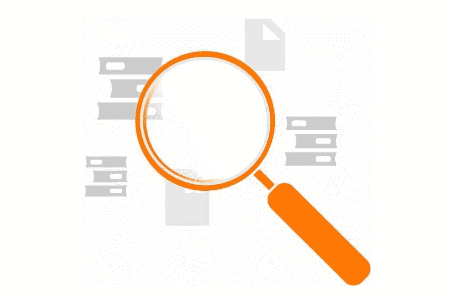

# 理解数据仓库

> 原文：<https://medium.com/visualmodo/making-sense-of-the-data-warehouse-3382d61eb3a2?source=collection_archive---------0----------------------->

数据是企业至关重要的资产。从多种来源的数据中收集的见解可以帮助公司和组织极大地改善他们的决策。数据仓库是帮助实现这一目标的便利工具。在本文中，我们将理解数据仓库。

数据仓库是一个连接到几个数据流的中央存储库，比如事务数据库和关系数据库。它提供了存储和聚合来自一个或多个来源的大量结构化数据所需的技术基础架构，并有助于分析整个企业中的大量数据。

典型数据仓库的工作流程包括三个步骤。首先，提取转换加载(ETL)流程处理数据，根据需要集成来自多个系统和来源的数据，并以正确的格式将这些数据接收到数据仓库中。

接下来，数据被传递到数据集市，数据集市保存特定部门、部门或其他有意义的组织业务单位的数据。

此后，商业智能(BI)工具帮助那些需要它的人访问数据，包括实时仪表盘、定期报告和“切片和切块”多维数据分析。

# 数据仓库的简史

数据仓库的想法是由 IBM 的研究人员 Barry Devlin 和 Paul Murphy 在 1988 年首次提出的。他们的概念是一个非易失的、面向主题的、非易失的、集成的、随时间变化的数据收集工具，可用于支持管理层做出的决策，无论是报告还是执行“假设”模拟。这意味着来自多个来源的带有智能时间戳的数据的结构化集合，可以用作当前和历史信息的稳定、持续的记录。

从那时起，计算机和业务数据需求有了很大的发展。正如德夫林在一篇纪念数据仓库概念诞生 30 周年的文章中所写的，当时，一台典型的个人电脑拥有 20MB 的硬盘，显示器的分辨率仅为 640×480 像素。

今天的数据收集世界也走过了几乎难以想象的漫长道路。我们现在生活在一个大数据的世界中，有更多的数据和前所未有的具有潜在价值的全新数据源。数据仓库必须能够吸收这些(通常是半结构化的)数据，对其进行清理以使其适合用途，将其与其他数据集相结合，然后以真正有用的方式使其可供企业访问。

# 与数据库或数据湖不同

在为组织设置合适的数据存储系统时。重要的是不仅要知道什么是数据仓库，还要知道它不是什么。

它不是一个数据库。数据库是记录数据的工具。同时，数据仓库是一个信息系统，用于存储来自单个或多个来源的历史数据，以便进行快速分析。

它也不是数据湖，这是另一种广泛使用的存储数据的方式。与数据仓库不同，数据湖存储数据没有特定的结构。顾名思义，数据湖是一个巨大的原始数据池。但是这个池子还没有目的。与数据仓库相比，设置数据并将其加载到数据湖中所需的专业知识要少得多。不过，提取见解和进行查询可能会更加困难，因为它还没有准备好特定的目的。

数据湖更有可能是拥有特殊工具的数据科学家。而商业专业人士会发现数据仓库中处理过的数据更容易接受。用户可以利用仅具有主题知识的数据仓库。而不是需要处理未处理数据的专业知识来理解仓库。

# 保护:理解数据仓库

越来越多的公司认识到，在许多情况下，数据是他们最有价值的资产。因此，无论是在内部，尽可能地保护数据都是至关重要的。在云中或混合环境中。

幸运的是，组织可以采取多个步骤来做到这一点。一个至关重要的问题涉及到适当的数据屏蔽和加密，这意味着敏感数据将变得不可读。一个坏演员，如果它不存在了。

然而，同样的，一个人想要保护他们的房子。而不是担心一旦窃贼进入室内如何对付他们。首先，我们的目标是阻止坏人进入。

为了实现这一点，可以考虑使用数据库防火墙。数据库活动监控和用户权限管理工具，以及其他预防措施。在所有情况下，目的都是监视数据仓库。因此，阻止出现的威胁，同时在发生任何可疑情况时生成实时警报。

数据仓库已经改变了许多企业的游戏规则。确保您采用正确的措施来保护它们，以便您可以继续从中受益。