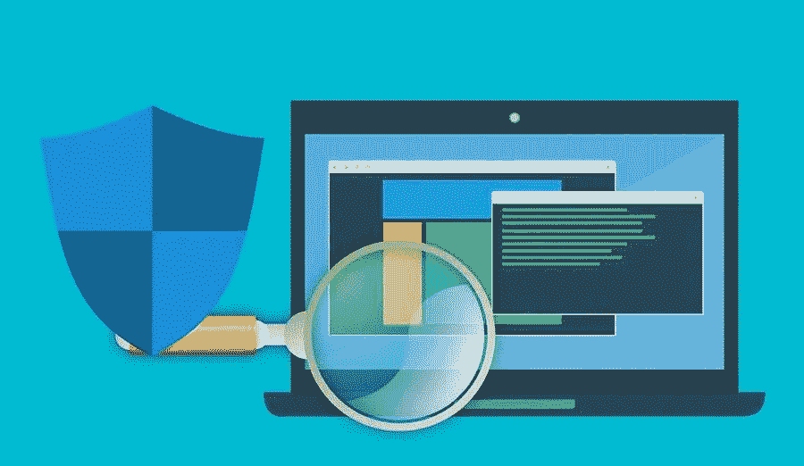

# 恶意主题和插件如何保护你的网站

> 原文：<https://medium.com/visualmodo/malicious-themes-and-plugins-how-to-protect-your-website-d7d5d7129c22?source=collection_archive---------0----------------------->

官方的 WordPress 数据库包含了大量的主题和插件目录。所有出现在 WordPress 官方频道上的主题和插件都由主题和 WordPress 的创建者自己进行了严格的恶意软件和恶意链接测试。可悲的是，第三方渠道和网站上成千上万的 WordPress 主题却并非如此。在这篇文章中，你将学习如何保护你的网站免受恶意主题和插件的攻击。

这种第三方将恶意代码添加到他们的主题和插件中是很普遍的。不是所有的创造者都把你的最佳利益放在心上。

该代码随后用于:

*   未经你的允许从你的网站获取反向链接；
*   获取您的数据，包括用户名和密码；
*   将你的访问者重定向到其他网站和产品；
*   显示广告和广告横幅。

网站所有者需要保护自己和他们的网站，同时做任何必要的事情。为了保护自己免受攻击者、黑客和入侵者的攻击，建议始终使用 VPN。随着黑色星期五即将到来，这是获得 VPN 黑色星期五交易的伟大网络安全工具的最佳时间。

# 保护您的网站

在保护网站的过程中，首先要做的是进行一些检查。最基本的检查包括关注崩溃的数量，来自 Google 和 WordPress 的警告信息，以及死亡的白屏。

如果网站崩溃更频繁，或者如果您从 Google 和 WordPress 收到太多关于您网站行为的警告消息，或者如果经常出现白屏死机，所有这些迹象都强烈表明网站或网站上安装的插件包含严重的恶意软件。

以下是网站所有者可以采取的缓解或减少恶意软件和恶意代码威胁的步骤列表。

# 预防

预防胜于治疗。确保安全的最佳方法之一是在尝试任何安装之前采取预防措施。

为此，第一，留意主题的起源是很重要的。确保你正在下载或安装的 WordPress 主题或插件来自一个可靠的来源，一个可靠的开发者，或者一个可靠的第三方供应商。

# 安装前后

在确保主题或插件的来源是可信的和真实的之后，下一步是以运行安全扫描的形式对下载的包进行检查。

检查病毒最简单的方法是运行简单的病毒扫描。这种简单易行的方法在大多数情况下对病毒有效。然而，它无法检查导致链接重定向和窃取备份的恶意代码。因此，任何与源代码本身相关的东西都不能用常规的反病毒软件来检查或过滤。这就是在线工具的用武之地。

# 在线工具:恶意主题和插件防护

网站所有者可以用来检查主题和插件完整性的在线工具包括:

*   病毒总数
*   主题真实性检查器
*   PCRisk
*   去问苏库里
*   漏洞扫描程序
*   强力防火墙
*   谷歌安全浏览

上面还包含了可以检查已安装主题和插件上的恶意软件和恶意代码的工具。每种工具都遵循不同的步骤。最好访问他们各自的网站，以确保遵循准确的步骤。这些工具对网站所有者非常有益。

随着黑色星期五即将到来，现在是在所有这些工具上获得最佳交易的最佳时机，包括 VPN 黑色星期五交易。此外，这是保护您的宝贵信息的好方法。

对于经验丰富的开发人员和技术专家来说，最好的选择是检查服务器上的文件(如果是手动安装的话)或者检查系统文件(如果是下载的话)。因此，经验丰富的开发人员可以快速浏览所有的源文件。

如果专家知道他们在寻找什么，恶意代码通常很容易被发现。这是一个手动的过程，如果插件的主题非常大或者非常复杂。此外，执行检查可能会花费很多时间。在这种情况下，最好使用在线工具。

# 恶意主题和插件防护结论

避免恶意软件和恶意代码的最好方法是在安装之前确保 WordPress 主题或插件的完整性。如果指定的错误在安装后的某个时间开始出现，那么利用在线工具来检查和减轻它们是下一个最佳选择。每个工具遵循不同的程序和方法来移除恶意软件。因此，最好访问所选工具的官方网站以获得详细说明。