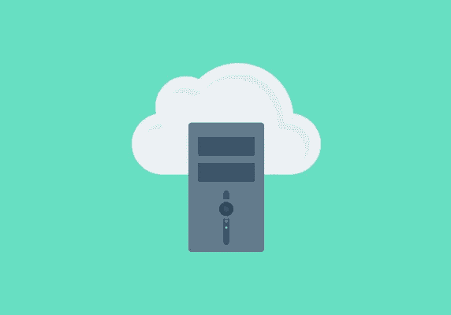

# 托管 WordPress 主机

> 原文：<https://medium.com/visualmodo/managed-wordpress-hosting-6a9251a0e9d4?source=collection_archive---------1----------------------->

经营一个 WordPress 博客或网站不是一件容易的事情。你必须负责所有的内容、营销、网站设计、社交媒体等等。但在此之前，你必须确保你的 WordPress 网站运行顺畅，并且你当前的托管服务提供商没有给你带来任何麻烦或问题。

如果你是一个新的主机，制定出你需要的服务似乎是一项艰巨的任务，有很多因素要考虑。但它不必势不可挡。和任何决定一样，有些东西是你绝对必须拥有的，一旦你找到了几个符合要求的选项，你就可以进入细节来缩小你的清单。比方说，你正在选择一家餐馆，首先要考虑的是你想要的食物种类、位置和价格。一旦你找到了几个适合你的需求和预算的地方，你就可以进入喜欢的评论，气氛和菜单选项。

选择主人和选择餐馆并没有什么不同:会有一些阻碍因素会缩小你的清单，然后细节会帮助你找到最适合你的[需求](https://visualmodo.com/blog/)的选择。

在这篇文章中，我们将看看四种不同的主机选项——共享主机、VPS(虚拟私人服务器)、专用主机和托管 WordPress 主机。我们将介绍它们是什么，为什么它们彼此不同，它们的成本是多少，利弊，何时选择每一种，以及—也许是最重要的—何时不选择！

# 共享主机

**比喻:**共享主机是主机业务的麦当劳。这种产品并不难吃(我们时不时都会吃一个汉堡)，但它并不适合每种情况——相反，它是一种低成本的快速解决方案，没有任何花哨的功能。

共享主机是建立在小网站需要很少资源的前提下的。一个共享服务器包含成百上千的用户，每个用户都有许多不同的网站。结果是一个廉价的产品，功能不是很强大，而且经常带来各种各样的过度拥挤的问题。

# 费用

根据我们选出的最能代表这种托管类型的八家知名托管公司(如下所列)，共享托管计划的平均成本约为每月 9.50 美元，这还不包括这些公司可能提供的任何初步优惠(稍后将详细介绍)。

[一个小橘子](https://asmallorange.com/hosting/shared/)提供最便宜的正价方案，每月 2.92 美元。对于一个更强大的解决方案， [MediaTemple](https://mediatemple.net/webhosting/shared/) 提供 100 个站点和 20GB 的存储空间，每月 20 美元。

最终，每月 10 美元应该可以买到一个高质量的共享主机服务。

# 好人

与任何其他类型相比，共享主机的最大优势在于它便宜。它没有太多的优势，但价格本身就足以证明在许多情况下使用共享主机是合理的。

# 坏事

所有关于共享主机的问题都源于这样一个事实，那就是你正在与成百上千的其他用户和成千上万的其他网站共享同一个环境。这可能导致四个主要问题:

*   你自己的网站以外的网站可能会使用服务器上不成比例的资源，留给你的网站的资源更少，从而导致它们变慢或停止。
*   一个账户的安全问题可能会影响到你的账户。你可以用你能支配的所有花哨的技术来保护你的网站，但是服务器层面的问题可能仍然会影响你。
*   正常运行时间和可靠性可能是共享环境中的一个主要问题。由于其他网站可能会占用资源或引发安全问题，因此不仅您面临风险，而且您根本无法判断问题何时会发生。
*   共享一个环境意味着没有人能够真正控制他们服务器的细节，这导致了一刀切的设置。这对于小网站来说很好，但是随着你的成长，你将需要更多的活力。

还有其他问题，但大多数都源于其中一个——所有这些都与共享环境有关。

# 开始

警惕共享主机定价。许多主机会提供初始折扣，直到您第一次续订。例如，Bluehost 提供 2.95 美元的新计划，而不是 7.99 美元的标价。

但是，如果你支付一个月的费用，你只能得到这个月的折扣价。你**可以**提前三年付款，但之后你需要预付 106 美元。

# 选择共享主机

如果你的**预算**没有达到 VPS 或托管的水平(见下文)，那么共享托管是唯一的选择。这种主机类型有更多的停机时间和不可靠性，但这并不意味着你的网站会每周连续几天离线。

我曾经在 Bluehost 上托管我的网站，虽然性能并不出色，但我的网站 99%的时间都在运行，这足以让我的业务起步。

停机时间**会**经常让你损失大量业务。如果你的预算不多，不要等到你买得起 VPS，现在就申请一个共享账户，等你买得起的时候再换。

如果你有低流量，相对不重要的网站，共享主机是一个很好的和廉价的方式来保持他们在线。个人博客、客户测试站点、存档项目和正在测试的项目都非常适合共享环境。

共享主机也非常适合不需要很多性能的后起之秀。当你开始创业时，很有可能在第一个月没有人会看到你的网站，在接下来的几个月里，你会慢慢增加流量。你可以从共享主机开始以节省一些钱，当更多的人开始访问你的网站时再切换。

如果你是网络世界的新手，并且你的网站不是关键的，我建议你选择你能找到的最便宜的计划，仅仅是为了学习一些新的东西。当你需要在 100 美元和 150 美元的 VPS 计划之间做出决定时，这是很好的经验和研究。

# 共享主机

就可靠性、资源和安全性而言，共享主机并不是很好。如果你有一个任务关键型网站，并且你能负担得起更高层次的主机，你应该避免共享主机。

知道什么时候不选择共享主机很简单:如果“什么时候选择共享主机”一节中的所有要点都不适合你，你应该远离它。

如果你运营一个电子商务网站，我建议从一开始就使用非共享环境。如果有人无法查看您的博客，您就失去了一位访问者。如果有人买不到你的产品，你可能会失去一笔生意。

# 谅解

作为一个游戏双方都经历过的人(作为一个主机用户和主机的管理职位)，我最好的建议是知道你在支付什么。

如果你每月只花 5-10 美元在主机上，不要期待奇迹。所有众所周知的共享主机(我们将在下面讨论)都是好公司。他们不是来抓你的。他们不会有目的地从你的网站上获取资源。

他们是出售廉价产品的诚实企业。该产品本身就有缺陷，但它为成千上万的客户提供了一个体面的网络展示的机会。

用数字来说，Bluehost 的正常运行时间约为 99.4%。如果与更高层的主机相比，这并不太好，但这实际上意味着每 100 天中，您将经历 14.4 小时的停机时间。也就是说，每天有 8.64 分钟的停机时间，这远远不是一场悲剧。

# VPS 托管

**类比:**在我们以餐厅为主题的类比中，VPS 托管是芝士蛋糕工厂。它当然不符合米其林星级标准，但却是一家优秀的餐厅，而且，无论你的口味如何，你都会在菜单上找到你喜欢的东西。你可能会满意地离开——即使你不会用它来招待你最有声望的客户。

# 螺母和螺栓

VPS(有时也称为云托管)类似于共享托管，但使用更强大的技术来分隔同一台机器上的用户。与共享服务器相比，共享服务器可能有数千个邻居，VPS 系统通常有 5 到 20 个。

较低的数字已经表明来自坏邻居效应的风险较小，但最重要的是如何将这些用户分开。VPS 系统采用管理程序来为每个用户监控完整的虚拟系统。

简单地说，这意味着一个用户不能霸占另一个用户的资源。例如，一台有 16GB 内存和八个用户的机器将为每个用户分配 2GB 内存。因此，如果这些用户中的一个超过了 2GB 的分配，他们的网站可能会崩溃，但同一台机器上的其他网站不会受到影响。

# 成本

VPS 主机的价格差异很大。我们已经查看了九家公司(如下所列)最便宜的套餐，总体平均价格约为每月 25 美元(其中包括几个非常便宜的每月 5 美元的套餐，我们实际上不推荐)。

一个体面的低层副总裁应该在 20 美元至 30 美元左右。50 美元到 100 美元可以轻松运行大多数网站，但是，如果你需要额外的能量，有 VPS 计划达到数千。

# 你花钱买的东西

使用 VPS 系统，您主要为三件事付费:

*   提供隔离、可扩展性和保护的 VPS 技术。
*   内存、硬盘使用率和带宽等资源。
*   “额外费用”是因为 VPS 服务器只能容纳几个用户，而不是几百个——这使得它在财务上更难维持。

第二项是最重要的，因为您需要了解站点的资源使用情况。如果你有一个产生 4TB 带宽的网站，你将无法使用 DigitalOcean 的 5 美元计划，因为它只包含 1TB 的带宽。

# 好人

虚拟主机的所有积极方面都与虚拟主机有关。这允许更好的分离、缩放和安全性。让我们来看看一些好的方面。

*   虚拟实例受到单独的资源限制，消除了不确定性并允许更好的规划。
*   通过虚拟机管理程序感染多个虚拟实例的恶意代码并非闻所未闻，但极其罕见。您可以放心，其他帐户的安全问题不会影响您自己的帐户。
*   由于资源是分配的而不是集中的，VPS 系统很容易扩展，非常适合动态增长的网站。
*   虚拟实例是一个自包含的软件层，包括操作系统和您需要的所有其他部分。从灵活性的角度来看，这大致相当于拥有自己的专用服务器，从而可以更好地控制您的环境。

# 坏事

VPS 系统没有真正的缺点。任何不利之处都必须根据你网站的目标来衡量。我们将讨论其中的一些问题，但是请记住，这些问题会随着项目的不同而变化。

*   如果你有一个**高度**专业化的网站，你可能想控制硬件水平，专用托管可能更合你的胃口。VPS 系统是灵活的，但不是无限灵活的。
*   如果你只是需要一个快捷的地方来隐藏一个网站，VPS 系统可能有点昂贵和不必要
*   如果你有一个 WordPress 网站，你应该把托管 WordPress 主机作为一种选择。VPS 更灵活，但是，由于托管 WordPress 主机的高度调谐特性，它通常在速度和安全性上胜过 VPS。

# 何时选择 VPS 托管

决定 VPS 是否适合你不应该太难，因为你可以通过排除来达到它。这里有几个问题要问你自己:

我的项目是次要的，是测试还是预算紧张？换句话说，它是否有任何属性使其符合共享帐户的条件？如果答案是否定的，下一个要排除的是专用主机。

我的项目是否需要一个非常精细的环境，让我**必须**做所有的系统管理员工作，比如确保操作系统是最新的，安装我可能需要的任何包？此外，我是否具备独自管理服务器的必要知识？

如果答案是否定的，那么我们已经排除了专用主机。如果你的答案是肯定的，我建议你三思。除非你非常精通服务器管理，否则你最终会创建一个**调优很差的**环境——一个预设的 VPS 会好得多。

现在我们只剩下托管 WordPress 主机了。首先:你的网站是基于 WordPress 吗？如果不是，那么 VPS 就是你的选择。如果是，看看下面托管 WordPress 主机的利弊，自己决定。

我的立场是:如果我有一个 WordPress 网站，我几乎总是会选择托管 WordPress 主机——尤其是如果我打算从中赚钱的话。否则，为了省钱，我可能会把一些 WP 网站放在 VPS 上。

# VPS 托管服务

在任何情况下，我都不会建议你远离 VPS 主机——VPS 系统伸缩性很好，所以，即使你的网站收到了数百万次浏览，你也能找到一个合适的计划。除了高流量网站(比如《纽约时报》等)或有特殊需求的企业(比如大型银行等)，VPS 计划是一个不错的选择。

对于副总裁来说，问题不是:“我应该远离吗？”而是:‘有没有别的东西会更好？’总而言之，使用 VPS 不会错太多——当你有疑问时，它通常是一个很好的退路:前提是你知道你在用它做什么。

# VPS 主机

几乎所有的托管公司都提供 VPS 计划，但是当涉及到 VPS 服务器时，服务质量会有很大的差异。以下是业内知名的八家公司，它们可以提供可接受的服务，值得信赖:

# 专用主机

**打个比方:**专注的招待就是放弃选择餐馆，转而在家做饭。自己把厨房建好之后。要做到这一点，需要高水平的专业知识，但是您可以根据自己的需要定制您的环境和产品。

# 螺母和螺栓

当购买专用主机时，您购买的是一件硬件和一个存放该硬件的地方，包括最少的维护。一旦硬件就位，你就需要处理好从安装和操作到设置你的 web 服务器软件(Nginx，Apache，以及所有需要的东西)的一切。

托管公司将为您更换损坏的组件(这种情况应该很少发生)，但您需要自己远程维护其他所有组件。

# 价格

我们对比了五家知名托管公司最便宜的方案(如下)，平均约为 125 美元。最便宜的选择是 [Hetzner 的](https://www.hetzner.de)52 美元，你可以想象，它不会给你太多资源。

我们推荐的最低价格在 130 美元左右，中级解决方案的价格在 500 美元左右，高端设备的价格则高达数千美元。

# 好人

专用服务器有两个巨大的好处:你是你购买的机器的唯一用户，你通常会得到更多的带宽。

通过成为服务器上的唯一帐户，您可以完全消除坏邻居的影响。事实上，您可以放弃一些类似软件的复杂供应器和管理程序(它们监督一台机器上的多个 VPS 系统)。

您可以根据自己的喜好微调整个环境，从硬件到服务器，并根据您的具体需求定制恶意软件扫描和其他保护措施。

如果您需要定制的监控工具或高度专业化的部署流程，专用托管尤其有用，您可以完全根据需要进行设置。

# 坏事

专用服务器最大的缺点是你需要自己做所有的事情。你要么需要相当多的专业知识，要么需要一个值得信赖的系统管理员(他们可以完全访问一切)，这将增加你的成本。

其他托管类型会为您处理许多管理任务——例如确保所有内容都是最新的，应用安全补丁，让您可以从用户界面切换 PHP 版本，定期扫描等等。

在大多数情况下，通过您的专用服务器，您将接收不到这些服务中的任何一项**。有一些专门的管理解决方案，但你需要拿出一些现金。**

另一个缺点是，如果发生硬件故障，解决问题可能需要更长的时间。VPS 系统甚至可能不会注意到损坏的 RAM——系统可以分散负载。对于专用服务器，必须有人进去物理替换计算机中的模块。

# 何时选择专用主机

很多人不需要专用主机。大多数项目——甚至是大型项目——在一个好的 VPS 解决方案上都能顺利进行。

然而，如果你有一个巨大的网站，并且它有需要全职系统管理员才能的特定需求，是时候考虑专用主机了。

它对于那些前端和后端使用不同服务器，甚至媒体使用不同服务器的大型站点也很有用，因为它允许您创建独立运行的冗余系统。

# 何时远离专用主机

如果你没有从头开始建立一个托管环境的知识，或者你没有钱雇佣一个好的管理员，你应该避开专用托管。

一个 90%适合你的站点的环境仍然比一个用胶带粘在一起的半生不熟的解决方案好得多。

许多网站所有者想要像负载平衡或专用主机这样的花哨东西，因为这是顶级技术，他们觉得他们的网站应该得到最好的，但这是有缺陷的想法。

大多数网站所有者不知道什么是“大”当谈到托管。一个一年赚 100 万美元，一个月有 1000 万人浏览的网站，就其所需的资源而言，并不一定很大。如果编码有效，它可以轻松可靠地运行在每月 250 美元的 VPS 上。

# 托管 WordPress 主机

**打个比方:**托管 WordPress 主机将是婚礼上的餐饮服务。与餐馆服务不同，它为你量身定制体验，但也有一些限制。

# 螺母和螺栓

托管 WordPress 主机是一种特殊类型的主机，提供一系列与 WordPress 相关的服务。服务器可以是共享的或 VPS 的，但这并不重要，因为主机应该非常擅长维护服务。

由于提供商只需要支持一个应用程序——WordPress——他们的工作就容易多了。他们可以设置从硬件到软件的整个环境，以提高速度，消除安全问题，并为您提供强大而有用的功能。

# 价格

提供高质量托管 WordPress 主机服务的四大真正专业的公司中，最便宜的计划是飞轮*——15 美元——每月仅提供 5000 次访问的能力——这意味着它只真正适合非常小的网站。

由专家管理的 WordPress 主机(适合大多数网站)的最低可用等级大约为 29 美元。如果你对你的 WordPress 托管需求很认真，并且一个网站每月有大约 100，000 或更多的访问者，你需要每月支付大约 100 美元(注意:如果网站需要大量的服务器资源，管理的 [WordPress](https://visualmodo.com/wordpress-membership/) 托管可以很容易地达到每月 1000 美元——想想每月有数百万访问者的网站)。

# 好人

托管 WordPress 主机有很多让人喜欢的地方。大部分的好处来自于只需要支持 WordPress，允许专业主机真正微调他们的系统，并花时间开发方便的管理功能。结果应该是一个运行速度明显更快、使用资源更少的网站。

主机通常要求 WordPress 的最新版本，这意味着你将永远是最新的，并且更安全。他们还可能禁止某些已知会导致问题或包含安全漏洞的插件。

托管 WordPress 主机如何提升你的网站的一个很好的例子是缓存。一些主机在服务器级别上有自己的微调缓存系统，每次都会胜过 W3 Total Cache 等插件。事实上，你甚至经常被禁止使用这种常规的缓存插件，因为它们经常会与主机自己更高效的内部系统相冲突。

托管 WP 主机通常比一般的 VPS 或共享主机对 WordPress 相关问题有更好的支持——这并不奇怪。他们专门处理 WordPress——当你与他们的技术人员交谈时，这一点会立即显现出来。

# 坏事

最大的缺点是失去了灵活性，而且与 VPS 服务器相比价格更高。使你的站点更安全的特性(强制 WordPress 版本，禁止插件，等等)有时也会对一些站点有所限制。

此外，有了专业的 WordPress 托管服务，你真的只能使用 WordPress。你不能快速地添加 Joomla 或 Drupal 站点来看看它是如何工作的，或者创建一个纯 HTML 的站点(尽管有些主机可能在技术上允许这样做)。

# 选择托管 WordPress 主机

托管 WP 主机几乎总是 WordPress 网站的最佳解决方案。以下是在决定是否使用它时要考虑的一些事情。

首先，它是一个重要的站点吗？如果不是，就没有理由把所有的钱都花在托管上。如果只是一个个人博客，那么在 VPS 上加载 2.8 秒和在托管 WP 上加载 1.9 秒没有太大区别。

你可以在一个账户上安装的网站数量通常是一个瓶颈——事实上通常只有一个网站——所以要小心，只有当一个网站真正有保证的时候才使用这种类型的主机。

除此之外，如果你有一个大的和/或重要的网站，并且需要确保它尽可能平稳可靠地运行，那就使用托管 WordPress 主机(只要你能忍受它强加的小限制)。

# 避免托管 WordPress 主机

还是那句话，没什么好躲的。对于 WordPress 网站来说，托管 WordPress 主机几乎总是更好的选择——尽管如果你没有钱，或者你需要把一堆网站藏在一个地方，那么常规的 VPS 主机可能会为你提供更好的服务。

# 最后的话

就像没有能让所有人都满意的餐厅一样，也没有适合所有人的神奇解决方案——你需要的托管类型在很大程度上取决于你的目标和你个人项目的要求。

权衡项目的重要性，预计的资源使用，你的财政有多紧张，通读每种类型托管的利弊，做出明智的决定。

同样值得记住的是，转换主机相对容易——许多顶级 WordPress 主机实际上提供免费迁移——所以你总是可以尝试一个。