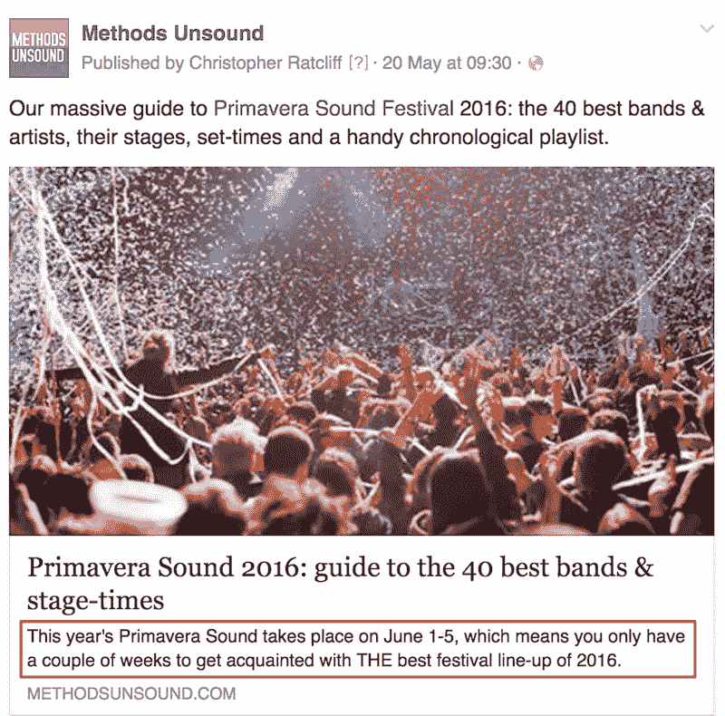

# Meta 描述:如何写才能更好的 SEO？

> 原文：<https://medium.com/visualmodo/meta-description-how-to-write-it-for-better-seo-75a7dde75901?source=collection_archive---------1----------------------->

什么是元描述？怎么写一个？为什么元描述很重要？他们真的能帮助搜索引擎优化****？有哪些好的和不好的例子？****

**继我们非常受欢迎的指南 [22 优化你的网站的 SEO 要点](https://searchenginewatch.com/2016/01/21/seo-basics-22-essentials-you-need-for-optimizing-your-site/)之后，我想我应该遵循关于元标签的建议并回答以上所有问题。**

****如果你只是想要一个优化元描述的快速指南，** [**点击这里跳转到清单部分**](https://searchenginewatch.com/2016/05/26/how-to-write-meta-descriptions-for-seo-with-good-and-bad-examples/#checklist) **。****

**对于其他人来说，首先让我们谈谈元标记的一般情况:**

# **什么是元标签**

**正如 Kristine Schachinger 在 2012 年我们之前的[元标签指南](https://searchenginewatch.com/sew/how-to/2154469/write-title-tags-search-engine-optimization)中所描述的，元标签是 HTML 元素，为搜索引擎和网站访问者提供关于网页的信息。**

**有两个元素必须作为标签放在 HTML 文档的部分。这些要素是:**

*   **标题标签**
*   **元描述**

**我们已经在上周的另一篇文章中讨论了[标题标签](https://searchenginewatch.com/2016/05/16/how-to-write-meta-title-tags-for-seo-with-good-and-bad-examples/)，现在你已经掌握了这个技巧，让我们直接进入元描述。**

# **什么是元描述？**

**元描述是放在网页的 HTML 中描述其内容的一小段文本。元描述将出现在搜索结果中你的页面的 URL 下。这也称为片段。**

****

**当人们在其他网站和社交渠道上分享你的文章时，元描述也会经常出现。**

****

# **我在哪里添加元描述？**

**您可以在站点 HTML 的部分添加元描述。它应该是这样的:**

****<头>**
**<meta name = " description " content = "这里是对我牛逼网页的精确描述。">**
**</头>****

**你应该在你的 CMS 中完全控制你的元描述，特别是当你使用 WordPress 的时候。**

**如果您使用 SEO 插件，如 Yoast，您可以在“meta description”部分添加一个元描述，并且可以预览它在搜索引擎结果页面(SERPs)中的外观示例:**

****

# **为什么元描述很重要？**

**元描述可以影响搜索者的决定，他们是否想从搜索结果中点击你的内容。描述越详细，越吸引人，越相关，就越有可能有人点击进入。**

# **元描述被用作排名信号吗？**

**谷歌已经声明元描述不是排名信号。但是，同样，描述的质量会影响点击率，所以明智地使用这个元素非常重要。**

# **如何写一个伟大的元描述**

# **元描述清单**

*   **关键词:确保你对网页最重要的关键词出现在元描述中。通常搜索引擎会用**粗体**突出显示它在你的片段中找到搜索者的查询。**
*   ****写清晰易读的文案:**这是必不可少的。关键字填充你的元描述是不好的，它不会帮助搜索者，因为他们会认为你的结果会导致一个垃圾网站。确保你的描述读起来像一个正常的，人类写的句子。**
*   **把元描述当成你网页的广告来对待:让它尽可能地引人注目和相关。描述必须与页面上的内容相匹配，但是你也应该尽可能的吸引人。**
*   ****长度:**一个元描述不应该超过**135–160 个字符**(尽管[谷歌最近一直在测试更长的片段](https://searchenginewatch.com/2016/05/19/googles-recent-serp-changes-and-tests-everything-you-need-to-know/))。再久一点，搜索引擎就会把结尾砍掉，所以要确保任何重要的关键词都在最前面。**
*   **不要重复元描述:和标题标签一样，每个页面的元描述必须不同。谷歌可能会因为大量复制你的元描述而惩罚你。**
*   ****考虑使用丰富的代码片段:**通过使用模式标记，您可以向代码片段添加元素以增加它们的吸引力。例如:星级评定、客户评级、产品信息、卡路里计数等。**

# **元描述的好例子**

**这里有几个符合上述标准的吸引人的元描述的例子。**

****“伦敦最好的汉堡”****

**虽然关键词在描述中的位置比它们应该在的位置更靠后，但这个结果如此吸引人的原因是它用感性的(令人垂涎的)语言吸引你的方式。**

****

****《美国队长内战评论》****

**这包含了显示星级的标记，元描述是简短的，爽快的，最重要的是，包含了行动的号召。**

****

****‘元描述’****

**事情真的变得太元了。在这里，Moz 设法在自己的元描述中准确地描述了什么是元描述，这非常有帮助。不过请注意，这段代码比谷歌通常允许的要长得多。**

****

# **元描述的坏例子**

****‘伦敦最好的汉堡’****

**我对伦敦垃圾汉堡的历史并不感兴趣，我想知道现在哪里有好吃的汉堡！这个元描述也没有包括来自它自己的标题标签的“最佳”关键字。**

****

****《美国队长内战回顾》****

**虽然有一些丰富的片段标记，但文本是混乱的，只是直接复制了标题标签，而不是提供一个不同的诱惑。它也太长了。**

****

****“元描述”****

**我不确定是否有什么东西阻碍了谷歌正常抓取网页，但一个名为“高排名”的网站应该知道得比这更清楚…**

****

**克里斯托弗·拉特克利夫是《不健全的方法》的编辑，也是 SEW 的前编辑。更多搜索引擎优化指南，请访问[https://visualmodo.com/blog/](https://visualmodo.com/blog/)**

**来源:[https://visualmodo.com/](https://visualmodo.com/)**