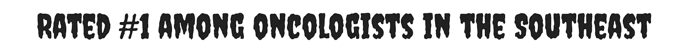

# 极简设计完全指南

> 原文：<https://medium.com/visualmodo/minimalist-design-complete-guide-ab7a0ea7bb72?source=collection_archive---------0----------------------->

极简设计。这是什么？怎么办？很多关于它的问题。关于极简设计有一点:当你做得好的时候，它绝对是美丽的。当你做错的时候，出于同样的原因，它是可怕的。把它做好是一个平衡的行为，真的，只有少数几个设计元素。

# 极简设计完全指南

像许多艺术和设计一样，需要相当敏锐的眼光才能分辨出在**行得通**和**行不通**的东西之间的[差异](https://visualmodo.com/)。

在你的网页设计中，你应该避免那些**不起作用的**。如果你正朝着极简主义努力，你想让你的网站吸引访问者的 **ooh** 而不是 **eww** ，我已经告诉你很多你应该做的事情(和很多你不应该做的事情)。

# Do:使用颜色！

人们倾向于认为极简设计是单色的，甚至更糟——黑白和/或灰度。不不不。

几乎矛盾的是，极简设计并不是说**拥有**很少；这是关于**最大化**很少。你的意图应该是充分利用你仅有的一点点。

这意味着当谈到颜色时，你应该…使用颜色。看看这个来自 [Epoch Design](http://www.epok-design.fr/) 的例子:这里颜色的使用很少，但是设计师已经最大化地使用了它，以确保你能看到它。

# 不要:使用所有颜色！

在那些令人愉快的[设计](https://visualmodo.com/)的另一面，极简主义者隐藏着大量使用所有颜色的黑暗冲动，只是用光谱上几乎每一种色调来代替他们设计的干净。

好吧，也许没那么糟糕，但是过度使用色彩和其他极简主义美学会令人难以置信地分散注意力和弄巧成拙。

比如 Rogue + Co，他们试图用极简主义的干净线条和不对称的卡片尺寸来吸引用户的注意力。但是他们给每样东西都添加了多余的颜色，然后无缘无故地给它添加了动画。它把用户从内容上引开，而不是吸引他们。

还有博尔登，他完全理解极简主义。除了颜色。太多的颜色和太聪明的尝试让他们不得不添加多余的动画。你必须把鼠标放在屏幕的角落上才能看到文本。

# Do:使用动画

你看，上面那些动画……都不重要。他们不会给网站添加任何东西。但是像**流氓&公司**这样的电影图形使用起来可以；他们只需要增强网站，而不是让它变得杂乱。

在大多数情况下，微交互是可行的——鼠标悬停在按钮上或者在卡片上突出显示。即使是不显眼的加载、滚动或背景动画也能增强你所追求的极简设计。

最大的障碍是确保动画符合你的设计。不要把它们加在不属于它们的地方。当你滚动的时候，看看我们 Divi 页面的页脚是如何扩展吸引你的注意力的，但是不会影响你使用页面的方式。

# Do:使用空白

就像彩色 pops 一样，空白(或负空间)可能是你的武器库中最有用的武器之一。例如，荒谬地流行的[媒介](https://www.medium.com/)几乎全是空白，而且很有效。

看看唯一的颜色是如何把你的注意力吸引到你绝对需要的按钮和链接上的？

有效使用空白有一个平衡点。你需要在可读性、实用性和美学吸引力之间取得平衡。当有效使用时，留白会让你的极简设计令人难忘。*一声咳嗽谷歌 coug 咳嗽*

# 不要:只使用空格

另一方面，过度使用空白会让访问者几乎无法使用你的网站。你看，谷歌对空白的使用突出了他们希望你如何使用网站:在框中键入一些东西。

然而，如果你对空白的使用没有把用户引向你的网站的目的，或者让他们在你的网站上有更好的体验，你可能需要更明确的元素来引导他们。

例如，通过你也是一个了不起的项目。但是我花了很长时间才弄明白怎么用(你要悬停在中间的大文字上，我没有这么做，因为我被画到了右上角)。当你得到它时，导航是简单的，空白并没有指引我到那里。

# 做:适当地使用令人敬畏的字体

几乎所有极简设计都依赖的一件事是字体的有效使用。为你的网站选择合适的字体是你展示你的个性以及你的产品或公司的方式。

因此，你需要一种字体，从人们看到它的那一刻起，就渗透出你的品牌身份。线条简洁，字体圆滑。粗糙的边缘和一些笔触。[优雅](https://visualmodo.com/)又上档次。无论你要做什么，确保你选择了匹配的字体。

以 Squarespace 为例。只要看看注册表格和使用的字体，你就知道他们公司会给你带来什么。干净，简单，清晰。它散发出他们广告中的时尚，主要是通过他们选择的字体。(因为这是你在这里唯一能看到的设计元素。)

而乡亲的乡亲们想要一种民间的感觉，所以他们肯定找到了一种感觉很好的字体。他们的受众是显而易见的，就像他们对自己产品的看法一样。而且没有明确说明。

# 不要使用不合适的字体

另一方面，选择过于粗体的字体会产生错误的冲击力。每个人都希望自己的网站独一无二，出类拔萃。但是你不希望它因为错误的[原因](https://visualmodo.com/)而引人注目。

想象一下，寻找一条危机热线来帮助有需要的家庭成员，并找到一个类似这样的网站:

如果一个医生想让你知道她是拯救你生命的最佳选择呢？

或者，如果你在寻找一个出色的当代网页设计师，你看到的只是这个:

好吧，我无法抗拒漫画的诱惑。告我吧。但你明白我的意思:字体选择很重要。尤其是当你使用[极简](https://visualmodo.com/)设计时，因为你对字体的选择可能是设计中最重要的部分。

# 往前走，最小化！

和 minify，但这是完全不同的文章。# iamadelight

玩笑归玩笑，记住颜色、字体和负空间是设计的基本原则。你只需要练习谨慎，这样你就能正确地使用它们。只要你**按照我说的**去做，而不是我**不**说到极简设计，你应该没什么好担心的。

当你设计极简网站时，你的指导方针是什么？