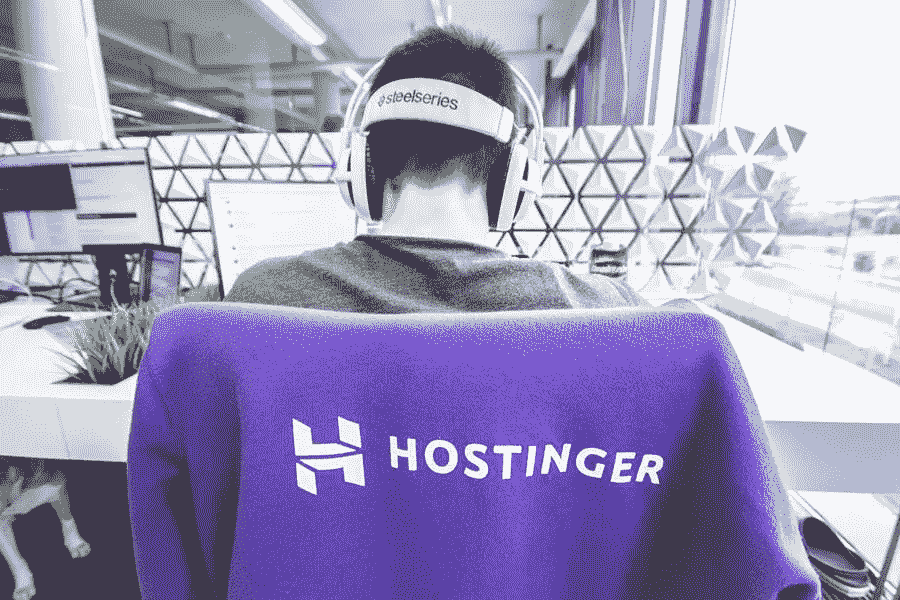

# 选择 WP 第一个虚拟主机时要避免的错误

> 原文：<https://medium.com/visualmodo/mistakes-to-avoid-when-choosing-your-wp-first-web-hosting-b04588071a4f?source=collection_archive---------1----------------------->

不管它的类型和功能，一个网站在你的品牌努力中有着重要的作用。为了获得最佳效果，你的网站不仅要有吸引力，而且要能正常运行，这一点至关重要。一个网站的表现很大程度上取决于它所使用的主机。除了确保你的网站在网上的可用性，虚拟主机还提供了所有必要的资源和硬件来提供完美的浏览体验。在这篇文章中，我们将分享你在选择 WordPress first 虚拟主机时需要避免的最常见的错误。

出于这个原因，你必须从一开始就选择正确的虚拟主机——例如，像 Hostinger 的高质量虚拟主机计划。否则，你的网站不会产生预期的结果。

由于现在市场上有各种各样的虚拟主机提供商，为你的网站选择一个最好的似乎是一项艰巨的任务。如果你打算购买你的第一个虚拟主机服务，那么这篇文章就是为你准备的。以下是 WordPress 用户在选择网站托管服务时最常犯的一些错误。

# 1.选择免费虚拟主机的错误

以公寓为例，你能免费获得一套公寓吗？答案是否定的，因为它不是这样的。同样的，一个虚拟主机提供商不太可能免费为你提供顶级的服务和大量的资源。

个人谁运行一个小博客作为一种爱好，可能会发现免费的主机服务绰绰有余，以发布他们的网站。然而，具有更大目标和更高风险的商业网站会发现它们的功能和资源有限。

举例来说，免费的主机提供商往往提供缓慢而不可靠的服务。他们还可以强迫你的网站托管第三方广告来补偿免费资源，对用户体验和 SEO 造成负面影响。不仅如此，子部件的特性和有限的资源使得扩展你的站点具有挑战性。

出于这些原因，最好不惜一切代价避免免费的虚拟主机提供商。相反，考虑投资于信誉良好的付费主机提供商，并在以后获得收益。

# 2.避免选择虚拟主机的错误:错误的计划

选择一个优秀的主机只是成功的一半。新手往往会陷入价格陷阱，选择一个便宜的主机方案，而没有权衡你的网站的需求。因此，他们最终缺乏所需的资源和硬件，或者为他们的网站支付过高的托管费用。

在确定你的主机类型时，你需要考虑几个因素——流量、数据存储、价格、安全性和技术知识。

如果你期待低流量，你可以选择共享主机。由于服务器资源在多个站点之间共享，与其他托管类型相比，这种托管类型的费用最低。因此，它具有较高的安全风险和较低的可扩展性。

为了更多的资源和更好的安全性，考虑选择 VPS 托管。它为您提供专用资源和更好的安全功能，以预测更高的流量和扩展网站。因此，由于这些原因，VPS 托管往往比共享托管更昂贵。因此，在选择一个长期的虚拟主机计划之前，一定要确定你的网站的需求，以免出错。

# 3.不考虑客户支持

虽然我们都希望有一个流畅和完美的托管体验，但你的网站肯定会遇到问题。当这种情况发生时，你会希望尽快从你的虚拟主机支持团队那里得到一个解决方案。所以，你需要考虑你的主机提供商的客户服务的有效性。

做这件事的最好方法是进行测试。你可以联系你的网站主持人的支持团队，询问他们网站上没有回答的问题。不要忘记验证他们的可用性。今天的大多数主机提供商承诺 24/7 支持，但其中一些无法实现。

确保支持团队的沟通渠道的选择是你可以访问的，同时选择你的虚拟主机不会出错。如果你选择的虚拟主机在另一个国家运行，通过电话联系他们对你来说不是一个实际的或者负担得起的解决方案。

此外，您可以浏览博客评论和论坛，以获得有关他们的响应时间和产品知识的信息。

# 4.前述退款保证

即使你做了所有的调查，你仍然有可能最终选择了错误的主机提供商。为了避免浪费你的钱，你应该选择有退款保证的主机提供商。它允许你测试主机方案，看看它是否符合你的需要，确保你只为你想用的东西付费。

一定要检查退款政策，因为它通常带有限制。有些情况下，该服务仅提供按比例退款，或者不适用于附加产品，如域名和安全功能。

# 避免选择虚拟主机的错误:底线

理解虚拟主机服务对你的 WordPress 站点有多重要，你应该让你的选择有价值。通过了解如何避免犯菜鸟托管错误，更容易做出更好的决定，不仅有利于网站，也有利于你的品牌。