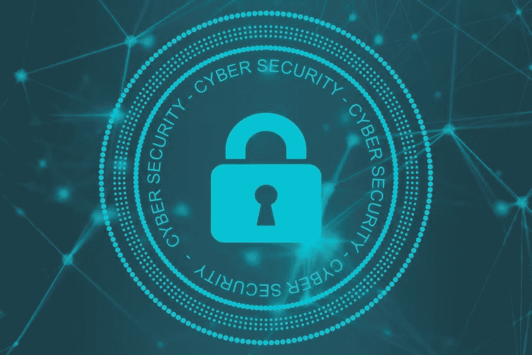

# WordPress 网站上最常见的攻击以及如何防止它们

> 原文：<https://medium.com/visualmodo/most-common-attacks-on-wordpress-sites-and-how-to-prevent-them-70704585aa49?source=collection_archive---------1----------------------->

WordPress 是世界上最流行的 CMS 系统。了解 WordPress 面临哪些常见的攻击，以及如何用最好的安全技术来防止它们。大约有 7500 万网站使用 WordPress。客观地看，全世界大约有 1.72 亿个网站。因此，大约 40%的全球网络流量都来自它。

许多人倾向于认为 WordPress 是中小型企业的解决方案。但是即使像《纽约客》、索尼音乐和 BBC 美国这样的大公司也是 WordPress 驱动的。

由于 WordPress 是大部分互联网的内容管理系统(CMS ),它也是网络犯罪的一个重要目标。这就是为什么每个 WP 用户都需要知道 WordPress 网站上最常见的攻击，以及如何保证网站安全的实用解决方案。

# WP 网站上常见的攻击类型

以下是 WP 所有者需要认识的最常见的攻击类型:

# SQL 注入

WordPress CMS 平台的下面是一个存储管理信息的数据库层。它包含用户数据、内容存储和站点配置信息等元素。SQL 或结构化查询语言是所有这些工作的基础。

黑客可以向您的网站注入恶意的 SQL 来运行定制的命令。他们可以做任何事情，从通过“选择”查询查看额外信息到更改数据等等。

SQL 攻击发生的频率比您意识到的要高。使用 [SQL](https://en.wikipedia.org/wiki/SQL) 注入的网络罪犯是攻击纳斯达克、Heartland、7-eleven 和其他重大数据泄露事件的幕后黑手。每年，仅这些攻击就给公司造成了大约 3 亿美元的损失。

# 跨站点脚本

跨站点脚本攻击(XSS)类似于 SQL 注入。但是它们的目标是 JavaScript 页面元素，而不是数据库。这些攻击会导致用户的隐私信息受损。这是因为被黑客攻击的 JavaScript 将用户重定向到欺诈性的登录页面。他们确实像他们的目标。但一旦客户输入个人信息，他们就会直接落入黑客手中。

XSS 袭击甚至会影响到最著名的名字。黑客已经在易贝的产品页面上使用它们很多年了。

# 命令注入

WordPress 在三个主要层面上运行:

*   数据库服务器
*   应用服务器
*   网络服务器

这些服务器中的每一个都代表了潜在漏洞的不同方面。使用命令注入攻击，黑客瞄准特定层并输入恶意信息。从表面上看，代码看起来很正常。但在底层，该命令可以提示层显示重要信息，如文件列表和目录。

联网摄像头是命令注入攻击的常见目标。例如，研究人员发现了一个重要缺陷，使得流行的 macOS 终端应用程序容易受到命令注入攻击。

# 文件包含

WordPress 依赖于流行的编码语言，如 PHP 和 Java。因此，他们允许网络程序员在代码中使用外部文件和脚本来创建网站功能。此活动被称为“包含”命令。

黑客可以操纵 WP 网站来利用“include”代码部分。它允许他们访问应用服务器。通常，插件是这类攻击的目标。一旦用户安装了受感染的插件，黑客就可以访问服务器上的所有数据。

# 如何防范 WP 攻击

WordPress 攻击可能以其他形式出现，但是你现在有工具识别潜在的威胁。以下是你需要做的一些基本的事情来提高你的 WP 安全性:

# 检查你的插件，以防止常见的攻击

WP 最大的好处之一就是大量的第三方开发者创造了新的主题和插件。他们为你提供了如此多的灵活性和自由来扩展和定制你的网站。

但是为了避免安全风险，总是从 WordPress.org 下载插件和主题。确保检查开发者的评论和历史，以了解这些附加组件来自一个值得信赖的来源。最后，经常更新插件以获得最新的安全补丁。

# 保护您的互联网连接

网络罪犯利用互联网连接漏洞来入侵设备、网络和 WordPress 网站。例如，黑客可能会用恶意软件(如键盘记录器)感染您的计算机。然后，他们可以记录您的击键，以保存您的登录凭证。或者他们可能会创建一个假的登录页面(如上所述)来获取您的信息。

使用防病毒软件保护您的设备，使用虚拟专用网络(VPN)保护您的互联网连接。当您连接到 VPN 服务器时，它会在您的流量到达目标 web 目的地之前对其进行加密。它可以防止黑客和其他团体跟踪您的互联网活动和感染。一些 VPN 提供商甚至有网络安全功能。这些还会警告您其他威胁，如可疑网站和下载。

# 使用安全的主机

大多数人通过云托管环境来运营 WP 网站。确保使用提供 SSL 加密和内部防火墙等其他安全工具的云托管服务。

另外，做好功课。寻找在抵御网络攻击方面有着良好声誉的平台。而且你不需要为了性能而取舍。最好的供应商提供快速和安全。

# 不再有 WordPress 常见攻击

最后，不管你的网站的目标是什么，你的 WP 网站的安全性对于实现它们是至关重要的。总之，认识最常见的 WP 攻击，并开始实施策略来防止它们。您不仅可以为自己和您的用户创造一个更安全的环境，还可以为更好的互联网安全做出贡献。