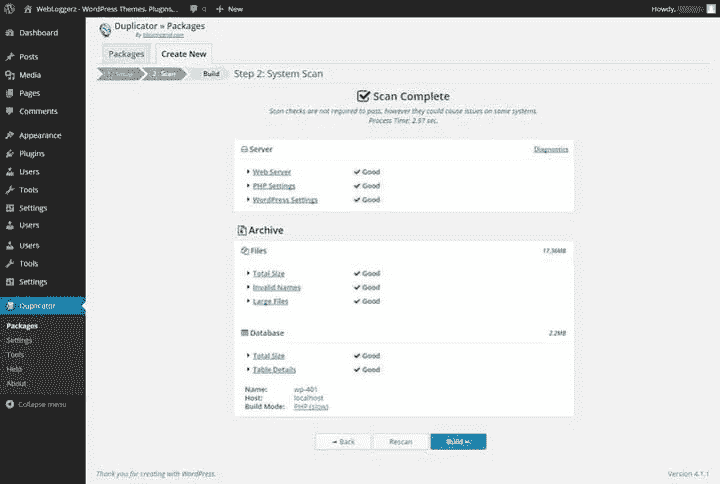
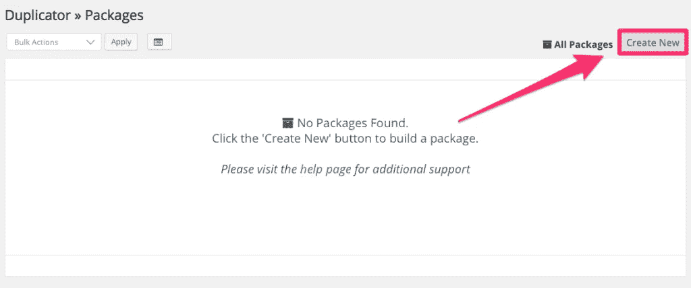

# 将 WordPress 站点移动到本地计算机

> 原文：<https://medium.com/visualmodo/move-wordpress-site-to-local-computer-5ced52cd9b72?source=collection_archive---------0----------------------->

在不影响实时网站的情况下在本地编辑网站

对于我们的许多 WordPress 项目，我们正在对客户的[主题](https://visualmodo.com/wordpress-themes/)进行修改和编辑。在他们的实时网站上执行这些更改并不是一个好主意。因此，我们有一个将 WordPress 站点转移到本地计算机的流程。一旦更改完成并经过测试，我们就用更新的文件替换掉实时网站上的文件。我们获取网站文件和数据库的方法是通过 FTP 复制文件，然后使用插件创建数据库文件的副本。然后，我们将在本地创建数据库并导入数据库表。

最近，我们决定尝试加快将 WordPress 站点复制到本地计算机的过程。在我们的研究过程中，我们看到了文章 [3 个插件可以轻松迁移 WordPress 站点，并尝试了&测试过](http://www.makeuseof.com/tag/3-plugins-for-easily-migrating-a-wordpress-site-tried-tested/)。经过进一步审核，我们决定尝试网格中[生命的](http://lifeinthegrid.com/)[复制器](https://wordpress.org/plugins/duplicator/)插件。所有的主题都与这个插件完全兼容

该插件非常简单，易于使用。请注意，该插件在 WP 引擎的禁用插件列表中(它们会创建自己的备份)。插件在 WordPress 插件库中，可以通过你站点的仪表板安装。

# 将 WordPress 站点移动到本地计算机

一旦安装并激活，您就可以开始使用它了。只需转到**复制器>包**并点击新建按钮。

第一步是软件包设置。在大多数情况下，默认设置就足够了。在这一步，您只需点击**下一步**按钮。

第二步将扫描你的 WordPress 安装并运行一些测试。对于所有三个测试(Web 服务器、PHP 设置和 WordPress)，服务器部分应该返回“Good”。否则，您需要对这些区域进行故障排除。存档部分可能会返回一些警告。只要您没有得到任何错误，您应该可以创建带有警告的包。如果您收到警告，您需要单击消息“检测到警告状态，您确定要继续吗？”要完成这一步，点击**构建**按钮。

最后一步将创建安装程序并归档 php 文件。一旦这些都准备好了，你需要下载它们。我们使用 MAMP 为我们的本地网站。(如果您使用的是另一个程序，请相应地调整目录名和位置。)当您单击任一文件的按钮时，将打开保存对话框。将这两个文件保存在“htdocs”目录下的站点文件夹中。

# 在本地安装网站

保存文件后，在浏览器中导航到“localhost/SITENAME/installer . PHP”。安装程序将开始运行，并从部署步骤开始。

如果这是一个新的安装，请在“操作”字段中选择“创建新数据库”。如果您要替换旧数据库，请选择“连接并删除所有数据”选项。主机字段将自动为您填充。“名称”字段将是您要用于本地数据库的名称(或您要替换的现有数据库的名称)。用户和密码字段是为 phpMyAdmin 设置的用户名和密码(大多数本地系统默认为“root”和“root”)。您可以点击测试连接按钮，以确保您的设置是准确的。您需要选择“我已经阅读了所有警告和通知”消息旁边的复选框。然后，点击**运行部署**按钮。

接下来是更新步骤。复印机安装程序会自动为您填充这些字段。这将用本地主机 URL 替换对数据库中实时 URL 的引用。验证信息是否正确，然后点击**运行更新**按钮。

最后的安装步骤是测试新站点。只需按顺序执行这些步骤，您的本地站点就可以运行了。请注意,“保存永久链接”和“安全清理”步骤要求您登录到站点(使用您用于登录实时站点的相同凭据)。

# 结论

我肯定你想知道这个插件能为你节省多少时间。我们决定测试这个插件，并记录重建远藤创意网站的时间。我们用我们的老方法，先把 WordPress 网站移到本地电脑，然后用复印机在本地复制网站。使用 Duplicator 完全重建了这个网站，所用的时间比使用 FTP 下载完网站文件所用的时间还要少。

简而言之，该插件在简化过程的同时加快了过程。我们现在花在设置上的时间更少了，而花在实际代码上的时间更多了。