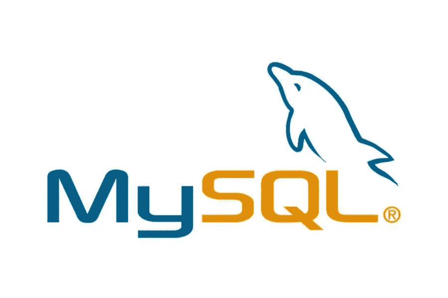

# MySQL:全面的解释

> 原文：<https://medium.com/visualmodo/mysql-a-comprehensive-explanation-d95650d6b590?source=collection_archive---------0----------------------->

MySQL 是一个免费的开源关系数据库管理系统(RDBMS ),它使用结构化查询语言(SQL)。在本文中，我们将分享一个关于 MySQL 的全面解释

首先，你必须知道它的发音:MY-ES-KYOO-EL' [maɪˌɛsˌkjuːˈɛl].有时候人们会叫它“我的续集”或者其他名字，但至少你知道官方的发音。一家名为 MySQL AB 的瑞典公司最初于 1994 年开发了 MySQL。美国科技公司 Sun Microsystems 在 2008 年收购 MySQL AB 后获得了全部所有权。美国科技巨头甲骨文公司在 2010 年收购了太阳微系统公司，自此 MySQL 实际上被甲骨文公司拥有。

就一般定义而言，MySQL 是一个具有客户机-服务器模型的开源关系数据库管理系统(RDBMS)。RDBMS 是一种用于基于关系模型创建和管理数据库的软件或服务。现在，让我们仔细看看每个术语:

# 开源

开源意味着你可以自由地使用和修改它。任何人都可以安装这个软件。您还可以学习和定制源代码，以更好地满足您的需求。然而，GPL (GNU 公共许可证)根据条件决定你能做什么。如果您需要更灵活的所有权和高级支持，可以使用商业许可版本。

# MySQL 数据库解释

数据库只是结构化数据的集合。想象一下自拍:你按下一个按钮，捕捉自己的图像。你的照片就是数据，你手机的图库就是数据库。数据库是存储和组织数据的地方。“关系”一词意味着存储在数据集中的数据被组织成表。每张桌子都有某种联系。如果软件不支持关系数据模型，就叫 DBMS 吧。

# 服务器模式

安装和运行 RDBMS 软件的计算机称为客户机。每当他们需要访问数据时，他们就连接到 RDBMS 服务器。这就是“客户机-服务器”部分。

MySQL 是众多 RDBMS 软件选项之一。由于 MySQL 的流行，RDBMS 和 MySQL 经常被认为是一样的。举几个大的网络应用，比如脸书、推特、YouTube、谷歌和雅虎！所有都使用 MySQL 进行数据存储。尽管它最初是为有限的用途而创建的，但现在它与许多重要的计算平台兼容，如 Linux、macOS、Microsoft Windows 和 Ubuntu。

# SQL 综合解释(MySQL)

MySQL 和 SQL 不一样。请注意，MySQL 是最流行的 RDBMS 软件的品牌之一，它实现了客户机-服务器模型。那么，在关系数据库管理系统环境中，客户机和服务器如何通信呢？他们使用一种特定于领域的语言——结构化查询语言(SQL)。如果您曾经遇到其他包含 SQL 的名称，比如 PostgreSQL 和 Microsoft SQL server，它们很可能是也使用 SQL 语法的品牌。RDBMS 软件通常是用其他编程语言添加的，但是，总是使用 SQL 作为与数据库交互的主要语言。MySQL 本身是用 [C 和 C++](https://visualmodo.com/how-to-validate-the-c-test/) 编写的。

计算机科学家 Ted Codd 在 20 世纪 70 年代早期用一个基于 IBM 的关系模型开发了 SQL。它在 1974 年得到了更广泛的使用，并很快取代了类似的，当时已经过时的语言，ISAM 和 VISAM。撇开历史不谈，SQL 告诉服务器如何处理数据。它类似于你的 WordPress 密码或代码。您将其输入系统以访问仪表板区域。在这种情况下，SQL 语句可以指示服务器执行某些操作:

*   首先，数据查询:从现有数据库中请求特定信息。
*   其次，操作:添加、删除、更改、排序和其他操作，以修改数据、值或视觉效果。
*   标识:定义数据类型，例如将数字数据更改为整数。这也包括定义数据库中每个表的模式或关系
*   最后，数据访问控制:提供保护数据的安全技术，这包括决定谁可以查看或使用存储在数据库中的任何信息

您是否一直在寻找一个很好的托管解决方案？我们建议您跟进 Hostinger 优惠券页面，并成为第一个以市场最低价格获得高质量主机的人！

# 它是如何工作的？

该图像解释了客户机-服务器结构的基本结构。一个或多个设备(客户端)通过特定的网络连接到服务器。每一个客户端都可以从他们屏幕上的图形用户界面(GUI)发出请求，只要两端都理解指令，服务器就会产生期望的输出。在不太技术性的情况下，MySQL 环境中发生的主要过程是相同的，它们是:

*   MySQL 创建了一个用于存储和操作数据的数据库，定义了每个表的关系。
*   客户端可以通过在 MySQL 上键入特定的 SQL 语句来发出请求。
*   服务器应用程序会用请求的信息进行响应，并出现在客户端。

差不多就是这样。从客户的角度来看，他们通常强调使用哪个 MySQL GUI。图形用户界面越轻、越友好，他们的数据管理活动就越快、越容易。一些最流行的 MySQL 图形用户界面是 MySQL 工作台、SequelPro、数据库可视化工具和 Navicat 数据库管理工具。其中一些是免费的，一些是商业的，一些是专门为苹果操作系统运行的，一些是与主要操作系统兼容的。客户应该根据自己的需要选择图形用户界面。对于 web 数据库管理，包括 WordPress 网站，最明显的选择是 [phpMyAdmin](https://www.phpmyadmin.net/) 。

# MySQL 优化说明

大量的集群服务器支持 MySQL。无论您是在存储大量的大型电子商务数据还是在进行繁重的商业智能活动，MySQL 都能以最佳的速度帮助您顺利完成任务。

# 灵活性

您可以修改源代码以满足自己的期望，并且不需要为这种程度的自由支付任何费用，包括升级到高级商业版本的选项。安装过程相对简单，不应该超过 30 分钟。

# 流行

MySQL 确实不是市场上唯一的数据库管理系统，但它是最受欢迎的数据库管理系统之一，在使用搜索结果中的提及次数、LinkedIn 上的专业简介以及互联网论坛上的技术讨论频率等关键参数进行评分时，仅次于 Oracle Database。许多大型科技巨头依赖它的事实进一步巩固了他们当之无愧的地位。为什么这样原因如下:

# MySQL 应用标准解释

最后，行业已经使用 MySQL 很多年了，这意味着对于熟练的开发人员来说有丰富的资源。MySQL 用户可以期待软件的快速发展，如果他们需要软件，自由职业专家愿意以更低的工资工作。