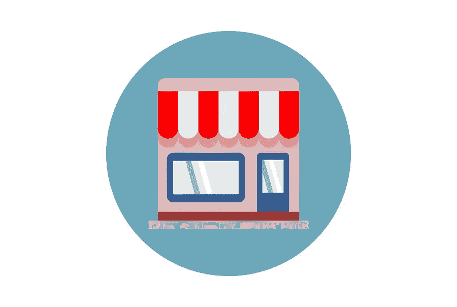

# 新年电子商务决心

> 原文：<https://medium.com/visualmodo/new-years-ecommerce-resolutions-83929b90f25e?source=collection_archive---------0----------------------->

根据营销专家的说法，2019 年为众多电商商店带来了巨大的成功。人工智能驱动的数据，聊天机器人，AR/VR 技术，商店个性化。所有这些都在 2019 年成为主流，据统计，在 2020 年将变得更大。大型企业已经采用了这些技术，所以所有企业也应该考虑一下。在新年到来之际，这里有几个关于你的客户、竞争对手和员工的重要决定要在你的电子商务中实施。

# 年度电子商务计划:建立新的关系

如果你现在还没有利用这个策略，你应该在 2020 年联系有影响力的人和其他网站。所以，他们可以推广你的业务，给你带来反向链接，提高你的搜索引擎优化排名，建立域名权威，增加品牌曝光度。没有比现在更好的时间来爬上搜索引擎结果页的顶端。

# 推动更多有机销售

你可能已经在使用至少一种形式的付费广告(脸书广告、谷歌购物、PPC)，这将帮助你完成大量的销售。如果你把努力放在我们上面提到的地方，增加你的域名权威，获得更多的反向链接，你将会提升你的排名。然而，这还不足以充分曝光和推动有机销售。试着找出你的竞争对手在吸引有机流量方面的不同做法，这样你就可以在与非付费流量相关的策略上投入更多。因此，一个伟大的电子商务解决方案。

# 消除重复内容

许多电子商务网站都有博客版块。我们打赌你至少有两篇文章是同一个话题，说明你在兜圈子。仔细检查你发布的内容，删除多余的帖子。这将有利于你的排名和用户体验。

# 降低购物车放弃者的百分比

电子商务网站上 33%的购买是在移动设备上进行的。因此，潜在客户放弃购物车的两个最常见的原因是过于复杂的结账流程和缺乏支付方式。如果你的目标是开发一个成功的数字战略，首先要确保你的潜在客户不会放弃购物车。如果他们这样做了，不管出于什么原因，使用重新定位来提醒他们他们打算购买的产品。

# 年度电子商务决心:做一些解释性研究

新年就要到了，现在是时候深入了解客户的决策问题了。这样，你可以更好地了解他们的需求，用你的提议让他们大吃一惊。所以，问他们清楚直接的问题。发出这些问题的最好方式是通过调查。如果您在调查中附上促销代码或折扣券，您会让您的客户再次回来完成另一次购买。

# 刷新您的网站布局

即使是一个简单的改变也意味着很多。毫无疑问，你可能已经有了一个吸引人的布局。但是加入一些新的东西会很有趣。你可以从一个简单的工具条改进到一个全新的布局。这样做的原因是为了让你的客户对你的产品更感兴趣。此外，他们会感谢你为提供更愉快的体验所做的努力，并会做出积极的回应。

# 最后总结一下今年的电子商务计划

最后，让 2020 年成为有史以来最好的一年。通过更多地与客户接触，让他们一年到头都来。给他们想要的，并提供激励——忙碌不是借口。这是一个合适的时间来致力于改善落后的领域，并找到更好的。更多创造性的方法来扩大您的电子商务商机。你能让它发生！