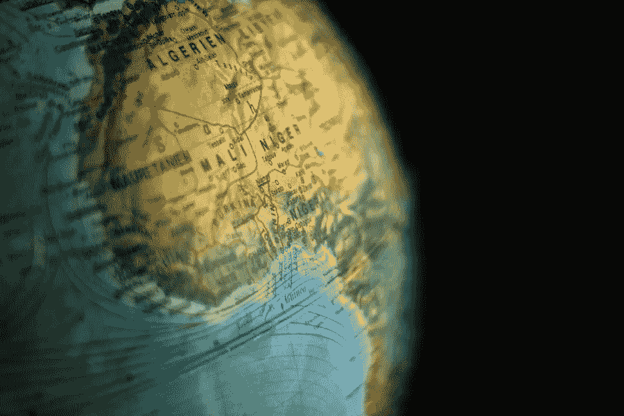

# 尼日利亚推特禁令即将解除

> 原文：<https://medium.com/visualmodo/nigeria-twitter-ban-to-be-lifted-soon-3ceed25297d5?source=collection_archive---------1----------------------->

8 月 11 日星期三，部长赖·穆罕默德表示，尼日利亚政府将很快解除推特禁令。这个消息是在这个西非国家最终解决了与社交媒体平台的冲突之后发布的。在这篇文章中，我们将谈论尼日利亚的 Twitter 禁令，以及如何保护自己免受这些行为的影响。

众所周知，尼日利亚政府在今年 6 月 4 日禁止了推特，此前总统穆罕默杜·布哈里的有争议的推文被删除。

在社交媒体平台删除总统威胁惩罚地区分裂分子的推文两天后，西非国家联邦政府禁止了推特。部长声明他们禁止微博平台是因为。“持续利用该平台从事可能会破坏尼日利亚企业生存的活动。”

“随着我们接近达成全面协议，Twitter 禁令将很快出台。”部长在内阁会议继续后告诉记者，“我们在一些领域达成了一致。因此，希望在未来几天或几周内，我们将得出结论。”

禁令颁布几分钟后，“哪个 VPN”就成了尼日利亚推特上的热门话题。尼日利亚人主要求助于虚拟专用网络(VPN)来使用这个平台。

足够幸运的是，尼日利亚不是对 VPN 的使用进行法律和限制的国家之一。因此，正当尼日利亚人民最需要虚拟专用网的时候，它来了。

# VPN 对 Twitter 禁令有什么帮助？

VPN 或虚拟专用网络通过在用户和互联网之间建立安全连接来工作。然后，它通过加密的虚拟隧道将用户的数据流量重新路由到另一个位置。这个过程在使用互联网时伪装了用户的 IP 地址，[使其位置](https://visualmodo.com/powering-digital-economies-with-a-blockchain-consensus-operating-system/)对每个人都不可见。