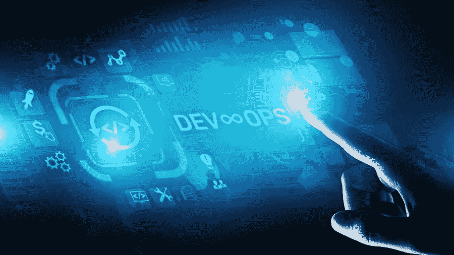

# 可观察性与监控:有什么区别

> 原文：<https://medium.com/visualmodo/observability-vs-monitoring-whats-the-difference-between-7e8c1328cbd0?source=collection_archive---------0----------------------->

可观察性和监控可能是 DevOps 世界里最容易混淆的两个词。它们之间有什么关系？请参阅本文中 DevOps 的这两个术语之间的区别。一个依赖另一个，还是彼此独立？有些人会说，可观察性只是监控的一个花哨词。尽管如此，这两个要素之间的关系或缺乏关系是 DevOps 中目前最有争议的话题之一。好吧，真相总是存在的，要靠你自己去发现它。本文将剖析这两个术语的含义以及您需要了解的内容。

要理解可观察性和监控之间的区别，您必须了解开发和操作(或 DevOps)的真正含义。它是任何发展部门三个关键方面的有效协调和沟通。这些领域包括软件开发、IT 运营和质量保证(QA)。任何公司要想成功，他们都必须高效地合作。有了这样的协调，在问题发生之前跟踪任何可能的问题就容易多了。此外，在停机或任何其他相关问题的情况下，可以通过结合所有三个部门的想法找到解决方案。

# 揭开可观察性和监控的神秘面纱

在深入这个话题的细节之前，谨慎的做法是先定义这两个术语。那么，什么是可观性呢？你可以用很多方式来定义它。也许，其中最简单的一点是，它是一个系统的内部状态由外部输出决定的能力。换句话说，观察器观察输出的行为，然后用结果来确定内部组件的可能状态。

当技术还处于早期阶段时，大多数系统都有有限的故障模式，这对用户和维修人员来说当然是一个优势。为什么会这样呢？嗯，每当有东西坏了，追踪根本原因会更容易，因为通常只有三种可能性。是的，这些系统以同样的三种方式一次又一次地失败。您可以看到为什么不需要观察输出通道的性能。

## DevOps 中可观测性与监控的区别:技术进步

然而，随着技术的进步，系统变得比以往更加复杂。因此，故障模式的数量增加了，对于那些负责维修的人来说，已经到了不堪重负的地步。这就是监控工具诞生的时候。

现在，您可能想知道监控是什么意思。简而言之，这是一个系统的数据收集、分析和使用信息的过程，以指导管理过程实现其目标。它通常在程序启动并运行后进行，有时也称为性能评估。

一个可监控的系统是一个很少或没有未知的系统。这意味着它的运行是可预测的，任何未来的结果都可以使用收集的数据来计算。因此，更容易防止未来的故障或追踪当前问题的根源。可观察性和监控的含义很接近，但它们有什么区别呢？

# 可观察性和监控有什么不同？

两者的主要区别之一是可观察性倾向于回答通过监控获得的结果所提出的问题。例如，监控将告诉您系统是否按预期运行，并将显示任何异常的性能行为。另一方面，可观察性将回答为什么会发生这种情况以及如何解决。通过这两者的结合，您可以检测任何未来的问题，并防止它们影响开发。

另一个值得注意的区别是，可观察性是系统允许监控的能力。如果一个系统是可观察的，它可以获得货币化。那么，什么是可观测系统呢？它的内部系统数据可通过外部输出通道获得。这些信息是在分析完成之前由监控工具收集的。因此，可以说这两个方面是相互依存的。然而，只有当你的分析切中要害时，不管是手动的还是自动的，它们才会有成效。缺乏有效的分析策略会使整个过程毫无用处。因此，这将决定您在可观察性和监控方面的投资成果。

# 可观察性有多重要？

对于一个简单的系统或独立的应用程序，控制和监控任何潜在的问题是相当容易的。例如，你不需要很多复杂的工具来维护一个定制的 WordPress 站点的稳定性。您需要的是内存、网络、CPU 和数据库监视器。在这样的系统中，对于一组已知的问题，你有已知的解决方案。但是，如果你有很多未知的东西呢？

这是当今大多数系统的共同特征。几乎每个人都喜欢分布式系统，在这种系统中，各种组件和应用程序组合在一起执行给定的功能。随着技术的进步，潜在故障的数量也在增加，因此，当系统出现故障时，跟踪问题变得很困难。这就是可观察性诞生的原因，并且已经成为任何产品开发过程的重要补充。

对于可观察性的重要性，系统必须产生某些类型的数据。其中之一是健康检查，包括定制的 HTTP 点，旨在保持良好的系统健康。度量是任何监控设备的系统必须利用的另一组数据。这些是内部环境的数字表示，通常在集合中。端到端跟踪是另一组信息，它捕获应用程序在系统中的流程。

# 为什么需要监控？

虽然监控听起来很老套，但它对 DevOps 的成功至关重要。举个例子，一家公司每小时赚大约 5000 美元。每周至少一小时的停机时间相当于每年 52 小时。从技术上讲，这样一家公司一年可能会损失超过 25 万美元。无论是初创企业还是成熟企业，这都是一个巨大的损失，可能会产生严重的后果。一家公司会有这么多停工期的原因之一是它缺乏有效的预期策略。

当然，由于不可避免的情况，系统故障有时会在任何行业发生。然而，通过监控，这种故障的频率可以降低很大的幅度。你将享受到的一个好处是，任何失败都可以在发生之前预测到。对你的网站进行定期维护比突然停机要好，因为突然停机会给你的消费者带来不便。因此，那些打算使用你的服务。在那个特定的时间将有足够的时间来重新安排他们的计划。

## DevOps 中可观测性与监控的区别:在失败的情况下

监控会派上用场。为什么一些停机时间比预期的要长。技术人员可能会花很多时间试图找到问题的原因。通常情况下，问题修复并不完全是由于匆忙造成的。有了监控工具。然而，通过使用度量标准和您拥有的其他数据，您可以很容易地跟踪问题。

DevOps 团队使用监控服务也是有益的。因为可以满足公司的具体需求。例如，您可以过滤掉一些与您的操作无关的数据。因此，系统只会在出现需要立即维护的紧急事件时发送警报。通过消除不必要的警报消息，它可以大大提高团队的效率。

# 结束语

为了[开发任务](https://en.wikipedia.org/wiki/DevOps)的成功，监控和可观察性携手合作。关于这两者是不同的方面还是同一件事，有过许多争论。它们密切相关，但在操作时有不同的含义。观察基本上创造了一个可以进行监控的平台。因此，如果一个系统是不可观测的，任何监测过程都很难发生。换句话说，如果内部环境的方面不能通过输出。几乎不可能收集任何数据进行分析。因此，这意味着它们相互依赖。

由于 DevOps 依赖于监控和可观察性才能有效，反之亦然。例如，如果 DevOps 团队工作不一致，监控就不会有效。因此，对于任何公司来说，确保 it、QA。软件开发部门都在为实现同一个目标而共同努力。因此，在遇到任何问题时，他们可以集思广益，想出一个持久的解决方案。技术只能帮助人类实现他们的目标。然而，管理层有责任确保员工遵守必要的程序。以保证工作顺利进行。