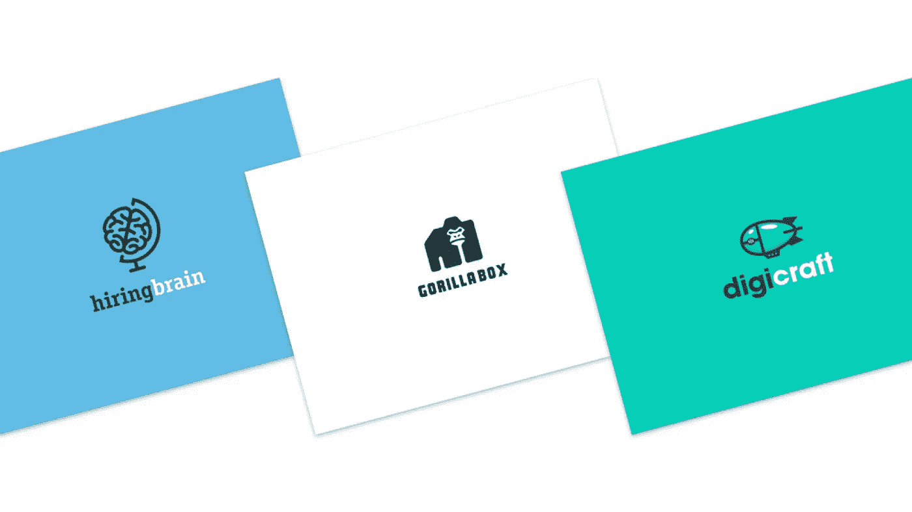
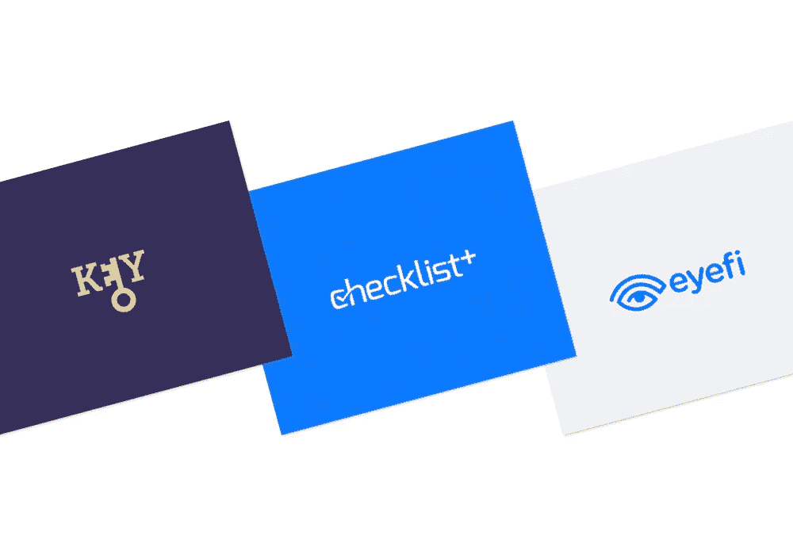
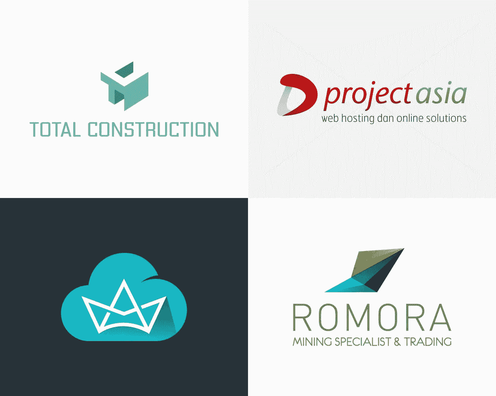

# 在线徽标制作工具

> 原文：<https://medium.com/visualmodo/online-logo-maker-tools-b1cd8dd29e5d?source=collection_archive---------1----------------------->

## 最佳选择

启动网站后要做的一件必不可少的事情是创建一个独特的标志，这个过程可以用这个神奇的在线标志制作工具来完成。

标志是一个符号或一个小的图形设计，代表你的博客和品牌。有时它将你与你的竞争对手区分开来，有时它描述了你的网站是关于什么的。最重要的是，它帮助你的访问者记住你的网站。

# 在线徽标制作工具

如果你没有设计技能，你可以聘请平面设计师为你制作一个标志。如果你能请得起一个[设计师](https://visualmodo.com/)，那是最好的选择。

但是如果你预算有限，你可以使用在线工具。有一些在线标志制作工具可以帮助你免费或花很少的钱制作一个标志。

今天我将为你的博客设计 7 个最好的在线标志制作工具。

让我们检查一下工具。

# 1.Canva.com

Canva 是我个人的最爱。它让平面设计变得异常简单。使用拖放设计工具，任何人都可以创建设计。我用这个工具为我的博客创建所有的图片。

它不仅仅是一个商标制造商。它可以让你为社交媒体文章、演示文稿、杂志、博客文章、信息图、名片等等创建图形。简而言之，这是非技术人员的一个完整的[视觉设计](https://visualmodo.com/)解决方案。

使用 Canva Logo Maker，您可以创建 500px*500px 大小的漂亮徽标。但是这个尺寸可能不是 WordPress 博客的标准尺寸。要创建一个你想要的尺寸的标志，你需要使用自定义尺寸。

这里有一个 YouTube 视频，是关于用 Canva 制作定制尺寸的 logo 的。

理解 Canva 的特性可能需要一些时间。但是它值得您花时间，因为您可以将 Canva 用于许多目的。

# 2.[OnlineLogoMaker.com](http://www.onlinelogomaker.com/)

顾名思义，这个工具可以让你在线创建自己的徽标。这是一个快速易用的工具。很久以前，我用这个工具创建了一个老客户网站的第一个标志。

如果你想在几分钟内创建一个标志，这个工具是给你的。使用此工具创建一个徽标需要几分钟时间。只需在“添加文本”中输入您的博客名称，并从“添加符号”中选择一个相关图标。并且[免费下载](https://visualmodo.com/)logo。

你可以按照他们的官方教程用这个工具创建你的第一个 logo。它提供免费和付费下载。对于一个新网站来说，免费版本已经足够好了。

# 3.[由 Shopify 制作的在线徽标](https://www.shopify.com/tools/logo-maker)

Shopify 是一款流行的电子商务软件。它有一个免费的在线标志制作工具。通过使用这个工具，你可以在几分钟内为你的博客创建一个简单而有吸引力的标志。

你必须遵循 3 个步骤来创建一个标志。在“您的商店名称”部分输入您的博客名称，选择一个图标并选择一个位置。就是这样。

它会将徽标发送到您的电子邮件中。Shopify 可能会要求您试用其电子商务软件。如果你不打算创建一个电子商务网站，你可以忽略这一点。只需进入您的邮箱并下载徽标。

# 4.[Fiverr.com](https://roadtoblogging.com/go/fiverr/)

Fiverr 不是一个标志制造商。这是一个创意和专业服务的市场，起价仅为 5 美元。这意味着你只需花 5 美元就可以从 Fiverr.com 得到一个定制的商标。

我认为在 Fiverr 上投资一些钱比在免费工具上花很多时间要好。如果你有一些钱可以花，我会推荐你从 Fiverr 买一个 logo。

最近我买了一个温度计的标志。这是一次很棒的经历。我得到的比我付的多。我强烈建议你试试温度计。(免责声明:卖家是我的朋友)

# 5.DesignMantic.com

DesignMatic 提供了为你的博客设计 logo 的最快方法。你所要做的就是，输入你的公司名称并选择你的行业。它会为你产生很多设计。你也可以通过开始一场比赛获得一个定制的[设计](https://visualmodo.com/)。

虽然它声称自己是一个“免费的标志制作工具”，但它不允许你免费下载标志。它只是免费展示设计。如果你想下载标志，你需要购买标志。

# 6.[TailorBrands.com](https://roadtoblogging.com/go/tailor-brands/)

TailorBrands 是另一个让标志设计变得简单的伟大工具。用 TailorBrands 制作 logo 非常简单。只需输入你的域名并点击“设计”按钮，然后它会要求你选择一些偏好。

然而，它不是一个免费的工具。你需要支付一些钱来下载一个标志。

# 7.[FreeLogoDesign.org](http://www.freelogodesign.org/)

我最近发现了这个免费的标志设计工具。该工具提供免费和高级版本的徽标。用这个工具创建一个标志是非常容易的。如果您选择免费选项，您的下载链接将被发送到您的电子邮件地址。