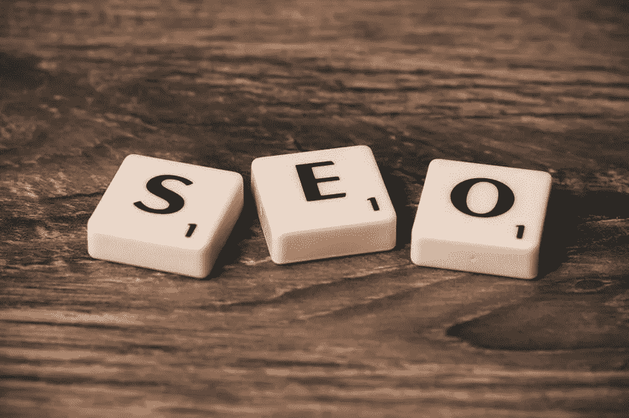

# 用这些 WordPress 的调整优化你的 WooCommerce SEO

> 原文：<https://medium.com/visualmodo/optimize-your-woocommerce-seo-with-these-wordpress-tweaks-e343ae9ae89a?source=collection_archive---------1----------------------->

WordPress 是世界上最受欢迎的内容管理系统，WooCommerce 为世界上 100 万家电子商务网站中的 22%提供支持。WooCommerce 是一个 SEO 友好的平台，这意味着它可以帮助你的网站在搜索引擎结果中排名靠前。你可以通过做一些小的改变来提高你的 WooCommerce 搜索引擎优化，这些小的改变可以让你领先于竞争对手，增加网站流量，促进销售。在本文中，我们将分享优化你的 WooCommerce 产品 SEO 的最佳实践。

# 优化 WooCommerce SEO

# 为 SEO 优化 WooCommerce 产品图片

Invodo 的一项研究显示，92.6%的消费者表示，在做出积极的购买决定时，图片是最具影响力的因素。优化你的图片可以让你比竞争对手更有优势，因为它减少了你的网站加载时间，也吸引了潜在的买家仔细阅读谷歌搜索。为了优化你的图片，确保它们不会太大以至于降低你网站的速度。在 WooCommerce for WordPress 中，将您想要使用的图像添加到产品页面的产品图库部分(这些图像将会出现在您网站的交互式图库中)。然后使用 Optimole 这样的免费工具来确保您的图像质量高，加载速度快。

# 优化页面标题

73%的购买决定是根据标题做出的，这意味着你不应该错过优化页面标题的机会。你的 WordPress 站点应该既有产品页面又有类别页面(这样可以确保单个产品页面不会在搜索结果中竞争)。用准确而宽泛的术语给你的分类页面加标题，优化它们。

优化你的 [WooCommerce](https://visualmodo.com/ecommerce-recommendations-increase-sales/) 产品页面搜索引擎优化，用术语来描述具体的项目。而分类页面应该用准确而宽泛的术语来命名。在 WordPress 中，转到产品类别，选择类别下面的编辑链接。因此，“女装”可能是一个类别页面标题，而“花卉 midi 连衣裙”可能是产品页面标题。在你的标题中使用关键词。Avidon Marketing Group 建议，像 Google Keyword Planner 这样的免费工具可以用来查找关键词。然而，不要在标题中过多地填入关键词，这最终会对你的网站不利。

# 为 WooCommerce SEO 撰写原创产品描述

没有书面的产品描述会大大降低在搜索引擎结果中排名靠前的机会。同样，单纯的重复使用厂商的文案，对 SEO 也是不利的。因为所有其他卖家也可能会复制它。所以，花时间写一个原创的产品描述来帮助你的 SEO 保持良好的声誉。一定要写一份描述性的文案，给买家提供他们做出购买决定所需的信息。此外，注意不要太罗嗦，因为这会伤害购买转化。

这些 WordPress/WooCommerce SEO 技巧相当简单，实施起来不会太费时间。然而，你会发现他们对你的网站流量有很大的影响，最终，你的底线。