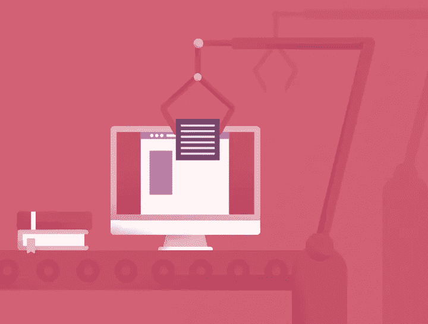
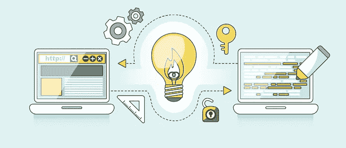

# 克服创建自己博客的障碍

> 原文：<https://medium.com/visualmodo/overcoming-barriers-to-starting-your-own-blog-da27910c20a9?source=collection_archive---------0----------------------->

你想创建自己的博客的原因有很多，这可能是一个非常值得的尝试。如果你有分享你的想法和想法的冲动，但还没有采取行动，有几个可能的障碍阻止你采取行动。尝试任何新事物可能是一种可怕的经历，但对于博客来说，最糟糕的情况是没有人阅读它！另一方面，想想博客丰富你生活的所有方式。如果你能找到克服阻碍你的问题的方法，你也可以享受拥有自己的博客的回报。

# 你自己博客上的障碍

# 我不是作家

的确，有些人似乎比其他人对文字更自然，但这并不意味着你不能学习写作的技巧。互联网上有各种各样的课程和帮助指南，可以向你展示优秀写作的基础。如果你担心自己在写作基础方面的能力，你也可以使用拼写和语法工具来帮助你。一旦你对自己的写作变得更加自信，你就可以开始使用成功博客作者的提示和建议来完善你的写作，这些提示和建议也可以在网上获得。不要担心你的文章每次都很完美，大部分读者不会注意到那些奇怪的错误，即使他们发现了错误，只要内容足够吸引人，他们也不会因为不完美的文章而却步。

# 谁会对我写的东西感兴趣？

互联网将人们与最具体的兴趣联系在一起，所以无论你想写什么，只要你对一个主题有所贡献，就会有潜在的受众。即使你和你的朋友和家人是唯一读过你博客的人，你仍然会从创建一个关于你最喜欢的主题的永久记录中获得巨大的成就感和满足感。大多数成功的博客作者创建博客是因为他们想与其他人分享他们的兴趣、[知识和经验，而不是因为他们想发财或拥有成千上万的追随者。他们的成功是日积月累的，经常让他们大吃一惊。](https://visualmodo.com/)

# 我负担不起自己网站的费用

如果你不知道任何更好的，它会很容易假设一个网站可以花费数千美元来设计和维护。当然，花大量的钱在一个专业设计的网站上是有可能的，这个网站拥有你能想象到的所有聪明的功能，但是你现在考虑的是开一个简单的博客。建立你自己的 WordPress 博客的成本可能比你想象的要便宜得多，免费选项和增强功能每年不到 100 美元。对于一个简单的博客，你根本不需要找到太多的投资，所以在你以费用为由放弃这个想法之前，看看一个博客实际上会花你多少钱。如果你有经济困难，甚至这个数目令人不快，那么花些时间来解决你的情况，努力改善你的财务状况。首先，为你所有的收入和支出建立一个详细的预算，看看你如何能更有效地管理你的钱。利用一个权威的财务规划网站来获得如何重建信用评级的建议，当你对自己的财务状况感到更放心时，再重温一下成为一名博客写手的愿望。你可能想写关于你的理财经历的博客，并为其他正在为现金流而挣扎的人提供建议和支持——这正是能引起读者共鸣的个人故事。

# 我不知道该写些什么

对于喜欢写博客的人来说，纠结于他们真正想写什么并不罕见。这通常是对你的专业知识缺乏信心的表现。例如，如果有成千上万的博客报道旅游、时尚和美容，你可能会想你能贡献些什么。首先，你应该为自己写博客，而不是担心潜在读者想要什么。最好的作品来自于追随你的激情，而不是试图取悦观众。例如，那些创建博客的人，因为他们被告知这是你推广业务所需要做的，而不是一个真正作家的兴趣和热情，往往以枯燥乏味的销售广告告终，这些广告对任何人都没有吸引力，只是在营销待办事项列表上打勾。第二，你总能从一个新的角度切入任何话题，比如为某个特定的领域写作，或者对某个主题形成独特的观点。例如，你可以在人生的某个特定阶段关注时尚和美丽，或者专门带孩子去旅行；无论你对什么有热情，有什么有用的知识可以分享。

# 我没有时间

如果你是为自己，或许是为几个朋友和家人写作，你可以随心所欲地频繁或不频繁地发表博客。因为这是开博客的最佳方式，所以没有理由让时间的缺乏阻碍你。随着你变得越来越有经验和自信，你会发现你可以在半小时或更短的时间内写一篇像样的文章。如果你想扩大你的受众，你需要定期发帖——如果可以的话，大部分时间都要发帖——但是一旦你进入状态，你会发现这已经成为你日常工作的一部分。

如果你真心想成为一名博客写手，那么所有阻碍你的障碍都可以迎刃而解。这可能需要一些时间来获得技能，对投资感到高兴，并开始建立受众，但这是一个非常值得的努力——谁知道呢，如果你的博客变得足够受欢迎，你甚至可以开始从中赚钱！