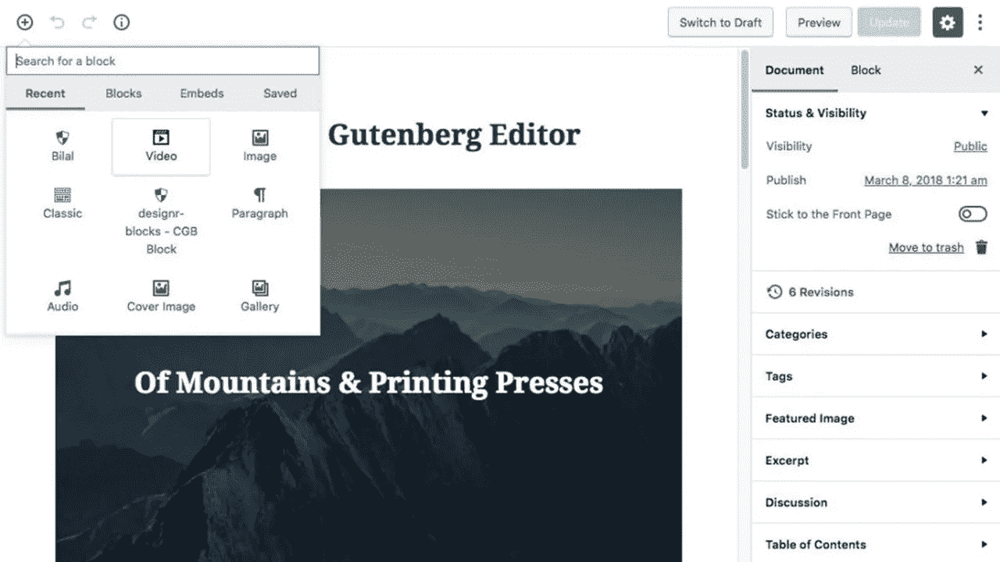

# 页面生成器插件在 WordPress 5 Gutenberg 中的用法

> 原文：<https://medium.com/visualmodo/page-builder-plugins-usage-in-wordpress-5-gutemberg-3cf76ab42ff2?source=collection_archive---------0----------------------->

在今天的视频中，我们将解释如何在 WordPress 5 (Gutenberg)更新中继续使用你最喜欢的 WordPress 拖放页面生成器插件，用一些简单易行的方法，这样你就可以在新的 WordPress 5 界面中找到它的元素。
下载 WordPress [主题](https://visualmodo.com/)完全兼容 WordPress 5+。

如果你关注 WordPress 新闻，你肯定已经听说过古腾堡了。自从 2017 年 6 月发布测试版以来，它一直是人们关注的焦点。如果你没有跟上社区的发展，没有人会责怪你没有听到太多。

前端页面生成器使用视频指南[此处](https://www.youtube.com/watch?v=C2jwX34iZTE)。
后端页面生成器使用视频指南[此处](https://www.youtube.com/watch?v=9RDGjz5bGws)。

# 页面生成器插件在 WordPress 5 中的用法

如上所述，Gutenberg 是 WordPress 5.0 即将推出的全新帖子编辑器的代号。这是我们要对付的东西的图像。

正如你所看到的，有一个巨大的用户界面差异。你喜欢的所有功能都还在，但是你如何使用它们已经完全不同了。也将会有新的特性，但是 Gutenberg 仍然是一项正在进行的工作，所以任何完整特性列表的尝试都是不可靠的。

同样的工作可以发送给所有的主题和插件开发者，他们需要更新他们的作品，就像我们为所有的 Visualmodo WordPress 主题所做的那样

# 最后的话

如果 WordPress 想要继续发展，甚至保持它在全球 CMS 领域的地位，它必须继续发展。我们拥有超过四分之一的网站，但是如果我们不继续创新和探索新的方法来提供最好的网站创建体验，这个数字只会越来越小。