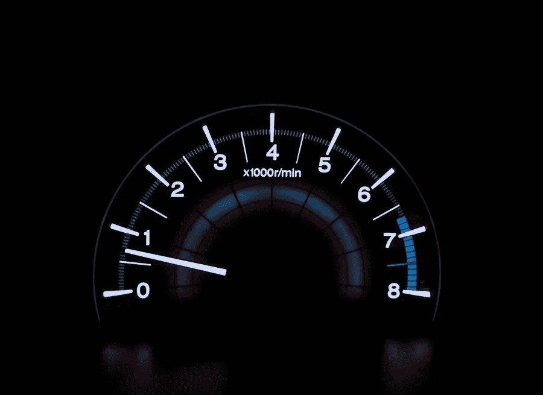

# 优化 WordPress 网站的页面速度测试

> 原文：<https://medium.com/visualmodo/page-speed-test-optimizing-wordpress-sites-c95282cb5930?source=collection_archive---------0----------------------->

加载时间是描述一个特定网页整体加载所需时间的指标。这个过程包括 HTML，但也包括所有的 CSS 代码、脚本、图像和网站上可以找到的第三方资源。在这篇文章中，我们将探索如何使用页面速度测试结果来优化你的 WordPress 网站。

我们可以将加载时间定义为从用户开始浏览页面到所有页面内容加载完毕之间的时间段。事实上，理想情况下，一个高性能的页面应该在不到两秒的时间内加载。对于移动页面来说尤其如此，因为它的加载时间最长。

# 页面速度测试

运行页面速度测试就像访问一个网站并在框中输入你网站的 URL 一样简单。然后速度测试会分析你的网站并给出建议。有许多不同的速度测试工具，但这里有几个值得一看。

Pingdom 有一个用于速度测试的工具，它可以让你在世界不同的地方进行测试，或者从离你比较近的服务器进行测试。例如，如果你的目标是本地用户，这是一个很好的方法来看看你的网站对他们来说有多快。

[谷歌灯塔](https://developers.google.com/web/tools/lighthouse/)是一个性能工具，存在于 Chrome 浏览器的网络开发工具中。要访问它，右键单击页面，选择 Inspect 并在浏览器中打开的新窗口中检查 Audits 选项卡。在这里，您可以测试移动设备或台式机的速度，以及不同的带宽和连接速度。

在 Lighthouse 出现之前， [Google PageSpeed Insights](https://developers.google.com/speed/pagespeed/insights/) 是一个寻找速度提升的好方法——现在仍然如此。它甚至可以让你为你的网站下载优化的图片、CSS 和 JS 文件。但是如果你正在使用 WordPress，你可能会发现很难用这些优化的文件直接替换你的文件。幸运的是，WordPress 有插件可以为你生成它们。

# 页面速度 x WordPress 插件

一旦你运行了页面速度测试，你可能会觉得你应该花一些时间来优化你的网站速度。你会得到很多建议，从你可以自己做的事情到一些你可能需要技术帮助的事情。

# 图像优化

图像通常在速度优化中起很大的作用，尤其是当你使用大标题图像的时候。或者如果你的网站整体上图片过多。优化这些图像总是一个好主意。如今，几乎没有质量损失就能做到。需要注意的一点是，就像上面的页面速度测试例子一样，图片实际上比它们在屏幕上显示的要大。如果你有一个覆盖整个屏幕的图像，并把它压缩成一个 300 x 200 像素的点放在你的网站上，你可能会使用几兆字节的图像。相反，你也可以在上传之前改变图片的尺寸。并以正确的尺寸和 KBs 的文件大小提供图像。通过减小文件大小，你可以提高网站的速度。

# 浏览器上的缓存

页面速度测试中经常出现的另一个问题是浏览器缓存优化。浏览器缓存是将网站文件，如 JS 和 CSS，存储在本地的 internet 临时文件夹中，以便下次访问时可以快速检索。或者，正如 Mozilla 所说:Firefox 缓存临时存储图像、脚本和你访问的网站的其他部分，以加快你的浏览体验。

# 优化 WordPress 中的图像

WordPress 也有很多图片优化插件(有付费的也有免费的)，比如 [Kraken.io](https://wordpress.org/plugins/kraken-image-optimizer/) 、 [Smush](https://wordpress.org/plugins/wp-smushit/) 或者 [Imagify](https://wordpress.org/plugins/imagify/) 。插件通常会从图像中删除 Exif 数据，这是一个好主意，因为 Exif 数据包括用于拍摄照片的相机设置的信息——对摄影师来说可能很有趣，但不是你在博客帖子中需要的图像。你也可以用这些插件把你的图像替换成质量稍差的图像。

其中一些插件还可以帮助你调整图片的大小。试用这些插件，看看哪个最适合你，哪个能最好地缩小你的图像文件。要了解更多关于图像优化的信息，请务必查看这篇关于图像搜索引擎优化的文章。

# WP 超级缓存

大多数速度优化插件帮助你使用缓存来优化你的站点。有时候就是这么简单:WP 超级缓存[的高级标签](https://wordpress.org/plugins/wp-super-cache/)有很多更深入的配置，但是从插件的默认设置开始通常是一个好的开始。之后，开始调整这些高级设置，看看他们做什么。

请注意，WP 超级缓存有一个选项，可以为他们所谓的“已知用户”禁用缓存。这些是登录用户(和评论者)，这允许在没有缓存的情况下进行开发(或评论)。这意味着每次在浏览器窗口中刷新网站时，您将获得该网站的最新状态，而不是缓存的版本。由于过期时间的原因，最后一个可能比较老。如果您将过期时间设置为 3600 秒，浏览器将仅在一小时后检查缓存网站的更改。例如，如果你想在开发过程中立即看到设计的变化，你就会明白这是多么的烦人。

# 图像尺寸

WordPress 有一个方便的默认功能，你上传的每张图片都以不同的尺寸存储。因此，如果你想让帖子中的所有图片宽度相同，请选择一个预定义的图片，或者在这里设置你的自定义尺寸。您上传的图像会根据这些尺寸进行缩放，原始尺寸的图像也可以使用。

这意味着，例如，如果您加载中等大小的图像而不是大得多的原始图像，这将提供较小文件大小的图像，加载速度会快得多。

# 其他 WordPress 缓存插件

我在这里说的是 WP 超级缓存，因为它至少对大多数人来说是免费且易于使用的。但是还有其他选择。 [WP 最快缓存](https://wordpress.org/plugins/wp-fastest-cache/)也很受欢迎，活跃安装数超过 60 万。它有类似的特性来优化缓存。

我还喜欢的一个付费插件是 [WP 火箭](https://wp-rocket.me/)。它很容易配置，你会怀疑你是否错过了什么。但是你的页面速度测试会告诉你它开箱即用。有更多的高级设置，你可以微调你的网站。但在我们开始讨论之前，我们需要先谈谈压缩。

# 压缩文件

你的页面速度测试工具可能会告诉你尝试缩小你的 CSS 文件。缩小你网站的 JS 文件。缩小您的 HTML 文件或启用(GZIP)压缩

这些建议都与压缩有关。这是关于在将文件发送到浏览器之前使它们尽可能小。这类似于减小图像的文件大小，但对于 JavaScript 或 CSS 文件，甚至是一个页面的 HTML 文件。 *GZIP* 压缩就是将一个压缩文件发送到你的浏览器，你的浏览器可以解压并阅读。你的速度测试的建议可能是这样的:

同样，许多正确的设置在默认情况下是打开的，类似于 Yoast SEO，但甚至更多，可以根据您的需要进行配置。您的 web 服务器的设置也可能会影响压缩的效果。

如果你使用这些插件之一，但你的压缩优化仍然不能正常工作，联系你的托管公司，看看他们是否能帮助你。一个像样的主机应该能够帮助你，尤其是如果它是这些 WordPress 托管公司之一。

# CSS & JS

速度测试通常会告诉你合并(外部)CSS 或 JavaScript 文件，或者推迟解析脚本。这些建议与如何将这些文件提供给浏览器有关。

正如你在上面的 WP Rocket 截图中看到的，这些文件的合并选项不建议用于使用 HTTP/2 协议的[网站](https://awards.visualmodo.com/)，该协议允许同时加载多个脚本文件。但是组合这些文件对于非 HTTP/2 站点来说仍然是好的，因为它减少了服务器请求的数量，这再次使您的站点更快。

推迟脚本或建议，如“消除重叠内容中的渲染阻塞 JavaScript 和 CSS”，是关于这些脚本在模板文件中的加载方式。如果所有这些都是从你的模板的顶部提供的，你的浏览器将等待显示你的页面(的某些元素),直到这些 JavaScript 和 CSS 文件被完全加载。有时将不太相关的脚本转移到模板的页脚是值得的，因此您的浏览器将首先显示您的网站，然后添加由 JavaScript 或 CSS 文件控制的增强功能。一个插件可以帮你做到这一点，那就是[脚本到页脚](https://wordpress.org/plugins/scripts-to-footerphp/)。警告:仔细测试。更改这些文件的加载方式会影响您的网站。事情可能会突然停止工作或看起来不同。

# 速度测试和 CDN

内容交付网络缓存静态内容，如 HTML、CSS、JavaScript 和图像文件。这些文件不会经常改变，所以我们可以通过遍布世界各地的服务器从 CDN 提供这些文件，这样无论访问者身在何处，您都可以非常快速地将它们发送给他们。这就像旅行:行程越短，到达目的地的速度越快。这些文件也是如此。如果提供静态文件的服务器离你的访问者很近(很明显，服务器的速度也一样快)，那么对于访问者来说，站点的加载速度会更快。更多关于 CDNs 的[见此贴。](https://visualmodo.com/does-my-website-need-to-use-a-cdn/)

# 速度测试的结论

页面速度测试会给你更多的建议，我们已经在这里讨论过了。同样，你可能无法自己完成所有这些工作。如果是这种情况，从你的网站开发者或代理处，或者你的托管公司那里获得帮助。但最后，如果你想要一个快速的网站，WordPress 是一个很好的选择，因为有许多很棒的插件可以在页面速度测试后帮助你优化网站的速度！