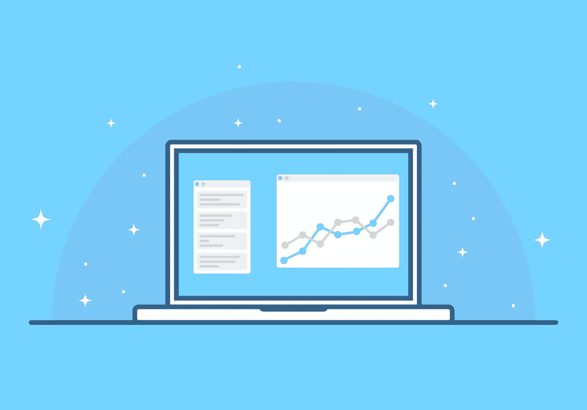

# 谷歌分析的页面浏览量解释

> 原文：<https://medium.com/visualmodo/pageviews-by-google-analytics-explained-f339711ffbfb?source=collection_archive---------0----------------------->

虽然我们不会说谷歌分析很简单，但是通过理解一些基本概念，你可以对你的网站有很多了解。让我们从用户、会话和页面浏览量之间的关系开始，并解释所有关于页面浏览量的指标。

# 谷歌分析浏览量解释

Google Analytics 有一个方便的功能，当你将鼠标悬停在问号图标上时，它可以解释某个指标或维度是什么。根据谷歌分析，浏览量的定义是:浏览量是被浏览页面的总数。单个页面的重复浏览被计算在内。

根据谷歌的谷歌分析支持网站，页面视图是:页面视图(或页面视图点击，页面跟踪点击)是一个页面在浏览器中被加载(或重新加载)的实例。页面浏览量是一个指标，被定义为总页数。

这是一个非常简单的解释。所以，假设你有一个关于基础搜索引擎优化课程的页面:页面浏览量会显示给定时间段内该页面被浏览的次数。该指标本身并没有说明有多少访问者看到了该页面，或者该页面在每个会话中被查看了多少次。只是每个页面的总浏览量。这意味着一个访问者可以负责大量的页面浏览，并且一个页面可以在每个会话中被多次浏览。

# 更多指标

页面浏览量*可以*显示一个帖子或页面有多受欢迎。但是一个帖子有很高的浏览量并不一定意味着*很受欢迎。每次访问都有很多页面浏览量，这是一件好事吗？这是否意味着人们喜欢阅读你网站上的大量页面？还是说他们找不到他们要找的东西？一个好的数据分析师总是对他或她的数据很挑剔。一个单一的指标并不能告诉你很多；上下文提供了您可以使用的信息。*

说到上下文，你可能会想:*“为什么我在*[*Google Analytics*](https://visualmodo.com/google-analytics-wordpress-setup/)*的一个网格表中看不到‘会话’，‘浏览量’和‘用户’？*“Google[Analytics](https://en.wikipedia.org/wiki/Web_analytics)默认情况下不让你查看结合会话和用户的浏览量是有原因的。这一切都与谷歌分析收集数据的方式有关。谷歌分析数据是根据范围组织的。如果要添加自定义维度，您可以看到这四种不同的范围:

Lunametrics 写了一篇关于理解 Google Analytics 中的范围的博文，解释了为什么不能组合不同范围的度量。简而言之，他们说:永远不要将命中和会话级指标结合起来。因此，如果您创建一个显示页面浏览量和每页会话数的自定义报告，那么您得到的报告没有任何意义。因为会话有点击，但点击没有会话。

# 浏览量上下文

因此，如果你不能将用户和会话指标与浏览量结合起来，那么能做些什么来为浏览量指标增加更多的上下文呢？

# 独特的浏览量

首先，你可以看看独特浏览量相对于页面浏览量的数量。根据 Google Analytics 中的问号:Unique Pageviews 是指定页面至少被查看一次的会话数。一个独特的页面浏览量是每个网页的网址+网页标题的组合。

我认为这个定义需要更多的解释。假设一个访问者访问了一个关于基础搜索引擎优化课程的页面，然后阅读了一篇基础搜索引擎优化文章，然后再次访问了关于基础搜索引擎优化课程的页面。在此期间，搜索引擎优化课程的基本页面会被浏览两次。这两个在这个单一会话的浏览量将被添加到该页面的总浏览量。但是在单个会话期间，只有一个唯一页面视图将被添加到该页面的唯一页面视图总数中。

# 度量标准

事实上，如果您想查看一个页面的会话数量。最好的方法是看看独特的浏览量指标。如果您将页面浏览量除以唯一页面浏览量，您将得到特定页面在每个会话中被查看的平均次数。检查页面浏览量与唯一页面浏览量相差很大的页面是一个好主意。这意味着访问者在一次访问中会多次浏览这个页面。这可能表明该页面正在迷惑人们。但是对此也有其他的解释。

# 分段

通过查看每次访问的浏览量，创建一个细分市场。这让你可以比较不同的用户群，看看他们之间有什么不同。例如，页面浏览量超过 3 次的访问与页面浏览量少于 3 次的访问。

这两个群体来自不同的来源吗？他们读不同的文章吗？他们到底买不买东西？比较不同的群体有助于你更好地了解你的听众。

# 最后的话

页面浏览量可以让你追踪网站流量如何与你的网站互动。因为唯一页面视图在单个会话中过滤掉页面刷新和多个视图。您可以更准确地看到传入的流量。这让你更容易看到哪些页面驱动了最多的流量。人们真正感兴趣的内容。所有这些都应该告诉你在你的网站上放什么内容，并帮助你找出如何获得更多独特的页面浏览量。