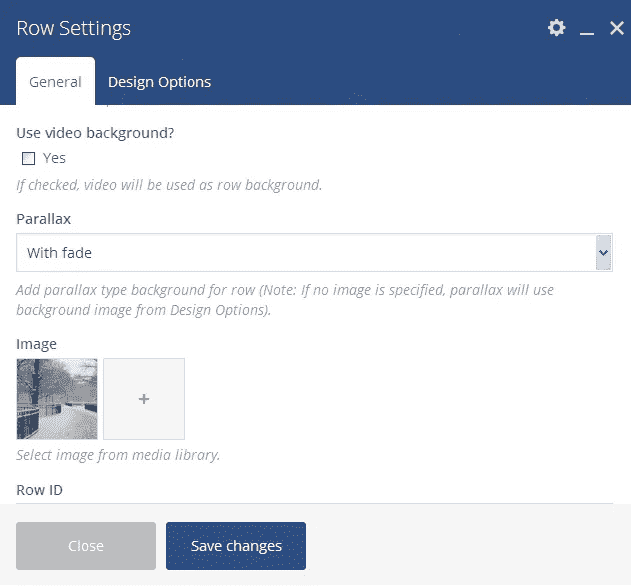
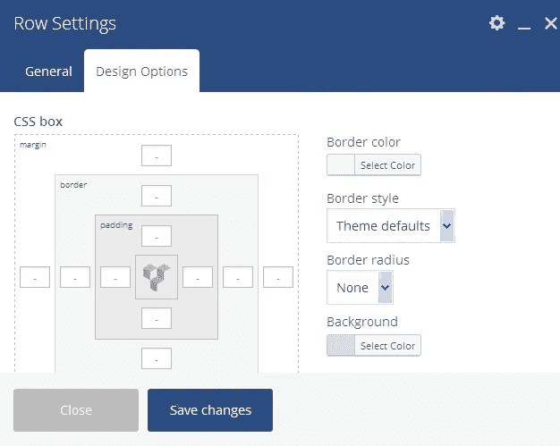
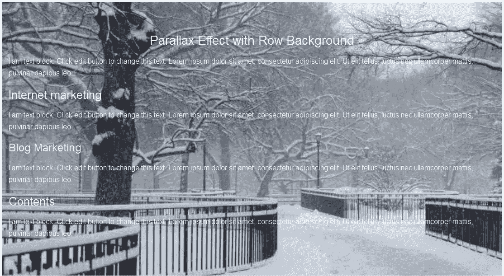

# 视觉合成器 WordPress 插件上的视差效果

> 原文：<https://medium.com/visualmodo/parallax-effect-on-visual-composer-wordpress-plugin-ec6dfa1c12b?source=collection_archive---------0----------------------->

Visual Composer 视差效果使用适当的颜色和背景图像使背景褪色。您可以使用 Visual composer 行设置选项轻松创建背景效果。这是一项非常简单方便的工作。

# 如何做一个视差效果？

请观看教程视频

要应用此效果，请打开站点的页面、帖子或首页，并使用 Visual Composer 进行编辑。你可以自由使用后端编辑器在你想要的情况下，两个系统都完美地工作。

现在点击“编辑行”并找到“视差”

现在搜索你想加在背景上的图片

# 设计选项

*   **CSS box:** 可以用 CSS box 在边距、边框、填充上添加像素。
*   **边框颜色:**选择边框颜色
*   **边框样式:**选择边框样式为点线、虚线或实线
*   **背景:**选择与背景图像融合的背景颜色。

最后点击“保存更改”,你就完成了

效果示例

# 结论

用 Visual Composer 很容易添加视差效果；您可以添加任何颜色到您的背景或选择图像作为您的背景。

# 看看它的实际效果

就像我说的，我们如此热爱 Visual Composer，以至于我们将它嵌入了我们最畅销的 WordPress [主题](http://theme.visualmodo.com/rare/)(购买时免费提供)。看看我们任何一个主题的现场演示的各个页面。您将在我们的现场演示中看到的大多数页面都是用 Visual Composer 创建的！添加背景，标题，文本，图像，图标…等等。都是“小菜一碟”。

# 你能在哪里得到它

如果你想自己下载，可以在 CodeCanyon 上找到 Visual Composer。它还完全集成了我们的[高级 WordPress 主题](https://visualmodo.com/wordpress-themes/)(以及其他三个价值 59 美元的高级插件——这比你为主题支付的费用还要多！).