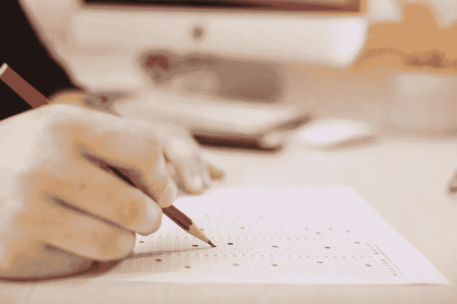

# 以高分通过 SY0–601 考试 CompTIA Security+认证

> 原文：<https://medium.com/visualmodo/pass-sy0-601-exam-with-high-scores-comptia-security-certification-d4d2d75bf8b5?source=collection_archive---------0----------------------->

在这本出版物中，您将学习如何通过模拟考试获得高分。最后，您的辛勤工作将得到 CompTIA security+认证的回报。

CompTIA Security+认证您提出网络解决方案和故障排除的能力。以及您处理在使用过程中可能出现的安全相关问题的技能。您的配置知识。有线或无线网络的管理也将通过测试来验证。

获得 CompTIA Security+证书是一个明智的步骤，将让您的 IT 职业生涯滚滚向前。获取信息安全和相关技能的专业知识。你必须参加资格测试，并证明你具备获得徽章的资格。你必须通过的考试是 CompTIA 考试-实验室 SY0–601。在本帖中，我们将简要探讨你需要知道的关于这个考试的所有信息。

# CompTIA SY0 501:完整指南

要通过这次考试，你必须完成 90 道题，可以是选择题，也可以是基于表现的题型。你必须在 90 分钟内完成。您必须在 100 到 900 分的范围内获得 750 分或以上的分数，才能通过此次认证考试。可以考英语和日语。因此，最好确保你至少能流利自如地使用其中一种语言。

这个 SY0–601 VCE 考试证明你处理网络和安全领域的能力。您需要具备足够的知识和技能来配置、设置和保护应用程序和网络。此外，还必须深入了解与网络安全相关的不同政策、法律和规则。您必须同时减轻或完全消除可能造成问题的威胁和风险。通过这项测试也将证明你拥有典型的正直品质。所以，尊重保密，因为这些是承担所有这些责任的必要特征。