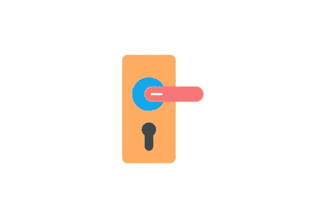

# 密码安全管理最佳实践

> 原文：<https://medium.com/visualmodo/password-security-management-best-practices-592a88e24ba6?source=collection_archive---------0----------------------->

黑客进入一个组织的敏感数据的最简单的方法之一就是简单地猜测某人的密码。当然，这可能过于简单化了，但大多数数据泄露都是密码泄露的结果。这就是拥有良好的密码管理实践以确保您的密码安全的重要性。如今，许多工作场所使用几个程序和软件，这意味着每个员工都有几个密码。这种环境容易被滥用，但是遵循这些密码安全管理最佳实践将有助于保护您的数据。

密码安全管理最佳实践

确保它们足够强大:密码安全实践

你知道在你的组织中有多少人使用他们第一只宠物的名字和 123 作为他们的密码吗？如果你不跟踪它，它可能比你想象的要多。如果您的员工对安全威胁不太了解，那么他们可能会认为童年时代的一些晦涩难懂的信息会成为足够强的密码。然而，黑客足智多谋，那些简单的话不会削减它。

如果您的员工选择自己的密码，他们至少应该有大小写字母、至少一个数字和至少一个特殊字符。为了更加安全，数字和特殊字符应该出现在除了结尾以外的任何地方，因为这是最常见的位置。

然而，这是最低限度。更好的办法是让密码管理软件生成一个随机密码。这样的话，任何人都不容易猜到，而且这也不是一个员工可以轻易说漏嘴的事情。

所有东西都有不同的密码

还记得你的职员小时候的宠物吗？它不仅通常是一个密码，而且也是他们访问的所有内容的密码。无论是电子邮件、客户关系管理还是员工档案，他们都使用相同的密码，并且可能用不同的数字来代替。这意味着，如果他们的密码被泄露，那么一切都可能被攻破。

他们使用的所有东西都应该有不同的密码。这包括他们可能访问的本地软件和软件服务。如果云软件服务出现漏洞，那么你不希望黑客能够访问你拥有的任何东西。