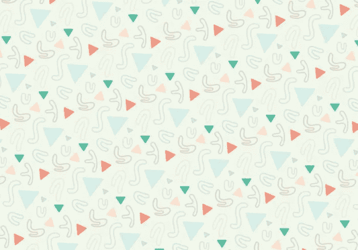
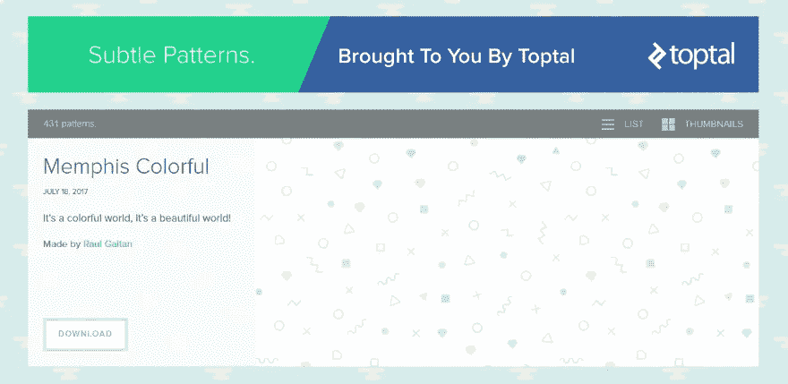
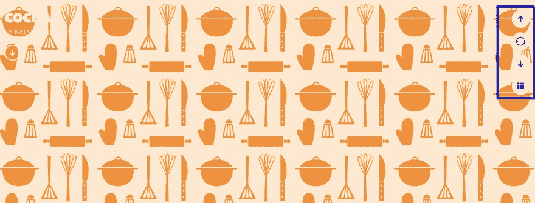
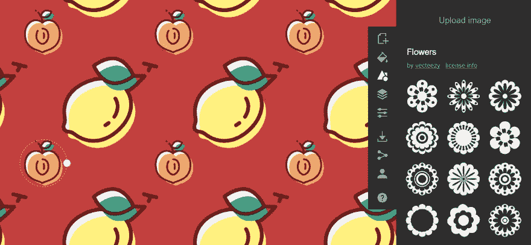
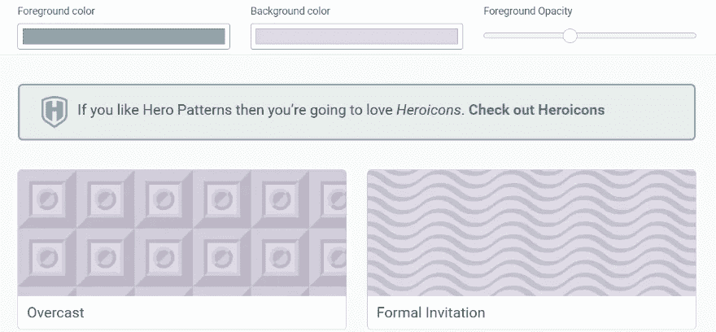
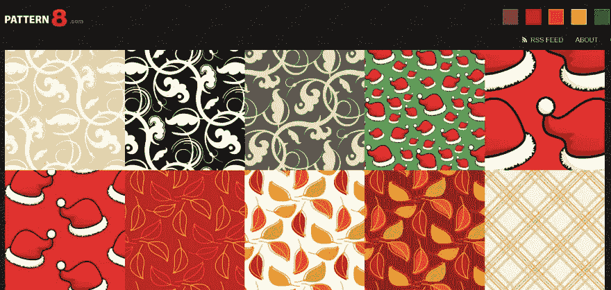

# 图案背景下载

> 原文：<https://medium.com/visualmodo/pattern-backgrounds-download-e8233513c79a?source=collection_archive---------0----------------------->

你是在找图案背景插图还是照片？我们已经为你找到了资源来下载它，并使用它来改进你的网站设计风格。

需要完美的图案背景来为你的网站增添趣味吗？如果使用得当，背景图案可以让你在不影响内容的情况下改进网站的设计。但是它们比纯色更容易使用。也就是说，你需要找到一个你喜欢的图案背景，然后才能把它添加到你的站点上。

为此，我将在这篇文章中给你五个很酷的地方，在那里你可以找到你网站的背景模式。

# 为你的网站找到一个图案背景的 5 个有用的地方

下面，你会发现一个网站列表，在那里你可以浏览各种各样的图案图像背景，你可以使用你的网站。这些不是特定的背景，而是可搜索的集合，你可以用它来找到高质量的背景。

# 1.托普塔尔的微妙模式

Toptal 的微妙模式是一个模式背景库，不出所料，它提供了微妙的背景模式，不会压倒你网站的其余部分。

在写这篇文章的时候，Toptal 的微妙的[图案](https://visualmodo.com/)提供了 431 种不同的图案背景，你可以 100%免费使用。为了使用这些模式，你需要做的唯一一件事就是在你的源代码中留下一份功劳**。你不需要把功劳放在你的前端网站上。**

使用该网站不需要注册——你需要做的只是点击**下载**来获得一个包含你所选背景的 PNG 文件的 ZIP 文件。

当鼠标悬停在一个图案上时，点击**预览**按钮，您还可以在细微图案网站上获得每个背景的实时预览。

**价格:**免费| [更多信息](https://www.toptal.com/designers/subtlepatterns/)

# 2.惊人的模式库

惊人的模式库是另一个有用的来源，可以为你的站点添加模式背景。用创作者的话说，“这个正在进行的项目汇集了最有才华的设计师们共享的模式，供你在设计中自由使用。”

并非所有的图案都像 Toptal 系列中的那些一样精致，但你仍然可以找到许多不错的选择，以及一系列其他风格。

要浏览模式，您可以使用右上角的向上或向下箭头，或者单击查看完全随机的模式。一旦你找到一个你喜欢的模式，你需要做的就是悬停在左上方直接下载文件。

**价格:**免费| [更多信息](http://thepatternlibrary.com/)

# 3.模式忍者

Patterninja 采用了一种不同的方法，因为它实际上是一种帮助你自己创建图案背景的简洁工具，而不是一系列预制的图案背景。

你可以上传自己的图片，也可以从现有的图片集中选择适合背景的图片。您还可以更改图像背后的核心背景颜色。

这个工具很容易使用，应该对设计师和非设计师都有帮助。

一旦你完成了你的模式，你可以把它下载成 PNG 或者 SVG 格式在你自己的站点上使用。

**价格:**免费| [更多信息](https://patterninja.com/)

# 4.英雄模式

Hero Patterns 是设计师 Steve Schoger 提供的免费图案背景资源。用他自己的话说，这是一个“可重复的 SVG 背景模式的集合，供您在 web [项目](https://visualmodo.com/)中使用。”

虽然该系列不像其他系列那么广泛，但确实提供了丰富的品种。你可以很容易地改变背景和前景的颜色，以及不透明度，就在网站上。

史蒂夫计划添加更多的背景，所以这个资源应该会越来越好。

**价格:**免费| [更多信息](http://www.heropatterns.com/)

# 5.图案 8

Pattern8 是一组可重复的背景图案，您可以免费使用。风格广泛多样，涵盖了从。

如果你知道一些其他的背景资料，请在下面的评论区告诉我们。