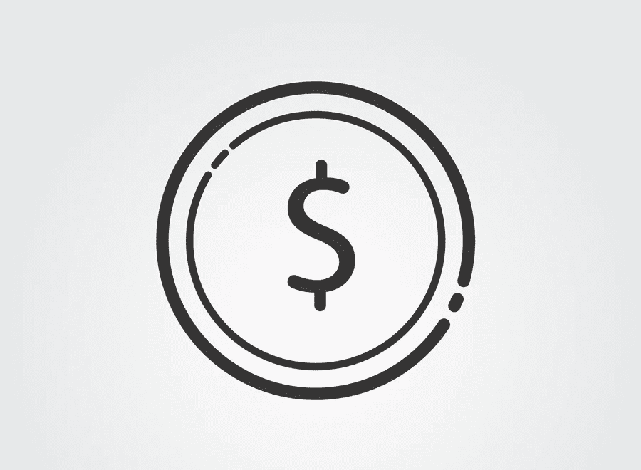

# 贝宝替代品:最佳支付解决方案

> 原文：<https://medium.com/visualmodo/paypal-alternatives-best-payments-solutions-ff199394cfa?source=collection_archive---------0----------------------->

PayPal 很棒，但它远不是唯一的选择。那么，你为什么想看看贝宝的替代品呢？好吧，这里有一些支付解决方案的主要缺点:所以如果你曾经发现自己在问，“我可以用什么作为贝宝的替代品？”我们抓住你了。

# 最佳 PayPal 替代品

# 转移方式

**最适合:**国际交易量大的个人和服务型企业。TransferWise 自称是“一种更便宜的国际汇款方式”,如果你进行大量的国际转账，它是一个很好的 PayPal 替代品。

PayPal 替代支付解决方案声称提供了“真实”的汇率，而没有增加额外的看不见的费用。在一笔 2000 美元的交易中，英国收款人的 TransferWise 成本比 PayPal 低 106.47 英镑。

但这还不是全部。这项服务的无边界账户为用户提供借记卡，允许你管理 40 多种货币的资金，运行工资单，批量支付，向客户收费等等。此外，通过 TransferWise for business，您可以用客户自己的货币向他们开具发票。那么 TransferWise 怎么能提供这么低的国际转账费用呢？

事情是这样的:假设你想为你在英国的朋友花 1000 美元。你的 1000 美元会存入 TransferWise 的美国账户。然后，他们会用实际汇率从 TransferWise 的*英国账户*给你的朋友汇去等值的英镑。

本质上，钱从来没有真正跨越国界！这也使得国际转账速度极快。**定价:**对于美元对欧元的转账，转账收费为交易金额的 0.6%，另加 1 美元。**应用:** iOS / Android

# PayPal 替代品:Payoneer

Payoneer 是自由职业者、博客作者和代销商的最佳 PayPal 选择。它让国际资金转移变得异常容易。

它提供 Payoneer 卡，可以用来进行国际支付和从当地的自动柜员机提款。此外，还提供一个虚拟的美国银行账户来接收全球支付。您也可以通过 Payoneer 从当地银行提款。这里有一些你可以用 Payoneer 做的事情。

*   首先，从 HostGator、Bluehost 等公司购买域名和虚拟主机。
*   其次，购买 Udemy 这样的公司的在线课程。
*   从亚马逊、ShareASale、ClickBank、CJ.com 等[附属网络](https://visualmodo.com/why-affiliate-marketing-programs-work-for-your-business-sales/)获得付款。
*   从 Fiverr、Upwork、99designs 等自由职业网站获得报酬。
*   最后，要求你的客户付款。

# Payza 支付解决方案

Payza 是一个受欢迎的在线支付平台，支持 190 多个国家和 21 种货币。虽然 Payza 在获得代销商支付方面没有太大帮助，但它提供了在用户内部发送和接收资金的最简单方式。Payza 的另一个优点是，它提供可充值的[预付卡](https://www.forbes.com/advisor/credit-cards/all/prepaid-and-debit/)，可以在任何接受信用卡的地方使用。但此功能仅在特定国家提供。

作为 PayPal 的替代品，Payza 拥有一些令人惊叹的商业功能。支付按钮、集中管理、购物车集成等有哪些？以下是博客作者可以用 Payza 做的几件事。

*   用 Payza 购买域名和虚拟主机。
*   通过 Payza 预付卡进行在线支付。
*   通过 Payza 推荐计划赚钱。
*   进行本地支付。

# 种类

最适合:需要直观灵活的 API(应用程序编程接口)的企业。Stripe 是最受欢迎的 PayPal 支付解决方案之一，尤其适用于在线业务。这种支付解决方案认为支付问题“根源在于代码，而不是财务”，他们认为自己是“开发者优先”的企业。

由于这个原因，该服务很容易使用其简单的 API 进行集成和定制。毫不奇怪，许多大型数字商业工具，如 Shopify，都有出色的条纹集成。(有关 Shopify 支付集成的详细信息，请单击此处。)

您可以接受来自世界各地的付款，Stripe 会自动将您的钱存入您的银行账户，此外，还提供移动支付。

不幸的是，交易费用与 PayPal 非常相似。总而言之，Stripe 的优势在于它的灵活性和可定制性。然而，对于那些没有多少编程知识的人来说，这可能是一个问题。定价:Stripe 收取交易价值的 2.9%外加 0.30 美元(点击此处了解详情)。因此，m it 仍然是最强的 PayPal 支付解决方案选择之一。