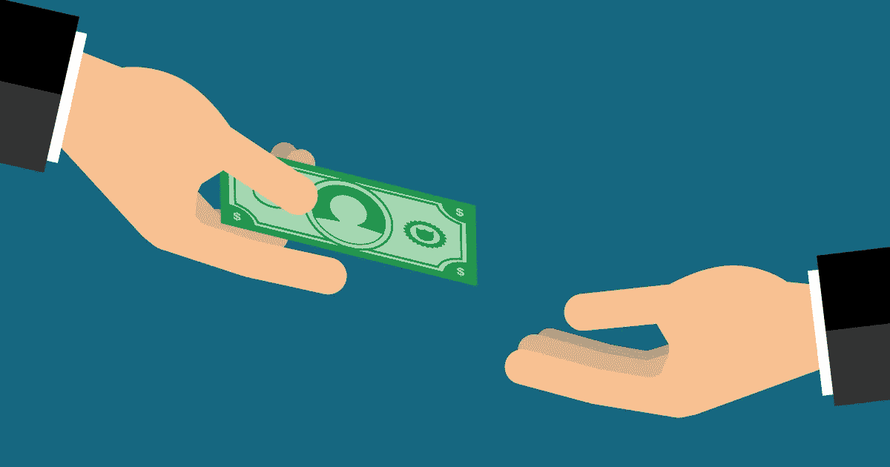

# PayPal 付款申请使用指南

> 原文：<https://medium.com/visualmodo/paypal-payment-request-usage-guide-a07e141d1d53?source=collection_archive---------0----------------------->

PayPal 有一系列支付和收款的选项，无论你是想还朋友的钱，还是给客户开账单。PayPal 付款请求是请求付款的一种方式。你可以用几种方法来使用它。

作为一名博客写手，我曾经要求我的客户在交易完成后把账单送过来。这是个好方法。但是有一个更好的方法——使用 Paypal 中的资金请求或发票选项。

如果你想知道“金钱请求”和“发票”之间的区别，这里有你的答案。金钱请求主要用于个人目的，如从朋友或家人那里获得付款。发票是用于商业目的的。它给你地方放公司标志，描述，项目编号，[运输](https://visualmodo.com/)等。

虽然资金请求是最简单的方法，但我更喜欢发票系统。它更专业。Paypal 让开发票变得异常简单。它有一个用于创建发票的内置模板。

一旦我开始给我的客户寄发票，它就能帮助我跟踪我的财务状况。它还能给人留下积极的印象，提高职业素养。所以我会建议使用这些贝宝功能在线支付。在这篇[帖子](https://visualmodo.com/blog/)中，我将分享如何通过 PayPal 发送汇款请求或发票。让我们从付款申请选项开始。

# 如何在 PayPal 中发送付款请求

发送汇款请求是最快的方式。以下是如何在 Paypal 上申请款项。

# 注册

首先，登录你的 Paypal 账户，点击标题中的“发送和请求”。

# 付款申请

在下一页上，点击“请求资金”部分的“来自任何人的请求”。

然后你需要输入电子邮件，手机号码或姓名的人，你会得到付款。通常，我使用电子邮件。现在输入电子邮件地址并点击“下一步”按钮。

# 金额和注释

然后输入金额并选择货币。顺便说一句，你会被收取少量的费用来收到钱。费用为 0.30 美元，另加金额的 1.9%至 2.9%。*费用可能因您所在的国家而异)

写便条不是强制性的，但可以让付款人明白目的。然后点击“要钱”。您将收到成功通知。您可以在您的帐户摘要中看到待处理的请求，从中您可以发送提醒、编辑金额或取消请求。

# 发票

使用付款请求有利于从朋友或家人处获得付款。但是涉及到专业支付，就要用 Paypal 的进销存系统了。Paypal 有一个内置的发票生成器。以下是如何使用 Paypal 生成发票。

# PayPal 帐户

首先，你需要登录你的贝宝账户，点击标题中的“发送和请求”。

# 发票创建

在下一页，点击“申请款项”部分的“创建和管理发票”。然后您将被带到 [Paypal 发票](https://www.paypal.com/invoice/)页面。只需点击“创建新发票”。然后你需要为你的发票创建一个模板。

为了创建模板，[上传](https://awards.visualmodo.com/)你的公司标志( **1** ，输入电子邮件地址( **2** ，输入描述、数量和价格( **3** ，在收据上写一个注释( **4** ，然后点击预览( **5** )，看看你的发票在收件人看来会是什么样子。

注意了；您将被收取少量费用，以通过发票收到款项。费用为 0.30 美元，另加金额的 1.9%至 2.9%。

# 发票交付

如果您对您的发票满意，只需点击发送按钮。这就是你如何在几分钟内创建一张看起来很专业的发票。你可以在你的 Paypal 摘要上看到发票，在那里你可以发送提醒或编辑金额或取消发票。

# 最后的话

我希望这篇文章能帮助你在 Paypal 上发送汇款请求或创建发票。

现在我想听听你的意见。你如何从你的客户那里得到报酬？你使用任何其他选项吗？通过评论让我们知道。然而，如果你觉得这篇文章有用，请帮我在脸书、Twitter 或 Google+上分享这篇文章。