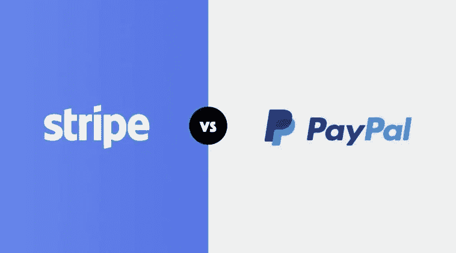
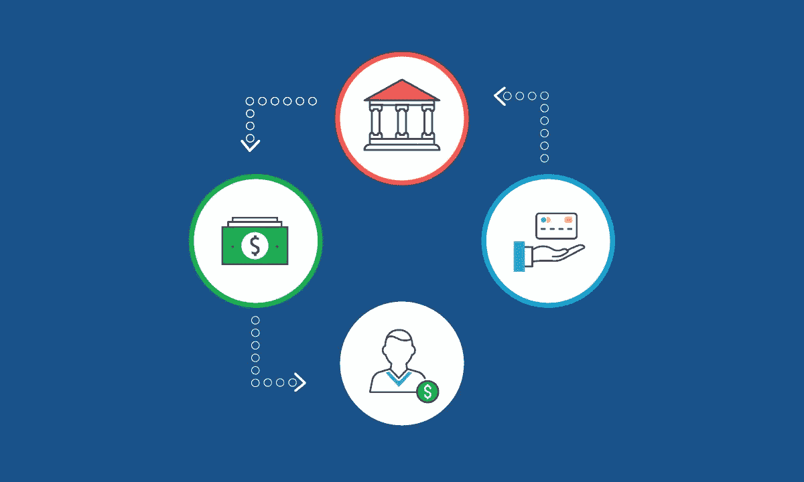

# PayPal X Stripe:门户之战

> 原文：<https://medium.com/visualmodo/paypal-x-stripe-gateway-battle-83346edb2500?source=collection_archive---------0----------------------->

让我们彻底回顾一下 Stripe x PayPal。我们将比较交易和服务费、API、安全性、客户服务和所有方面，以帮助您选择支付网关。

当你在网上购物时，你的付款很有可能会通过 PayPal 或 Stripe。除了像 Amazon Pay 这样的支付网关之外，Stripe 和 PayPal 确实是这个市场的大玩家。如果你在网上卖东西，你最大的选择之一就是如何付款。这种选择通常可以归结为 PayPal 和 Stripe。

你可以从任何一个支付网关获得很多相同的好处(你得到钱，是主要的一个，并且 [PayPal](https://www.paypal.com/us/webapps/mpp/paypal-fees) 和 [Stripe](https://stripe.com/us/pricing) 都有类似的费用)，但是有一些主要的差异，使 PayPal 和 Stripe 的选择成为你应该考虑的所有事实。毕竟，你的生意就是你的生计，我们只希望它越来越好。

# PayPal x Stripe:门户之战

# 贝宝

PayPal 是互联网上最古老的支付平台之一，正因为如此，它几乎无处不在。它的要点很简单:这是一个在线的一站式支付钱包。用户给他们想要的任何信用卡和/或银行账户和/或地址，他们就可以在你的商店里疯狂购物了。

# PayPal 专业人员

就像我上面说的:PayPal 无处不在。在很多方面，它已经成为事实上的网上支付方式。在大多数情况下，人们可以选择信用卡支付或贝宝。对你来说，**意味着你的** [**客户**](https://visualmodo.com/) **可能已经有了 PayPal 账户**。因此，他们按下一个按钮来支付，你得到你的钱和他们的地址和所有其他相关信息的权利和有。

PayPal 还提供了大量的买家和卖家保护，让你通过具体的精心设计的程序来解决纠纷。

**很简单**。也不仅仅是从客户的角度。从你的角度来看，PayPal 是很多插件和电子商务解决方案的默认支付方式——如果不是唯一的方式。在许多情况下，你需要做的就是准备好一个账户，然后输入你的电子邮件地址。做完这些，你就可以拿到钱了。看到了吗？简单。

报告、分析和其他工具触手可及。您可以在 PayPal 仪表盘中找到您需要的任何信息。点击几个按钮，运行几个报告，您就可以将几乎任何您需要的数据导出为 PDF、CSV、TAB 或 QuickBooks 格式。

**贝宝生活在你生活的任何地方。**我的意思是，大约有无数个国家可以使用 PayPal。如果你生活在 200 多个[国家中的一个](https://visualmodo.com/)并且/或者使用或者想要接受他们 25 种公认货币中的一种，那你就很好。PayPal 为你提供了一张最大的网，无论你在哪里，也无论你卖给谁，你都可以从中获得支付。

# 贝宝骗局

虽然在大多数情况下，你不需要单独的贝宝账户来支付，但这是非常必要的。**有些人不想要 PayPal 账户**，只想把他们的卡号扔在你的店里。如果 PayPal 是你唯一的支付选择，那么单单这一点就会吓跑一些人。

**PayPal 有点像它自己的生态系统。**所有事情都在他们自己的平台上处理，你只需为你的顾客链接到他们，他们就会被重定向回你的商店。这带来了一系列问题，其中最常见的是重定向被中断，销售不稳定。

**顾客通过支付宝付款**。就是这样。当然，它可以连接用户的银行账户和信用卡，但没有 Apple Pay、Android Pay、比特币或其他加密货币支付。如果它没有在 PayPal 的生态系统中得到保护，那么它就不是你用户钱包的一部分。

# 种类

有很多不同的支付网关不是 PayPal，但 Stripe 是其中最大的一个。它是处理各种不同货币和支付类型的主要网关。它们不像 PayPal 那样是一个前端品牌，在 PayPal 你有一个账户。他们只是一个幕后处理器，你的客户只会与你的网站互动，而不是 Stripe 的。

# 条纹优点

Stripe 是一个简单明了的支付网关。他们处理信用卡付款。他们就是这么做的。由于这种单一的关注，你可以获得比 PayPal 更多的支付选择，包括比特币、Apple Pay、Android Pay、支票、所有主要公司(全球)的信用卡和借记卡，以及 ECH 和电子转账。你拿什么都取决于你自己。**你完全控制着条纹**。他们只是为你处理付款。

**无数 API 集成**有了 Stripe，触手可及。您可以将 Stripe 的仪表盘与大量软件无缝集成，而不是仅仅依赖其内部报告和分析。除了为基于 Ruby、React Native、Laravel、Angular、Vue 和许多其他平台的平台提供专用库之外，[还为 WordPress](https://stripe.com/docs/libraries#third-party-plugins) 、Drupal、Joomla、Magento 和其他平台提供官方插件。

大公司使用 Stripe 作为他们的支付网关。当塔吉特、安德玛、蓝围裙和脸书使用条纹时，你就知道它至少值得一看。

# 条纹弊

让我们在这里完全诚实:**获得条纹设置可以是一个总的痛苦。设置过程让许多人尖叫着跑回到 PayPal 的怀抱。(或者[方](https://squareup.com/)，但那是完全不同的岗位)。Stripe 需要大量的 API 密钥杂耍，并且您的站点绝对必须被 SSL 锁定，无论如何它都应该被锁定。如果你在 WordPress 上，有大量的插件可以帮助你减轻一些痛苦。您仍然需要熟悉文档和过程，这也是您应该做的。**

**并不是世界各地都有**。他们正在努力扩大他们的网络，但如果你不生活在他们支持的国家之一，你根本不能接受付款。但是，如果 Stripe 支持您的国家，您可以从任何地方付款。例如，如果你在南非，这是不支持的，你不能从美国或其他地方付款。但是如果你在美国，你可以从南非的顾客那里获得付款。

# PayPal vs Stripe 该不该选？

**老实说，两个都用。**你希望你的顾客有尽可能多的付款选择，而人们对如何付款有自己的偏好。这种方法的唯一缺点是，您必须维护两个独立的服务并保持数据有组织，这只是要做的额外工作。这意味着你团队中的某个人要承担更多的责任，但是这也很有可能比把自己限制在一个人身上有更大的投资回报。

如果你想要简单易行的解决方案，你应该选择贝宝。如果你只需要获取支付信息，而不需要担心很多无关的细节，那么使用 PayPal 是不会错的。它是大多数平台的标准配置，人们可以马上开始向你支付费用。您可以稍后添加条带集成，因此从 PayPal 开始可能是个好主意。

如果你想要一个完全集成的支付系统，你应该选择 Stripe。开始行动要复杂得多。一旦你这样做了，它往往会在后台运行得相当稳定和安静。您的客户可以从 Stripe 获得更多支付选择。那些额外的插件、集成和文档使它成为了一个无处不在的明星服务。如果你需要一个快速启动的解决方案，Stripe 不是。

在 PayPal 和 Stripe 的争论中，是什么影响了你的决定？