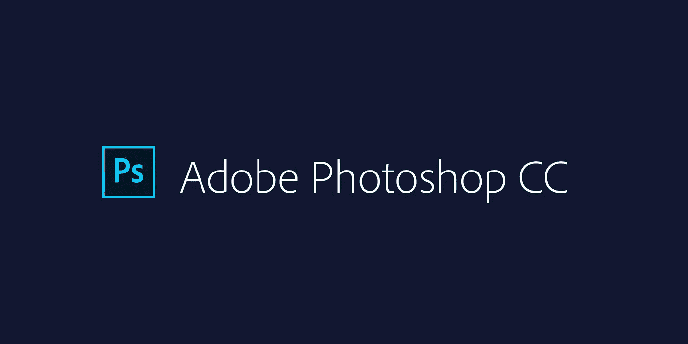
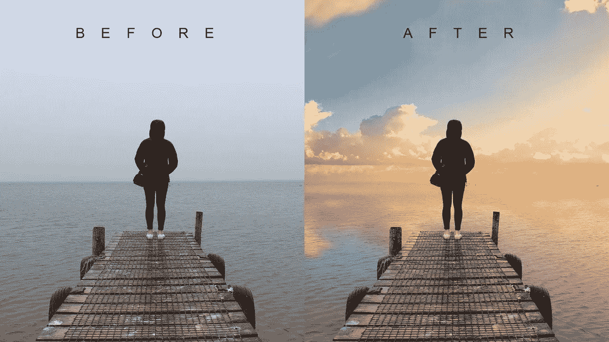
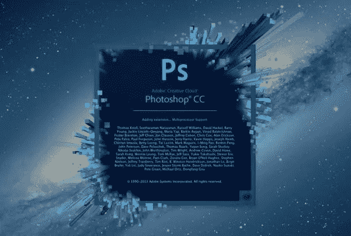

# 初学 Photoshop 的小技巧

> 原文：<https://medium.com/visualmodo/photoshop-tips-for-beginners-8440886db4bf?source=collection_archive---------1----------------------->

Photoshop 改变了我们改变想象力的方式。如果你对任何数字工作场所感兴趣，学习 Photoshop 会有很大帮助。今天的 Photoshop 无疑是一个创意中心，几乎每个数字领域都是如此；从网页设计到动画；从摄影到数字杂志，是紧密相连的。今天说到摄影，没有 Photoshop 是无法想象的。

# 初学 Photoshop 的小技巧

良好的 Photoshop 技巧无法让一张平庸的图片变得完美，除非你对操作感兴趣。然而，它肯定可以帮助你将你最好的照片提升为一幅令人惊叹的杰作。学习 Photoshop 是一个缓慢的过程，要有足够的练习去尝试，毕竟是一门数字艺术。

在这篇文章中，我将带你了解一些基本的 Photoshop 修图技巧。这 5 个简单的 Photoshop 初学者技巧将是学习处理照片的良好开端。

# 学习键盘快捷键

学习键盘快捷键将有助于您加快处理工作流程。工具栏中不同工具的快捷键很少。一些最广泛使用的快捷方式是:

*   V =移动工具
*   f-切换显示屏幕模式
*   空格键=临时手动键
*   B —画笔工具
*   d-将前景色/背景色设置为默认值
*   X —在背景色和前景色之间交换
*   电子橡皮擦工具
*   s-压印或克隆工具
*   W —快速选择工具
*   ctrl+j-复制所选层

这里有一些最常用的 [Photoshop](https://visualmodo.com/) 快捷键。当你开始更多地使用该程序时，你对快捷方式的了解会逐渐增加。一旦你意识到最常用的快捷键，修图的速度会比以往任何时候都快。

# 色彩增强—饱和度与鲜明度

色彩是另一个领域，你可以尝试，同时提高你的照片。一般来说，当你开始摄影时，增强每张照片的颜色看起来很好，就好像这些颜色是从照片中说出来的一样。如果你能理解饱和度和活力之间的区别，那会更有帮助。转到图像菜单，并选择菜单下的调整

如右图所示，选择振动选项。菜单上有两个选项——鲜明度和饱和度。鲜明度增加饱和度较低的颜色的饱和度。此选项可避免黄色和橙色肤色。基本上，充满活力最适合[肖像](https://visualmodo.com/)。

另一方面，饱和度会均等地增加图像中所有颜色的强度。对于肖像或人物照片来说，这可能不是一个好的选择。我能推荐的是这样的:慢慢地从色彩增强的鲜明度开始，如果你想更多地提升色彩，稍后使用饱和度。

如果你比较下面的两张照片，你就会明白为什么充满活力只负责增加饱和度较低的颜色的强度，而饱和度则平等地增加所有颜色的强度。

# 添加插图

渐晕基本上是一种使画面边缘变暗的技术，这样眼睛更容易移到主体上。当你的中心有一个主题时，这个过程最有效。我们的眼睛倾向于移向图像中较亮的部分，而移向较暗的部分。这种技术将导致对象周围的黑暗空间。

有很多手动的方法可以在你的照片中添加晕影，但是我会告诉你如何通过 Photoshop T1 轻松地给你的照片添加晕影。转到顶部的滤镜菜单，选择“镜头校正”，然后选择右边的自定义选项卡。第三部分是添加一个小插图。向左滑动量来变暗，中点来调整圆圈的大小。4 .增加清晰度和细节

添加锐度是 Photoshop 初学者的另一个技巧。这将使你的图像看起来更详细。我建议用适当的值来详细描述你的大部分图像。但是，如果你要在脸书上上传图片，一定要用较小的值锐化或细化你的图片，因为它会压缩图片并添加一些细节，使它看起来更清晰。因此，当一张已经锐化的图像被上传到脸书时，它看起来会变得过于尖锐。

像任何其他技术一样，有许多方法可以在 Photoshop 中添加细节。我将向你展示一个非常简单的技术。一旦你理解了这是如何工作的，你就可以尝试一些其他的技术。

*   第一步。使用快捷键 Ctrl+J (PC)或 Command+J oP MAC 复制选定层
*   第二步。打开高通滤镜:滤镜>其他>高通在顶层
*   第三步。应用一个适当的值(只是为了看到图像中的边缘)并单击“确定”
*   第四步。将顶层的混合模式改为叠加
*   第五步。根据你的喜好调整图层的不透明度

图层混合模式

# Photoshop 滤镜库

滤镜基本上是自动效果，只需点击几下就可以应用到图像上。滤镜可以帮助您实现某些特殊效果或外观。Photoshop 中有各种滤镜，您可以单独选择，每个滤镜应用于不同的图像时会产生不同的效果。您也可以应用多个并堆叠它们。虽然我不怎么使用滤镜，但如果你是刚开始使用 Photoshop，探索一下还是不错的。稍后，当你更熟悉高级工具和技术时，你可以尝试从手动选项和控件中创建类似的效果。

要应用滤镜，选择图层，进入滤镜>滤镜[图库](https://visualmodo.com/)。在你使用任何滤镜之前，请确保你的图片是 8 位的。你可以通过进入图像>模式> 8 位/通道来实现

我希望这 5 个基本的 Photoshop 技巧能帮助你修饰和增强你的照片。如果你有其他适合初学者的，请在下面的评论中分享。