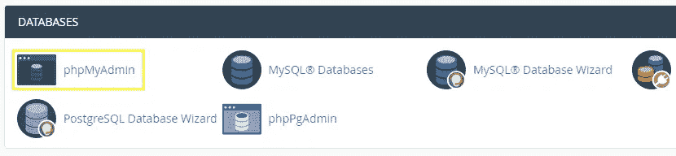

# PhpMyAdmin:完整的使用指南

> 原文：<https://medium.com/visualmodo/phpmyadmin-complete-usage-guide-36f2d28e1c68?source=collection_archive---------0----------------------->

如何使用 phpMyAdmin: A 是一个用 PHP 编写的免费软件工具，旨在通过 Web 处理 MySQL 的管理。phpMyAdmin 支持 MySQL 上的各种操作

除了最简单的网站，所有网站都使用数据库。在你的 WordPress 网站上发生的任何事情——不管它有多复杂——都会被记录到一个文件夹中。但是，有时您可能需要访问数据库内容并与之交互，如果没有合适的知识和工具，这通常会很困难。

这就是 phpMyAdmin(和 T2 等其他工具)的用武之地。这个用户友好的软件使你能容易地与你的数据库交互。在本文中，我们将讨论该软件做什么，如何配置它，以及它可以帮助您处理的一些任务。

# phpMyAdmin 简介

[phpMyAdmin](https://www.phpmyadmin.net/) 是一个基于 PHP 的开源工具，让你能够在线管理 [MySQL](https://www.mysql.com/) 和 [MariaDB](https://mariadb.org/) 数据库。要使用它，你需要在运行 Windows 或者它支持的几个 Linux 发行版之一的服务器上安装软件。

该软件使您能够管理任意数量的数据库。您可以编辑表和值，创建和删除数据库，甚至导入和导出它们。对于初学者来说，这个应用程序本身很容易上手，但是它提供了足够的深度，让你需要一段时间来掌握它提供的一切。

**主要特性:**

*   使用开源 web 应用程序管理您的数据库。
*   在基于 Windows 和 Linux 的服务器上设置 phpMyAdmin。
*   修改数据库中的任何值。
*   执行[结构化查询语言(SQL)查询](https://technet.microsoft.com/en-us/library/bb264565%28v=sql.90%29.aspx?f=255&MSPPError=-2147217396)以更有效地与您的数据库交互。
*   随意创建和删除数据库。
*   只需点击几下鼠标，即可导出和导入数据库。

大多数 WordPress 主机都将 phpMyAdmin 捆绑到他们的 [cPanel](https://cpanel.com/) 软件中。然而，一些托管服务，如[飞轮](https://getflywheel.com/)使用不同的工具，所以你的里程可能会有所不同。如果您运行自己的服务器，您可以自己设置 phpMyAdmin，我们将在下一节中讨论。

# 如何设置 phpMyAdmin(并配置其设置)

首先，如果您想在自己的服务器上设置 phpMyAdmin，对于那些有专业知识的人来说，这个过程并不复杂。如果你使用的是 Linux，你可以使用[一个简单的 *apt-get* 命令](https://docs.phpmyadmin.net/en/latest/setup.html#linux-distributions)来完成，而 Windows Server 用户可以[使用 Composer 工具](https://docs.phpmyadmin.net/en/latest/setup.html#installing-on-windows)进行简单的设置。

然而，你通常会在你的主机账户中找到最新版本的 phpMyAdmin。要访问它，导航到您的管理仪表板(通常是 cPanel 或 Plesk)，使用您的凭证登录，然后查找*数据库*部分——里面应该有一个 *phpMyAdmin* 图标:

点击它将启动应用程序。虽然您*可以*立即开始处理您的数据库，但是您应该先配置一些设置。例如，您可以从主屏幕的*外观设置*下更改默认语言和字体大小:

如果你愿意，你也可以改变 phpMyAdmin 的主题。根据您的主机，默认情况下，您应该只能访问几个主题，尽管其他主题也是可用的。当然，改变主题不会影响软件的功能，但如果你开始经常使用它，它会带来更好的体验。

# phpMyAdmin 可以帮助您完成的 4 项任务

在我们开始学习教程之前，请记住我们将关注与 WordPress 相关的任务。例如，我们不会讨论 SQL 查询，它非常复杂，需要更全面的文档记录。

使用 phpMyAdmin 可以完成的事情比我们在一篇文章中介绍的要多得多。如果你有兴趣进一步学习，你会想要查阅官方文件，其中包括你可能想知道的一切。

最后，如果你*打算*在 WordPress 的引擎盖下闲逛，记得做一个完整的网站备份以防出错。

# 1.检查 WordPress 数据库的状态

首先，phpMyAdmin 使您能够检查 MySQL 或 MariaDB 服务器的状态。为此，在 phpMyAdmin *中跳转到*状态*选项卡，而不用*选择特定的数据库:

在里面，你会发现你的服务器在运行时发送和接收的所有流量的摘要。还有并发连接的运行记录，甚至失败的尝试。如果你使用的是共享的[主机](https://visualmodo.com/)计划，你的数字很可能没有多大意义。这是因为你不是唯一一个使用 MySQL 服务器的人。然而，如果你运行的是私人服务器，这些数字应该更准确，它们可以帮助你确定你消耗了多少带宽。

在大多数情况下，如果您的数据库不可访问，您将根本无法使用 phpMyAdmin，因为该工具将无法建立连接。这也可能导致 WordPress 显示一个错误，说它不能连接到你的数据库，你可以在本教程之后修复这个错误。

# 2.访问和编辑你的 WordPress 数据库

访问你的 WordPress 数据库很简单——phpMyAdmin 在它的侧边栏上显示你现有的所有数据库，如果你只运行一个站点，应该只有一个选项。在我们的例子中，我们有几个这样的数据库，但是你可以识别 WordPress 数据库，因为它们的名字中经常包含 *up* :

默认情况下，WordPress 为其所有数据库使用前缀 *wp* 。但是，您可以更改设置(正如我们所做的那样)，使攻击者更难尝试访问您的设置。无论哪种方式，一旦你确定了你想要编辑的数据库，点击它。您将看到一个表格列表，其中包含易于识别的名称，如评论、用户和帖子:

例如，如果你想在 phpMyAdmin 中编辑你的一篇文章，你只需要点击 *wpca_posts* 表名(不是*浏览*按钮)。一旦你进入，你的文章应该按照他们的 id 顺序显示:

如果你想删除一个特定的文章，你只需要通过它的 ID 或 *post_title* 字段来识别它，然后点击该行的 *Delete* 按钮。或者，如果您想要编辑帖子，单击相应行上的*编辑*按钮:

在里面，你可以编辑与文章相关的每一个值，包括标题、内容、最后修改日期等等。每个值的名称都很容易理解，因此识别每个值应该没有问题:

完成更改后，向下滚动到屏幕底部，点击 *Go* 按钮保存更改。这也将使你返回到 *wpca_posts* 表格，在那里你可以重新开始一篇不同的文章。无论使用哪个表，编辑值的过程都是相同的，唯一改变的是它们对应的值。考虑到这一点，在编辑你不熟悉的字段时，你应该非常小心你在数据库级别所做的任何改变。

# 3.添加(和删除)WordPress 数据库

删除数据库是这两个过程中更简单的过程，所以这是一个很好的起点。要删除数据库，请转到 [phpMyAdmin](https://visualmodo.com/) 主屏幕，并在顶部查找*数据库*选项卡:

在里面，你会发现你可以访问的所有数据库的列表。如果您有适当的权限，您还会看到选择这些数据库并“删除”它们的选项(即删除数据库):

接下来，任何 phpMyAdmin 用户都可以创建新的数据库。如果你手动安装 WordPress，你需要创建一个空白的数据库来运行这个过程。为此，返回到*数据库*选项卡，并在屏幕顶部寻找*创建数据库*选项:

您可以为您的数据库选择任何您想要的名称——只要确保它是一个您以后可以识别的名称。当你准备好了，点击 *Create* 按钮，phpMyAdmin 会自动把你带到一个屏幕，在那里你可以把表添加到你的数据库中。暂时将其留空，转到*权限>* *添加用户帐户*、并点击它:

现在，为你的 WordPress 管理账户选择一个安全的用户名和密码，然后在*主机名*字段中输入 *localhost* :

然后向下滚动到用户帐户部分的*数据库，并勾选*授予 X 数据库*的所有权限选项。*“X”在本例中应该是你的数据库的名称。完成后点击 *Go* ，你的管理员用户就准备好了。现在你可以在你的服务器上执行 WordPress 安装程序了。安装程序会询问您数据库的名称、主机和帐户信息:**

在这一点上，你可以完成 WordPress 安装的剩余部分，你的网站就可以运行了！

# 4.导入和导出 WordPress 数据库

phpMyAdmin 还使您能够导入和导出现有的数据库。如果你想手动迁移一个 WordPress 网站，这很方便，因为你必须复制你的文件(例如使用一个 [FTP](https://visualmodo.com/) 客户端)和它的数据库。要导出数据库，从 phpMyAdmin 主屏幕的侧边栏访问它，然后在主菜单中查找 *Export* 选项卡:

在里面，你会看到进行*快速*或*海关*出口的选项。*快速*设置会自动包含数据库中的所有表格。选择此选项，并从下方的下拉列表中选择 *SQL* 格式，然后点击 *Go* :

这将自动下载一个包含数据库信息的 SQL 文件到你的计算机上。如果您想将它导入到不同的服务器上，只需在那里访问 phpMyAdmin 并查找 *Import* 选项卡:

在那里，您可以找到将 SQL 文件上传到服务器的选项。只需找到下载的文件并点击屏幕底部的 *Go* 按钮。phpMyAdmin 将上传该文件，并在您的服务器上创建该数据库的精确副本。

# 结论

简而言之，大多数 WordPress 用户不直接与他们的数据库交互。虽然该平台使您能够使用仪表板处理大部分日常任务，但了解如何手动调整数据库并无大碍。例如，如果你被锁定在网站之外，并且你不能重置你的密码，你可以在几分钟内通过诸如 [phpMyAdmin](https://www.phpmyadmin.net/) 之类的工具解决这个问题。

在这篇文章中，我们介绍了四种可以用 phpMyAdmin 执行的不同任务。让我们快速回顾一下:

1.  检查你的 WordPress 数据库的状态。
2.  访问和编辑您的数据库。
3.  添加和删除 WordPress 数据库(取决于您的权限)。
4.  将数据库导入和导出到不同的服务器。

关于如何使用 phpMyAdmin，你还有什么问题吗？下面评论区来说说吧！