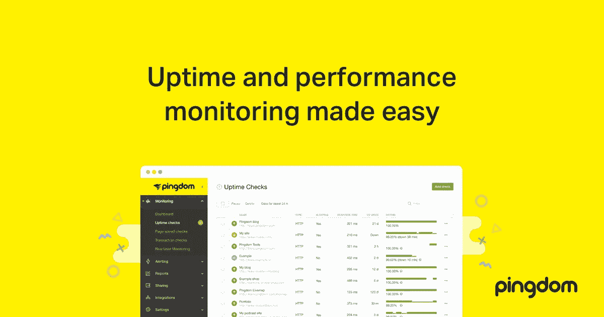

# Pingdom 网站速度测试

> 原文：<https://medium.com/visualmodo/pingdom-website-speed-test-62f7af1d494a?source=collection_archive---------0----------------------->

如何更好地使用和理解来自热门网站速度测试工具 [Pingdom](https://tools.pingdom.com/) 的数据？你可以用它对你的网站进行瀑布分析。这有助于您更容易地诊断性能问题，也不会误诊问题。我们看到很多次，WordPress 用户在 Pingdom 速度测试工具中错误地解释数据，这导致他们有时将他们的站点配置为比以前更差的状态。

老读者可能还记得，不久前我评论了我最喜欢的网站速度测试工具之一:GTMetrix。速度测试对所有网站所有者来说都是一项重要的任务，它提供了在不同情况下和一天中不同时间我们的网站加载速度的宝贵见解。

在本文中，我将介绍 Pingdom，这是目前最著名的网站监控和速度测试工具之一。乍一看，Pingdom 似乎是一个相对简单的测试工具——因为它看起来是基本的免费速度测试——但是一旦你注册了，就可以使用其他的功能。

从前面提到的免费速度测试工具以及如何使用它开始，让我们看看 Pingdom 提供的所有功能。

# Pingdom 免费速度测试

如果你需要的只是一个快速的网站分析，去 [Pingdom Tools](http://tools.pingdom.com/) ，输入你的网站的 URL，点击“开始测试”，然后等待结果。几秒钟后，您应该会看到类似这样的内容:

正如你所料，WinningWP 是一个优化相对较好的网站，所以列表上没有什么突出的问题。然而，以另一个网站——例如 wordpress.org——你会立即注意到一些问题。要更深入地研究每个问题，请单击扩展箭头(Pingdom 返回的每个问题的右侧)了解每个问题的更多详细信息。

当我完成一个项目的开发工作时，我会使用这样的速度测试。当你创建一个网站的时候，有太多的小事需要你去处理，忘记其中的一些是很正常的。诸如此类的工具让我能够处理每一个问题，并找到相应的解决方案。

然而，许多新手用户并没有意识到，测试不仅仅是你的网站主页是很重要的。你的一篇文章，产品和其他页面可能会给出非常不同的结果，当来自搜索引擎和其他链接到你的网站时，访问者很可能会到达这些类型的页面。

不过，Pingdom 给你的不仅仅是问题列表。您还可以按内容类型查看内容大小，按域查看内容大小，按域查看各种请求，以及以非常有用的“瀑布”格式查看所有文件请求。

Pingdom 没有给你(但 GTmetrix 给了)的一个工具是 PageSpeed 和 YSlow 分数的单独视图，但总而言之，Pingdom 给了你分析你的网站并使它更快的一切。Pingdom 网站最近也进行了更新，使其呈现得更加漂亮——让我们来看看:

# 洞察力

这是我在测试网站时最常用的部分——它就像一个清单，你可以通过它来使你的网站运行得更快。只需点击箭头即可查看详细信息，并按照指南解决问题。注意:在某些情况下，你可能无法控制将分数提高到 100%所需的一切，但这没关系——目标是尽可能多地打勾。如果你在努力结束时仍然有几个难以解决的黄色警告，不要紧张。

# 反应

如果你的网站已经建立并运行了一段时间，那么响应代码部分尤其有用，它会告诉你你正在页面上加载的所有资源的情况。200 和 300 级的状态通常是 A-OK，但是您需要清除所有 400 和 500 级的错误。

您还可以使用瀑布图(稍后将详细介绍)来找出是哪些资源给了您 404 和 500 错误，并采取适当的措施来删除它们或修改您的站点。

有四个表格为您提供了关于您的内容和请求的分布信息。

**按内容类型划分的内容大小**列出了按类型分组的所有资产——图像、脚本、CSS、HTML 等等——您可以使用这些信息来剔除任何明显的问题。在一个页面上加载 20MB 的图像通常意味着你应该优化你的图像，加载 2MB 的 JavaScript 意味着你需要更有效地使用脚本。

按内容类型划分的**请求**表显示了您的站点正在发出的请求数量——这是优化您的站点的另一种方式。如果您像这个测试站点一样正在拉 49 个单独的脚本，也许是时候将它们连接成一个(或至少几个)了。

**按域划分的内容大小**和**按域划分的请求**显示了关于内容来源的类似信息。您希望主要从本地资源或内容交付网络加载内容。如果你从站外资源加载大量内容，如果你的站点必须等待其他人缓慢的响应，你可能会降低站点的速度。

这个工具被各地的开发人员用来直观地了解网站如何加载以及瓶颈在哪里。它显示了丰富的信息，特别是如果您使用扩展箭头来获得每个请求的细节。

左边的图标表示请求的内容类型。如果响应不属于 200 类，您将会看到一个警告图标—将鼠标悬停在它上面可以获得更多信息。接下来，是请求 URL 和请求大小。最后，有一个水平条形图，向您显示何时以及如何加载资源。

条形图开始越靠右，资源加载得越晚。条形的长度显示加载时间，分为 DNS、SSL、连接、等待、发送和接收。

对于本地资源，关注连接大小是一个好主意。过长的连接时间可能表明您的主机有问题——假设您的站点配置良好。搜索那些阻碍网站加载的长条，或者带有冗长 DNS 或其他指标的外部资源——这些都应该被剔除。

# 高级功能

虽然免费版本看起来不错，但它并没有提供任何超越 GTmetrix 的实质性内容。然而，当你获得一个专业账户时，Pingdom 就变成了一个便利功能的发电站。让我们来看看你能用 Pingdom Pro 做些什么。

# 正常运行时间

正常运行时间监控(您的主机可能没有您想象的那么可靠)是 Pingdom 提供的最基本的监控类型。它由一个图表组成，该图表结合了平均响应时间和您的站点可能经历的任何停机时间。我最近更新了我的网站，让它离线了大约三天。看看 Pingdom 的反应:

作为一个快速测试，我关闭了我的网站 4 到 5 分钟，看看 Pingdom 是否能捕捉到它。正如你从底部的红色小点可以看到的，确实如此——我甚至在关闭网站后两分钟内收到了一封电子邮件。相当令人印象深刻！

正常运行时间报告显示响应时间日志、测试结果日志(来自多个位置)、下载 PDF、CSV 结果等。

# 表演

页面速度报告与网站上结合历史数据的免费工具相同——非常适合捕捉讨厌的趋势或与代码相关的缓慢。

# 报告

事务报告是 Pingdom 最强大的特性之一。它们可以让你确保跨多个动作和页面的用户交互顺利进行，对于网上商店、SaaS 应用程序和其他基于交互的网站来说是无价的。

这个想法是使用一个简单的编辑器来告诉 Pingdom 如何浏览您的站点以及如何检查结果。您可以指示 Pingdom 加载您的主页，检查它是否给出了 200 状态代码，填写一个搜索字段，然后转到一个结果。

注意:Pingdom 有一个关于事务报告以及如何设置它们的极好的[教程视频](https://help.pingdom.com/hc/en-us/articles/203910642)。我推荐看一看。

# 班长

页面速度测试往往是人为的。**你**在你的浏览器中加载你的网站，或者你使用外部服务比如 Pingdom 启动一个测试。这些都很棒，而且大多遵循现实中实际发生的事情——尽管并不总是如此。

真正的用户监控给你一点代码添加到你的网站——就像谷歌分析。添加后，您将看到**真实的**数据滚滚而来。你会看到你的网站为真正的访问者加载花了多长时间，而不是你或一些自动化的机器人。

真实的数据会给你提供远远超出可用测试地点的洞察力，因为你的访问者将来自世界各地。你可以为满意、宽容和沮丧的访问者设置加载时间条件，以更好地分割你的视图。

Pingdom 为您提供了一个开箱即用的基本警报系统。你可以收到电子邮件，基本的应用程序通知和短信。当我关闭我的网站时，我在两分钟内收到了一封电子邮件——这对我的目的来说已经足够了。

如果您正在使用一个大型应用程序，您可能希望使用 Pingdom 的 Beep Manager，它旨在“在正确的时间向正确的人发送正确的警报”。你将需要昂贵的高级帐户，但它可能非常值得你的投资。

您可以添加团队成员，设置谁会收到通知，安排维护时间，等等。我自己没有用过它，但是，基于 Pingdom 的 Beep Manager 视频，我正在考虑为我正在从事的一个[项目](https://visualmodo.com/wordpress-themes/)实现它。

您可以使用 Pingdom 的 API 为自己设置一些高级工具。目前，Liberato 和 webhooks 已经上市。当使用 webhooks 时，Pingdom 会将 POST 数据发送到您选择的 URL，您可以截取这些数据并随意使用。

您可以将 Pingdom 与您自己的事件管理工具集成，获得客户端网站停机的通知，创建您自己的统计信息面板，等等。

# 手机应用

Pingdom 有一个非常方便的免费移动应用程序(Android 和 iPhone 都有)，运行非常出色，看起来非常棒。无论你身在何处，它都是接收通知和更新网站信息的绝佳伴侣。

为了测试，我更新了我网站的代码，并提出了一个问题，导致我的网站抛出一个 500 服务器错误。片刻之后，我在手机应用程序中收到了这个消息:

移动应用程序还会向您显示基本数据，如响应时间和正常运行时间检查。这是对你的专业账户的一个很大的奖励，使用起来真的很愉快——这对于不是源于移动平台的服务来说是相对罕见的。

# 价格

一方面，Pingdom 很贵，另一方面，它真的不是为了它所提供的东西。基本帐户每月费用为 14.95 美元，包括十次一分钟间隔的检查，一次高级检查(交易或页面速度)，每月高达 10 万次页面查看的真实用户监控，基本提醒，每月 50 条短信和银牌支持(在线和聊天)。

如你所料，更高级别的账户会扩大规模。高级帐户(每月 89.95 美元)介绍了哔哔声管理器；每月 249 美元的专业帐户增加了多用户登录、发票支付、子域监控和标签，用于真实用户监控和金牌支持(包括电话支持)。

在我看来，专业账户附近的价格可能会很高，但它们非常值得。如果你有一个个人博客，你甚至不需要一个 Pingdom 账户——一个免费的检查就足够了。如果你对你的个人网站很认真，每月 15 美元应该是可以接受的。

如果你经营一家网店，你可以从免费支票开始，当你得到更多订单时，每月投资 45.95 美元给你三张交易支票。如果你因为一个监控良好的网站，每个月只获得一笔额外的销售额，它就已经收回成本了。

# 最后的话

我对 Pingdom 印象深刻。Pingdom 建立了一项服务，对试图发展个人网站的人和更大的网络公司同样有用。仪表板是导航的乐趣，移动应用程序非常有用，现场帮助非常容易理解和遵循。

简而言之，可以肯定地说，我可以全心全意地推荐 Pingdom 作为衡量和监控网站性能的最佳在线工具。