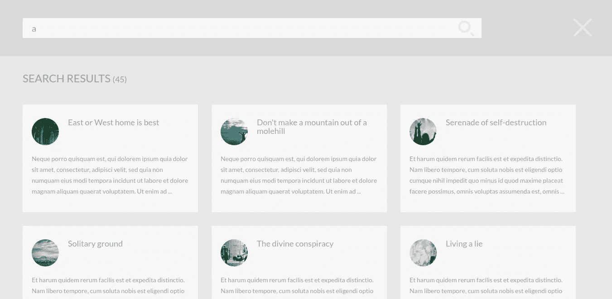
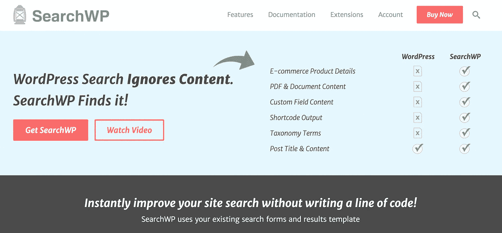
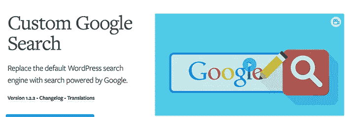
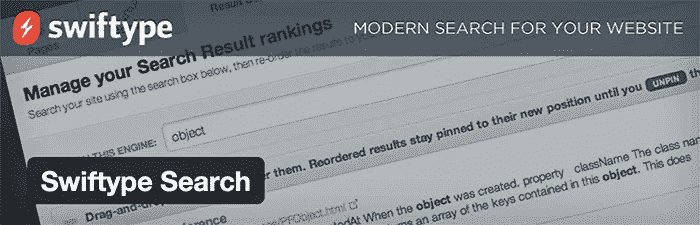

# 改进 WordPress 搜索功能的插件

> 原文：<https://medium.com/visualmodo/plugins-for-improve-wordpress-search-functionality-f5d412bf4b32?source=collection_archive---------0----------------------->

我们用一种简单的方法列出了最好的免费 WordPress 插件来改进本地 WordPress 搜索功能，以及每个插件的优点。

当创建你的 WordPress 站点时，有很多事情需要考虑，比如主机、主题和插件，但是最重要的事情之一是如何识别最好的搜索插件。在这篇文章中，我将回答这个问题:WordPress 最好的搜索插件是什么？

你可能会问自己，当 WordPress 自带默认站点搜索引擎时，为什么搜索插件值得你花费时间。简而言之，有两个原因:更好的用户体验和更低的跳出率。基本原理是这样的:

一旦访问者访问了你的网站，你有责任确保他们找到你最重要的页面。当然，最明显的方法是在主导航菜单中列出网站的关键区域。

这对于帮助人们找到放入各部分的内容类别非常有用，但是内容远不止这些。给你的观众一种**找到你提供的与他们相关的特定类型内容的方法**也很重要。这归结为使用工具，如类别，标签，档案，网站地图，相关职位，当然，搜索。

客气地说，搜索并不是 WordPress 擅长的事情。输入搜索请求，默认的 WordPress 搜索引擎会频繁地返回不相关的博客文章，以及几年前发表的文章和页面。它既不允许访问者将搜索范围缩小到特定的类别或关键词，也不允许访问者查看搜索结果中突出显示的术语。它也不允许您将用户搜索限制到特定的项目，如帖子、页面、评论和/或自定义帖子类型。

这种糟糕的搜索功能会大大增加希望获得更好体验的用户的跳出率。这就是为什么 [WordPress](https://visualmodo.com/) 用户通常会改进默认的 WordPress 搜索引擎，或者用更好的来代替它——这意味着如果给你的受众更好的体验对你很重要，你就需要解决搜索插件的问题。

所以，让我们来看看五个最好的插件(包括免费和高级的)来改进或替换默认的 WordPress 搜索引擎。

# 改进 WordPress 搜索功能的插件

# SearchWP

被许多人吹捧为 WordPress 的最佳搜索解决方案， [SearchWP](https://winningwp.com/ref/searchwp/) 是一个高级搜索 WordPress 插件，它对分类法、自定义文章类型和自定义字段有很大的支持。

它允许您确定在执行搜索时每种内容类型所占的权重。例如，您可以增加文章标题和页面标题的权重，这样包含这些术语的搜索将在搜索结果中排名靠前。也可以通过指定文章 id 或指定标签和类别来从搜索中排除页面。

这个插件最有趣的一点是它可以创建补充搜索引擎，只搜索你网站的特定部分。SearchWP 还拥有统计数据、WordPress 多站点支持，以及一系列增加额外功能的扩展。更重要的是，SearchWP 真正让我兴奋的是它能够从上传到你的[网站](https://visualmodo.com/)的 PDF 文件中索引文本内容。

一个网站的 SearchWP 许可零售价为 49 美元，五个网站为 129 美元，无限网站为 249 美元。所有许可证都有一年的支持，更新和访问所有 SearchWP 扩展。

# 雷文西

[Relevanssi](https://wordpress.org/plugins/relevanssi/) 是一个流行的搜索插件，它根据相关性而不是日期对搜索结果进行排序。该插件允许你定义诸如文章标题等因素的权重，这有助于你定义搜索结果中什么是重要的。

Relevanssi 允许访问者搜索评论、标签、类别和自定义字段。用户还可以将搜索限制在类别和标签上，并使用高级过滤来帮助调整搜索结果以满足他们的需求。该插件还允许包含在插件短代码中的内容被索引——这是其他搜索插件所不提供的。

Relevanssi 是免费下载的，但是，也有一个高级版本，它有许多附加功能，并保证开发者的支持(值得称赞的是，Relevanssi 的开发者也试图支持免费用户)。高级功能包括用户配置文件索引、为访问者突出显示外部搜索引擎中的搜索词，以及导出/导入功能，以帮助您将设置转移到您拥有的其他网站。

一个标准的 Relevanssi 许可证——适用于小型[企业](https://visualmodo.com/) —零售价为 39.95 美元。鼓励为客户设计网站的大型企业和公司以 69.95 美元购买开发者许可证。两种许可证都允许在无限数量的网站上使用，并包括一年的支持和升级。

# 自定义谷歌搜索

谷歌定制的谷歌搜索工具允许网站所有者在他们的网站上添加谷歌搜索引擎。搜索结果明显缩小到你网站的结果。

有很多不同的 WordPress 插件可以让你使用这个工具，但是我相信 WPMU Dev 的定制 Google 搜索插件是最好的。要使用这个插件，你必须首先[在谷歌创建一个定制的谷歌搜索](https://www.google.com/cse/)引擎，然后将你收到的代码添加到 WPMU 开发插件的设置区域。

WPMU Dev 插件以多种方式增强了定制的 Google 搜索工具。它允许您更改样式、确定搜索结果的显示位置以及隐藏搜索按钮。它还附带了一个有用的搜索工具，这样谷歌的搜索功能就可以无缝集成到你的网站设计中。

该插件可以从 WPMU Dev 获得，售价 19 美元。WPMU Dev 的会员计划每月有效费用为 24.50 美元，允许访问这个插件和 350 多个其他 WordPress 插件。

自定义谷歌搜索绝不是 WordPress 的最佳搜索解决方案，因为它依赖于谷歌索引的内容，而不是包含在你的数据库中的内容。因此，它不能像 SearchWP 和 Relevanssi 这样的插件那样增强搜索。然而，通过[谷歌](https://visualmodo.com/) Adsense 赚取额外收入的能力是一个诱人的功能，尤其是如果你有一个高流量的网站。

# 戴夫的 WordPress Live 搜索

由[大卫·米夏埃尔·罗斯](https://wordpress.org/plugins/daves-wordpress-live-search/)开发的[戴夫的 WordPress Live Search](https://wordpress.org/plugins/daves-wordpress-live-search/) 为你的 WordPress 网站增加了“Live Search”功能(你会看到它被用在搜索引擎上，比如 Google 和 Bing 自动完成[一个搜索词)。](http://en.wikipedia.org/wiki/Autocomplete)

该插件允许您定义显示的搜索结果的数量，以及在激活 live search 之前需要输入的最少字符数。一旦有人输入了您定义的最少字符数，就会出现一个结果框。此框可以显示结果信息，包括元数据、帖子缩略图、帖子摘要和“查看更多结果”链接。

该插件包括灰色、红色和蓝色配色方案，您还可以通过创建一个名为 Daves-WordPress-live-search . CSS 的样式表来自定义输出，或者简单地使用您的主题提供的默认样式。

虽然 Dave 的 WordPress Live Search 并没有改进默认的搜索引擎，但它确实改善了用户体验，因为用户可以直接进入他们想要的页面，而不必访问搜索结果页面。

# 快速搜索

[Swiftype Search](https://wordpress.org/plugins/swiftype-search/) 是一个漂亮的搜索解决方案，被许多高流量网站使用，但是，要使用这个插件，你需要注册一个免费账户来获得 API 密钥。(**免责声明:**我通常不喜欢除非你注册第三方服务否则无法使用的 WordPress 插件。)

Swiftype 允许您使用拖放功能自定义搜索结果的顺序，从而帮助您显示更多相关的搜索结果。这是一种将最重要的内容和页面放在结果顶部的有用方式，并且可以手动添加其他结果。Autocomplete(又名“live search”)也是可用的，并且有过滤器来帮助用户细化结果。

正如你所料，swift type 的免费会员计划是有限的:它将 swift type 品牌添加到你的搜索中，将搜索结果定制限制在 50 个，限制内容更新，并且只允许在一个网站上使用。

如果您想要访问所有可用的 Swiftype 搜索功能，您需要升级到[高级计划](https://winningwp.com/ref/swiftype/)。以每月 19 美元的价格升级到 pro 计划，您可以删除品牌，跨多个域进行搜索，并获得每日内容更新和搜索分析，帮助您跟踪正在搜索的内容。

该商业计划的零售价为每月 249 美元，提供实时搜索分析、推荐、转换跟踪、拼写和同义词、多搜索引擎支持等等。功能齐全的企业解决方案也适用于大公司；这个级别的解决方案增加了实时索引等功能。

# 最后的想法

搜索对于提供更好的用户体验和让访问者在你的网站上停留更长时间是很重要的。如果访问者找不到他们正在搜索的页面，他们很可能会点击后退按钮，离开你的网站。当 WordPress 有这么多好的替代搜索解决方案可以提供让你的读者满意的结果时，让这种情况发生似乎是愚蠢的。

当谈到你愿意或能够为这种更好的用户体验花费多少时，一些人仍然希望避免支付现金。如果你正在寻找一个好的免费解决方案，我推荐[Relevanssi](https://wordpress.org/plugins/relevanssi/)——我过去在自己的网站上用过它，我对它增加的功能非常满意。此外，[swift type Search](https://wordpress.org/plugins/swiftype-search/)也值得一试，如果你想手动改变搜索结果。

如果你喜欢从在你的网站上使用搜索的人身上赚钱，那么使用像[定制谷歌搜索](https://premium.wpmudev.org/project/custom-google-search/)这样的插件将谷歌的搜索功能整合到你的网站上是你唯一的选择。如果你选择将定制的谷歌搜索货币化，每年可以为你的底线增加几百美元，如果你有一个高流量的网站，甚至可能增加几千美元。

从好处来说，我觉得 SearchWP 是最好的整体解决方案:它与其他 WordPress 产品集成得很好，特别容易设置，对自定义帖子类型有很大的支持，并让您完全控制如何确定搜索结果。我还喜欢 PDF 文件的内容可以被索引的事实。