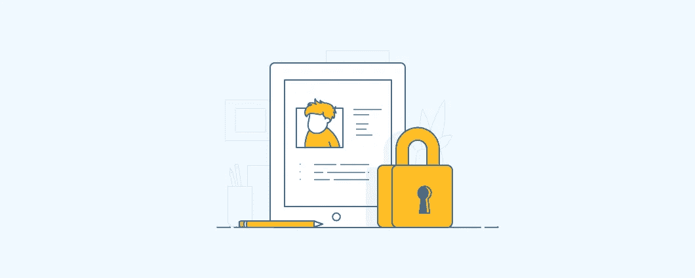

# 隐私政策创建指南

> 原文：<https://medium.com/visualmodo/privacy-policy-creation-guide-5cd8b169d17f?source=collection_archive---------0----------------------->

隐私政策是一份声明或法律文件，披露一方收集、使用、披露和管理顾客或客户数据的部分或全部方式。这不是一件可以掉以轻心的事情。您的企业需要通过实施必要的安全措施来保护客户的数据，从而遵循该策略。不遵守您企业的隐私政策可能会导致诉讼、法律费用和/或罚款。

隐私政策是大多数网站最容易被忽视的方面之一。如果你停下来看看你访问的大多数热门网站，你会发现它们都有独特的隐私政策(尽管特定页面的[流量](https://visualmodo.com/)通常很低)。即便如此，如果你希望你的网站符合当地和国际法规，这些文件是很重要的。

更重要的是，你不需要成为一名律师来为你的网站添加一个彻底的隐私政策。在这篇文章中，我们将更多地讨论为什么隐私政策是重要的，我们将教你一些基本条款。然后，我们将向您介绍三个工具，您可以使用它们来帮助您创建网站的隐私政策。

先说隐私吧！

# 什么是隐私政策(以及它们为什么重要)

隐私政策可能看起来很吓人，但是你应该尽可能地阅读它们。

隐私政策是法律文件，告知用户你如何处理他们的数据。例如，如果您在用户注册过程中收集电子邮件地址、姓名和生日，您需要告诉用户他们的信息会发生什么情况。例如，一些网站可能只将其用于内部目的(如客户档案)。其他人可能会将信息出售给第三方服务，在这种情况下，同意是必要的。

如你所知，隐私政策通常被大多数访问者忽略。但是，在您的网站上添加一个有几个好处:

*   **一些国家要求隐私政策成为法律的一部分。**一些本地和国际法规，如[加州在线隐私保护法案(CalOPPA)](https://consumercal.org/about-cfc/cfc-education-foundation/california-online-privacy-protection-act-caloppa-3/) 和欧盟通用数据保护法规(GDPR)要求您概述如何处理用户信息。
*   **某些第三方服务需要它。**例如，谷歌分析要求你的隐私政策[提及其使用](https://support.google.com/analytics/answer/2700409?hl=en)，并声明你正在追踪的数据类型。
*   透明永远是一项好政策。明确的隐私政策表明你认真对待保护用户信息的工作。

尽管有些国家不要求使用隐私政策，但根据国际法，你仍可能因不遵守规定而被追究责任。例如，如果您有欧盟(EU)用户，您需要遵守 GDPR。考虑到违规可能会被罚款，在你的网站上添加隐私政策很简单，而且是明智的商业举措。

理想情况下，你应该寻求律师的帮助来起草你的隐私政策。然而，对于绝大多数网站所有者来说，这并不是一个实际的选择。知道了这一点，许多在线服务涌现出来，帮助羽翼未丰的网站制定基本的隐私政策来保护他们的基础。然而，在讨论它们之前，让我们看看你的隐私政策应该包含什么。

# 你的网站的隐私政策应该包括 3 个条款

在大多数情况下，这三个条款不足以制定一个完善的隐私政策。请仅将它们视为任何此类文档都应该包含的基础。我们鼓励您对[其他关键条款](https://termsfeed.com/blog/9-privacy-clauses-landing-page/)做进一步的研究。

下一节将探索一些工具，只需很少的输入就可以生成完整的隐私策略。即使这样，你也必须对他们的基本知识有一个有效的理解。

# 1.您收集信息的方式和类型

这一条款是隐私政策的基础。它详细说明了您收集的确切信息，以及如何收集。回想一下我们之前的例子，您可以直接从注册表单中获得电子邮件地址和姓名。然而，你也可以在用户不知情的情况下获取数据。比如 Google Analytics 追踪用户偏好的 web [浏览器](https://visualmodo.com/)，这一点需要提到。

理想情况下，访问者会看一下这个条款，决定他们是否愿意使用你的服务，但更重要的是，它合法地覆盖了你的基础。以下摘录自我们的隐私政策，讨论了我们收集的信息类型以及收集方式:

> 个人身份信息是指明确告诉我们您是谁的信息，如您的姓名、电子邮件地址或电话号码。下载信息或登录可能会让公司“识别”您，从而允许我们为您提供个性化服务。

第一部分讨论的是我们认为的个人信息，而不是我们可能收集的匿名数据。它还提到我们可能会使用这些信息来个性化您的用户体验。在我们的例子中，只有在下载您可能已经购买的产品时才需要登录，所以这不是必须的。

# 2.你如何处理你收集的信息

许多网站从事出售或分享用户数据的活动。其他服务利用这一点来个性化内容和广告，以及其他元素。其他潜在的应用包括使用这些信息来执行使用条款、改进您网站的服务等等。

不管应用程序如何，这一条款是至关重要的，因为尽管用户可能同意共享个人数据，但他们可能对你决定如何使用它不满意。以下是我们隐私政策中的一小段，概述了我们对私人信息的一般使用:

> 对于我们的客户，我们使用个人信息主要是为了提供服务，并就帐户活动、新版本和产品或其他与服务相关的通信联系我们的客户。我们不会向任何第三方出售或共享最终用户的任何个人身份信息或其他信息，当然，您正在使用的网站的适用客户除外。

无论如何，如果你对网站使用你信息的方式感到不舒服，GDPR 概述了“[被遗忘的权利](https://gdpr-info.eu/art-17-gdpr/)”。例如，这意味着如果你要求网站取消你的账户，网站会依法删除你的信息。

# 3.你对饼干的使用

Cookies 是计算机上的文件，包含特定网站的个人设置。这个术语本身据说来自于[【神奇饼干】](https://en.wikipedia.org/wiki/Magic_cookie)，这是一种基于 UNIX 的操作系统(OS)使用的令牌。

无论如何，网站使用 cookies 来追踪你在里面做了什么。例如，cookies 使您即使离开网站也能保持登录状态(尽管有一些限制)。根据欧盟的 [Cookie 法](https://www.cookielaw.org/the-cookie-law/)和新的[电子隐私条例](https://www.i-scoop.eu/gdpr/eu-eprivacy-regulation/)，网站需要告知访问者他们对 Cookie 的使用，并提供禁用它们的选项。以下是我们隐私政策中关于 cookies 部分的摘录:

> 我们在网站上使用 cookies、追踪像素和相关技术。Cookies 是由我们的平台提供的小数据文件，存储在您的设备上。我们的网站出于各种目的使用我们或第三方丢弃的 cookies，包括运营和个性化网站。此外，cookies 还可用于跟踪您如何使用网站在其他[网站](https://visualmodo.com/)上向您定向投放广告。

以上解释了我们如何使用 cookies 以及它们是什么。在本政策的后面，我们还将讨论您如何选择不使用 cookiess，包括我们网站上由第三方服务提供的 cookie(如 Google 和 MailChimp)。

# 3 要考虑的最佳隐私策略生成服务

尽管我们完全推荐我们在本节中包含的服务，但为了安全起见，您应该经常查看您与它们一起生成的任何隐私策略的语言。我们来看看选项。

# 1.尤本达

iubenda 是一个在线网站隐私政策生成器，因其易用性而脱颖而出。它使用模块来帮助你选择你的隐私政策应该包括的确切条款，并根据你使用的服务来调整它们的条款。例如，如果您是 Amazon Associates 计划的成员，只需点击一下鼠标，就可以将必要的语言添加到您的策略中。

**主要特点:**

*   使用简单的模块系统构建全面的隐私策略。
*   允许您使用公司信息自定义您的策略。
*   使您能够为几个流行的第三方服务添加必要的条款，包括 Amazon Associates 和 Google Analytics。
*   根据任何新法规自动更新您的策略。

**价格:**提供免费和付费计划

# 2.TermsFeed

[TermsFeed](https://termsfeed.com/) 使您能够在几分钟内生成基本的隐私政策，并使用您网站的信息对其进行定制。每次您想要创建一个新的政策，该服务将引导您通过一份问卷调查，以帮助您确定您需要的条款。流程结束后，您将在几秒钟内通过电子邮件收到您的新保单。该平台还为您提供了随着法律变化自动更新保单的选项。

**主要特性:**

*   使您能够使用简单的调查问卷生成自定义隐私策略。
*   允许您调整策略以符合国家和国际法律。
*   每当法律发生变化时，提供自动策略更新。

**价格:**提供免费和付费计划

# 3.Shopify 的隐私政策生成器

[Shopify 的隐私策略生成器](https://www.shopify.com/tools/policy-generator)在范围上比我们讨论过的其他工具要窄一些。它的条款是专门为 Shopify 网站定制的。但是，您可以在几秒钟内生成他们的一个策略，并使用它来检查关于如何处理支付信息的基本条款。

**主要特性:**

*   允许您为您的 Shopify 商店生成隐私策略。
*   使您能够概述如何处理客户付款信息。
*   让您能够根据您的商店及其位置自定义您的隐私政策。

价格:免费，但你需要订购 Shopify 才能充分利用它

# 如何使用 iubenda 创建网站隐私政策

鉴于 iubenda 的易用性和合理的定价结构，我们将使用它来完成这部分内容。首先，进入[服务的主页](https://www.iubenda.com/en)，点击页面右上角的*生成您的政策*按钮。在下一个窗口中，输入您网站的 URL，然后单击蓝色按钮:

该服务将要求您注册一个免费帐户或使用脸书登录。无论哪种方式，当您进入时，您都会看到一个选项，可以将您的网站使用的任何服务添加到您的隐私策略中:

点击按钮将显示您可以添加的条款列表:

随着您包含更多服务，这些服务将自动添加到您的隐私策略中。您可以随时通过点击仪表板右侧的*预览*小部件进行预览:

添加完服务后，点击页面底部的*下一个*按钮。您现在需要输入贵公司的名称和地址，然后再次点击*下一步*:

在最后一个屏幕上，您可以找到将您的政策嵌入到您的网站的选项:

就是这样！如果你已经包括了你如何收集数据的所有方面，你的隐私政策将是好的。但是，一定要记得在发表之前通读一遍！

# 结论

网站隐私政策没有得到应有的关注。然而，对于任何认真对待数据保护法规的网站来说，它们都是必不可少的要素。除了让你的操作保持光明正大，隐私政策还概述了你的网站如何处理个人信息，这应该有助于让访问者放心。

如果你不知道从哪里开始创建网站隐私政策，这里有三个易于使用和功能丰富的在线生成器:

1.  [**iubenda**](https://www.iubenda.com/en)**:**基于模块的隐私策略生成器，支持数十种第三方服务。
2.  [**terms feed**](https://termsfeed.com/)**:**这个简单的服务让你可以通过一份问卷来创建一个基本的政策。
3.  [**Shopify 的隐私政策生成器**](https://www.shopify.com/tools/policy-generator) **:** 这个生成器是为 Shopify 店铺量身定制的。

关于您的隐私政策应该包括哪些条款，您有任何疑问吗？下面评论区来说说吧！