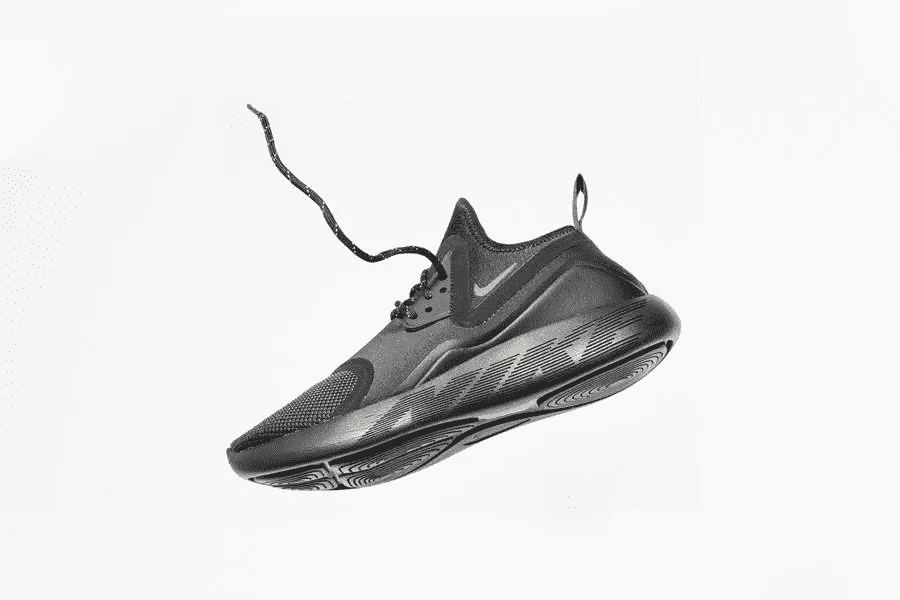

# 营销优化的产品定位

> 原文：<https://medium.com/visualmodo/product-positioning-for-marketing-optimization-cd076f13023b?source=collection_archive---------0----------------------->

什么是产品定位，如何将其作为营销策略？顾名思义，这是产品的物理展示方式。虽然产品植入可以是产品定位的一个方面，但它远不止于此。它是你的产品或服务被目标受众和竞争对手感知的方式。确保成功的产品定位的关键是尽可能以最诚实、最有影响力的方式展示你的产品。重点是脱颖而出，独一无二。你需要抓住观众的注意力并保持住。

# 成功的产品定位指南

让我们来看看在定位你的产品或服务之前你需要做些什么。

## 进行市场调查

第一步是做一些市场调查。与小企业或个人企业相比，大公司的这一过程非常不同。一个大公司或企业可以雇佣一个市场研究服务来运行焦点小组，收集竞争对手的数据并创建营销比较。一个小企业甚至一个自由职业者也可以通过简单地与他们的客户和他们周围的社区交谈来做到这一点。

市场调查的主要思想是确定目标市场和最终用户。分析越详细，你的产品定位就越容易。例如，你们的服务范围是面向教练的吗？定义什么样的教练；生活教练，商业教练，家庭教练。他们主要是女性还是男性？他们位于特定的区域吗，他们是特定的年龄吗？

## 定义您的竞争优势

在市场研究和业务知识的帮助下，有必要定义你的竞争优势。差异化是让你在竞争中脱颖而出的特殊之处。区分器必须涵盖三个关键因素:首先，它必须是真实的。简单地编造一些事情不会对你有利。第二，对你的目标市场和客户重要且相关。最后，你必须能够证明这一点。

您的关键优势将是产品定位如何演变的决定性因素。这给了整个过程一个支点。在某些情况下，您可能有两个适用于两个不同目标市场的竞争优势。当你的产品线或服务对不止一个目标市场有很好的价值时，就会出现这种情况。在 A/B 测试中使用竞争优势，然后坚持使用有效的方法。

## 起草一份定位和营销声明

在市场研究和明确的竞争优势之后，是时候起草一份定位声明了。这类似于使命宣言或品牌宣言。上述定位声明是亚马逊的一个示例声明，它是 Hubspot 发布的一系列示例中的一部分。所以，创建你自己的定位声明，你可以遵循一个简单的准则。首先，填写下面的信息，然后写成一段话:

1.  您公司或品牌的名称:
2.  你做什么:
3.  你为谁而做:
4.  您的优势，为什么客户选择您而不是其他人:
5.  支持你陈述中主张的证据:

这句话是一个内部工具，它为你的产品定位和[营销策略](https://visualmodo.com/email-marketing-superstar-infographic/)中的每一个后续步骤设定了基调和锚。这不是一个作为营销口号分享的文本，而是你团队的颂歌。用它来激励和保证你的策略是正确的。

## 品牌宣传

一旦产品定位声明准备好了，就该检查你的品牌了。如果你还没有做你的品牌，那么用你为产品定位所做的工作来指导品牌战略。了解目标市场和你的差异化将有助于选择正确的颜色、字体和口号。另一方面，如果你已经有了一个品牌计划，简单地回顾一下，看看它是否符合产品定位声明。

在大多数情况下，你不需要改变什么，但在其他情况下，你可能需要经历一个完整的品牌重塑。例如，如果你是一个人的企业，你的品牌名称不能代表你或你的客户，你就需要改变它。这就是为什么许多设计师和开发人员简单地使用他们的名字作为他们的品牌，以保持个性和可靠性的感觉。

## 广告策略+营销策略

现在是时候做你产品的实际定位了。根据你的市场调查显示，相应地为你的产品和服务定价。这个过程不是关于多收费或少收费，而是关于如何定价。许多人对以 0.99 结尾的数字反应积极，而其他人可能会觉得它无关紧要。你的产品价值 200 美元还是 199 美元？你的目标市场在乎差异吗？

说到为你的产品做广告，你需要知道你的目标市场在哪里花时间。如果他们在看 YouTube 视频，那么你应该在那里做广告。你的顾客卖手工制品吗？在 Etsy 上购买广告空间。你是一个设计网站的前摇滚音乐人，确切知道一个音乐人需要从一个网站得到什么吗？去演唱会做公关。把你的名片给音乐家和他们的经理，寻找音乐家的在线社区，做一些友好的公关。

如果没有正确实施，你为营销产品定位所做的所有工作都将毫无意义。不要偏离你的目标市场，在你的营销中用一种个人和情感的方式与他们交谈。

# 现实生活中的用法

下面是一些常见的产品定位营销用法示例。从这些中得到启示，但也要找到一种独特和原创的方式。如果你的 WordPress 开发业务的视频广告是 YouTube 上众多广告中的一个，你将如何让它脱颖而出？也许你需要在更小的平台上做广告。

1.  首先，足球比赛期间的快餐、汽车和啤酒广告。
2.  时尚杂志上的化妆广告。
3.  分割 YouTube 设计教程中的视频广告。
4.  日间电视节目中的家用产品广告。
5.  超市过道里与眼睛齐高的儿童麦片。
6.  商店收银台前的经典小吃。
7.  宠物收养中心的宠物产品海报。
8.  酒店接待处的旅游运营商手册。
9.  自由职业者的服务在在线作品集中展示，并在 Linkedin 上分享。
10.  最后，在播客中提及。