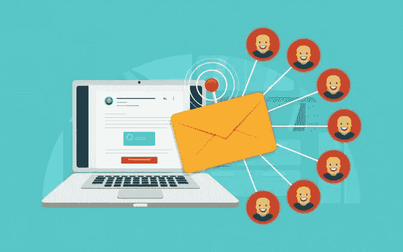

# 使用促销电子邮件提示用户采取行动

> 原文：<https://medium.com/visualmodo/prompt-users-to-action-using-promotional-emails-223b5e83db72?source=collection_archive---------0----------------------->

你有可靠的电子邮件订户名单，但你只赢得了一半的战斗。你的邮箱会被打开吗？如果打开，它的内容会提示用户操作或删除吗？为了写一封有效的促销邮件，你需要了解你的目标，掌握正确的时机，建立积极的关系，抓住并保持他们的注意力，并保持你的信息简单，可浏览，精致。按照这个指南来写促销电子邮件，促使用户采取行动。

# 使用促销电子邮件

# 计时正确

客户实际上并不介意定期收到他们订阅的企业发来的电子邮件。你只需要确保你不要发送太多，淹没他们。发送太多信息不仅会惹恼你的用户，而且他们可能会习惯于忽略你的信息。这是动态分段可以提供帮助的另一种情况。一封电子邮件将根据他们共享的几个属性、操作和频率发送给选定的组。久而久之，人们将退出这个群体，因为他们不再符合规范。这样做意味着人们不会仅仅因为最初符合这些参数就收到不相关的电子邮件。

# 了解你的目标

一些营销人员会发送静态的细分促销电子邮件，针对拥有相同主要特征的群体。你可以利用一种叫做动态细分的策略来使自己处于优势。动态细分包括更大程度的个性化，发送针对收件人定制的促销电子邮件。“您可以根据属性、动作和频率创建一个细分市场，而不是将规范建立在一个属性的基础上。EliteAssignmentHelp 的电子邮件营销人员吉尔·芬斯克(Jill Fenske)建议说:“电子邮件收件人更有可能回复这些似乎是为他们设计的邮件。

# 建立关系

在你的邮件中使用个人语气，介绍你自己的名字，让自己成为一个友好、值得信赖的人。感谢读者的时间。告诉读者你能提供给他们什么，并确保你能迅速传达，这样你才不会失去他们的信任。向他们展示他们可以从[关系](https://visualmodo.com/)中获益。

# 引起他们的注意

你邮件的标题是吸引读者注意力的好方法，可以满足他们的需求。让你的主题简短有力。你想让他们有兴趣继续读下去，所以不要在标题中泄露游戏。试着创造一种紧迫感，这样就可以马上打开邮件。简要说明你能提供什么，以及为什么读者应该关心。

# 保持简单和可扫描

尽可能用最简单的语言表达你的观点。像和朋友交谈一样写作。不要使用任何行业术语或市场用语。推进你的信息，但不要陷入不必要的细节，这样你可以保持收件人的注意力。不要写一墙的文字。将你的信息分成小段落，用醒目的标题吸引眼球，让读者保持兴趣。使用要点和列表，这样你的信息就可以被浏览，而不是被阅读，因为大多数人会这样对待你的信息。撰写电子邮件并设计其布局时要考虑到移动用户，因为所有电子邮件中有 [54%](https://litmus.com/blog/2016-email-client-market-share-infographic) 是在移动设备上打开的。

# 利用这些资源写更好的电子邮件

使用以下资源确保你的促销邮件写得好，校对好，语法正确:

–写作和写作民粹主义:使用这些有用的指南来确保你的促销邮件中的语法是完美的。不要发出有语法错误的电子邮件，这会影响公司的形象。

–[Via 写作](https://viawriting.com/)和 [SimpleGrad](https://simplegrad.com/) :这些有用的写作指南将帮助你撰写一封令人信服的电子邮件。

–[Boomessays](https://boomessays.com/write-my-essay)和[英国作品](https://ukwritings.com/coursework-help):确保使用 Boomessays 评论建议的校对资源，这样你的电子邮件看起来会更优雅。这将是一个耻辱，写了一封有效的电子邮件，只有一个错别字或拼写错误抹黑它。

–[study demic](https://studydemic.com/)和 Letsgoandlearn:使用这些免费资源来帮助引用，并确保你的字数是正确的。

–academiazed 和 [Essayroo](https://essayroo.com/law-essay) :这些是在线写作社区，你可以在那里找到写促销邮件的建议。

–我的写作方式和学术导师:在这些写作博客中，你会发现大量有用的技巧和想法。

# 结论

写一封促销邮件不是一件容易的事情。有很多时候你会失去读者的兴趣；很多邮件甚至都没有打开。第一步是了解你的目标，并使用动态细分来吸引他们。掌握时机至关重要；你不想发送太频繁，由于用户习惯而被忽略。一旦你吸引了读者的注意力，建立友好和信任的关系是关键。尽可能让你的信息简单易懂。使其易于在桌面和移动设备上阅读。花些时间访问上面的资源，这样你的信息就写得很好，在技术上也更加完美。遵循这些基本步骤，你就可以毫不费力地撰写促销邮件，促使用户采取行动。