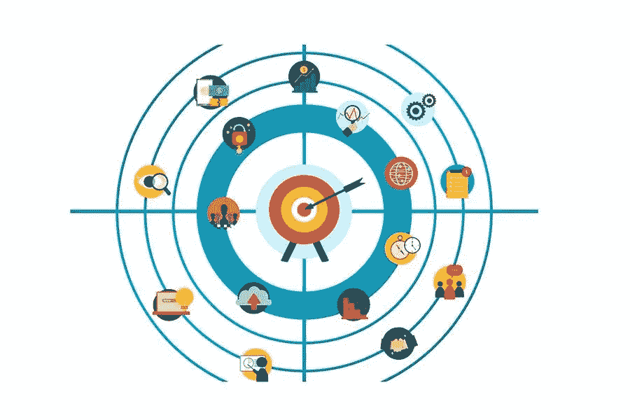

# 内部营销与外包营销的利弊

> 原文：<https://medium.com/visualmodo/pros-and-cons-to-in-house-vs-outsourced-marketing-7147664fd235?source=collection_archive---------1----------------------->

对于你的 B2B 制造营销，你应该采用外包还是内部营销？嗯，这是一个很多企业主都很难回答的问题。事实是，这两种类型的营销都有自己的优点和缺点。因此，你应该花时间去了解最适合你的企业的营销策略。记住，每个行业都是独一无二的。因此，成功地为另一个企业工作的营销策略可能不适合你，反之亦然。

我们把这篇文章放在一起是为了帮助你理解内部营销和外包营销的利弊；

# 什么是内部营销？

这是由你的专业团队在你的公司内部进行的营销。由于一切都由你的员工处理，你不需要外包帮助。

# 内部营销:优点

*   **提供高水平的能力**

一个内部营销团队的经营理念是，“团结则存，分裂则亡”。当你的公司有了自己的[营销团队](https://visualmodo.com/5-employee-advocacy-strategies/)，那么你就有了一群坚定的人，他们随时准备用自己独特的技能互补。不用说，这在 B2B 制造营销中是非常重要的。你的内部营销团队所拥有的知识和技能可能正是你提升业务所需要的。

*   **节省时间**

与内部营销、外包营销相比，你需要花很多时间选择完美的营销团队来代表你的公司。这段时间可以更好地用于处理公司的其他事务。此外，在选择过程中花费大量时间使得管理期望变得困难。在这方面，内部营销更好，因为你会有一个有能力的营销人员团队，他们随时准备在营销你的业务方面付出额外的努力。

*   **解放你**

虽然拥有一家企业很好，但完全控制它更好。你自己的内部营销团队可以让你的员工在需要的时候很容易就能找到他们。这也使得它很容易看其他事情，而知道 B2B 制造营销方面照顾你的业务是好的。

# 内部营销:缺点

*   当谈到 B2B 营销制造时，拥有该领域的专家可能会带来固有的风险。例如，组建一个正确的、强大的团队是非常昂贵的。找到合适的营销部门负责人、经理以及他们手下的员工绝非易事。
*   有了你的内部营销团队，你将享受不到各种各样的服务，因为这个团队专注于营销。然而，大多数外包营销人员会营销，开发你的网站，甚至同时提供社交媒体专业知识。
*   在你的品牌中加入太多有它的优点和缺点。在各种各样的事情中。因此，很难很好地了解对你的品牌不利的事情。这就是外包营销的好处所在——代理公司总是会带着新的观点进来，并且不回避指出错误。

# 什么是外包营销？

这种营销类型正如其名——外包。这是外包第三方来帮助你的营销。

# 外包营销:优点

*   代理营销人员在压力下表现出色。不用说，他们拥有高水平的专业知识，在所有垂直领域都有所建树。因此，你可以肯定，他们的高水平的专业知识将使你的营销项目成功。
*   我们付钱给营销机构来提供结果。如果在任何时候你觉得你的外包营销没有提供你期望的结果，你可以寻找新的东西，收回你的投资。
*   外包你的市场营销将让你有更多的时间专注于其他业务方面，并自由管理运营机会。

# 外包营销:缺点

*   尽管你的内部营销团队对你的新想法和建议持开放态度，但外包营销团队认为他们已经有了所有的答案。他们通常对处理业务的方式有强烈的看法。虽然他们的想法可能与你的冲突，但你也无能为力，因为你已经交出了营销大权。
*   总有可能以一个不一定符合你期望的营销产品而告终。在这种情况下，花更多的钱来补救。
*   如果你外包的营销机构正在投资其他项目，他们可能有其他项目，没有能力给予你的项目充分的关注。

# 哪种营销适合我？

如果你有财力帮助你从零开始建立一个营销团队。那么内部营销可能是最好的选择。这意味着你将雇佣一名数字营销人员、平面设计师和营销总监来确保你的营销梦想成真。然而，如果你没有资源做这件事，你应该考虑外包你的营销。当外包时，选择一个对自己负责并能体现你的品牌的代理机构。