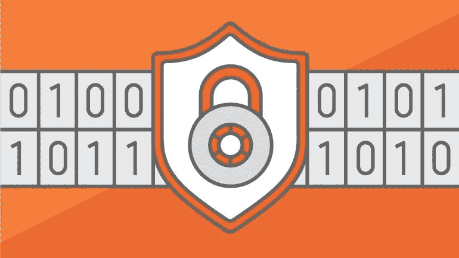
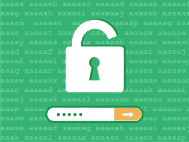

# 保护网站免受暴力攻击

> 原文：<https://medium.com/visualmodo/protect-website-from-brute-force-attacks-54197fce5246?source=collection_archive---------0----------------------->

什么是暴力攻击，我如何保护我的用户和应用程序免受暴力攻击？暴力登录攻击是针对 Web 应用程序的最常见(也是最不隐蔽)的攻击之一。*暴力攻击*的目的是通过反复尝试猜测密码来获取用户账户，看看如何保护你的网站。

# 保护网站免受暴力攻击

有一些疯狂的人会试图黑你的博客。最常见的黑客攻击类型之一是**暴力攻击**，黑客运行一个脚本，试图通过使用[用户名](https://visualmodo.com/)和密码的不同组合登录你的账户。

我们最近遭受了 visualmodo.Com 的暴力登录攻击。不管是谁干的，他都试图用不同的用户名登录我们的博客，比如“admin”、“administrator”、“visual”。由于对服务器的大量 HTTP 请求，RTB 宕机了。

所以每当我或访问者试图访问博客时，就会显示这个错误——“内部服务器错误”。我们在这个服务器上的其他网站也显示同样的错误。

然而，我能够通过联系主机提供商来阻止攻击。但是在这篇文章中，我将分享如何保护你的 WordPress 博客免受暴力攻击。在讨论技巧之前，我想告诉你什么是暴力攻击。

**什么是蛮力攻击？**

暴力攻击是指黑客快速浏览一些目录名、用户名、密码和 IP 地址，以获取私人数据或文件的攻击。汽车人或软件用来[生成](https://visualmodo.com/)大量连续猜测，得到想要的数据。

对 WordPress 博客的攻击主要针对 wp-login.php 文件，以获取对博客的访问。它反复尝试不同的用户名和密码，直到进入。

现在让我们来看看如何防止对你的 WordPress 博客的攻击。

**1。避免使用普通用户名，使用强密码**

首先，我建议你更改你的默认用户名。不要使用用户名，如“管理”，“管理员”或您的网站名称。这些用户名很容易猜到。当 [Visualmodo](https://visualmodo.com/) 受到攻击时，黑客使用了以下用户名。以避免这些“容易猜到”类型的用户名。设置一个真正随机的用户名。

同时，您必须确保您使用的是强密码。强密码包含 8 个以上的字符，没有字典单词，大写和小写字母，数字，符号(例如！@#$)等。

您也可以使用在线强密码生成器。其中一个流行的工具是— [密码生成器](http://passwordsgenerator.net/)。

**2。使用 JetPack 强力攻击保护**

JetPack 是 Automattic 的一个强大的 WordPress 插件，有很多特性。最近，Jetpack 推出了一项名为“保护”的新功能。它帮助你保护你的 WordPress 站点免受恶意和不必要的登录尝试。这意味着你的博客将受到保护，免受暴力攻击。

你所需要做的就是，从[这里](http://jetpack.me/)安装插件。一旦你激活插件，“保护”选项将自动启用。然而，你可以通过进入 WordPress Dashboard>Jetpack>设置来检查是否启用了保护选项。您还可以将 IP 地址列入白名单，防止其被 Jetpack 阻止。只需从“保护”选项中单击“配置”。

**3。使用 CloudFlare CDN**

CloudFlare 是一项免费的 CDN 服务。你可以用它来加速你的网站，并使其更加安全。CloudFlare 处理 WordPress 博客上的所有暴力攻击。我正在 Visualmodo 上使用 [CloudFlare](https://visualmodo.com/) 。不幸的是，在暴力攻击时，CloudFlare 设置中的“基本保护级别”被设置为“低”。

通常，“中”和“高”选项是好的。但是如果你受到攻击，只要选择“我受到攻击！”。它会在短时间内起作用。如果您在博客上使用 CloudFlare，请立即配置安全设置。

**4。使用“限制登录尝试”WordPress 插件**

如果你使用的是 Jetpack 插件，你不需要安装这个插件。

这个插件已经 2 年没有更新了，但是它仍然可以在最新的 WordPress 版本上运行。这个插件限制了正常登录和使用授权 cookies 的登录尝试次数。

该插件将限制登录时的重试次数(针对每个 IP)。它阻止用户在指定的失败登录次数后进一步尝试登录。

因此，如果你的 WordPress 博客受到攻击，你可以阻止攻击 IP 试图登录一次又一次。

**5。隐藏 WordPress 登录页面**

这有点冒险。只有当你知道你在做什么的时候才这样做。你可以隐藏你的 wp-login.php 文件。这样攻击者就无法找到要攻击的页面。

为此，您需要一个名为[安全隐藏登录](http://wordpress.org/plugins/secure-hidden-login/)的插件。这个插件将隐藏登录页面，你可以使用组合键或特殊按钮登录到你的网站。

你可以完全隐藏登录页面和其他选项。您也可以从符号列表中选择要在您的博客上显示的符号。

当您单击该符号时，您将看到登录选项。否则，你不会。我认为选择隐藏并设置一个组合键来登录你的博客是安全的。

选中“阻止 wp-login.php”来隐藏 wp-login.php 页面。确保你的。htaccess 文件具有正确的权限。并且不要忘记在卸载插件之前禁用这个选项。

以下是一些你可以采取的步骤来保护你的博客免受攻击。然而，如果你的 WordPress 博客受到暴力攻击，你可以做以下事情

*   请立即联系您的主机提供商。他们肯定能帮你。
*   如果使用 CloudFlare，将保护级别更改为“我受到攻击！”

如果你使用 HostGator 作为你的主机提供商，你应该检查[这篇文章](http://support.hostgator.com/articles/specialized-help/technical/wordpress/wordpress-login-brute-force-attack)。这可能会有所帮助。希望这篇文章能帮助你保护你的 WordPress 博客免受暴力攻击。如果你觉得这很有用，别忘了在脸书、Twitter 和 Google Plus 上分享这篇文章。