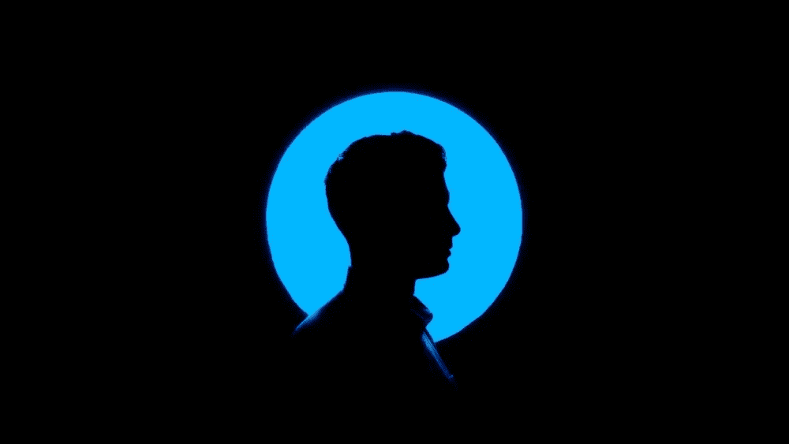
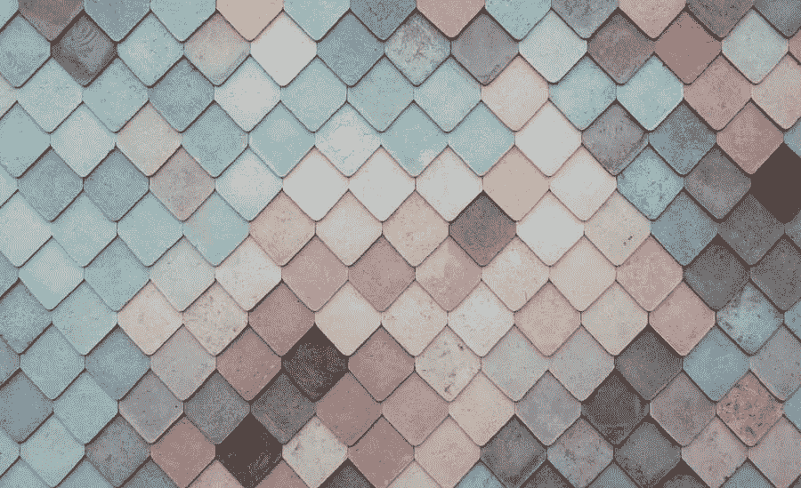
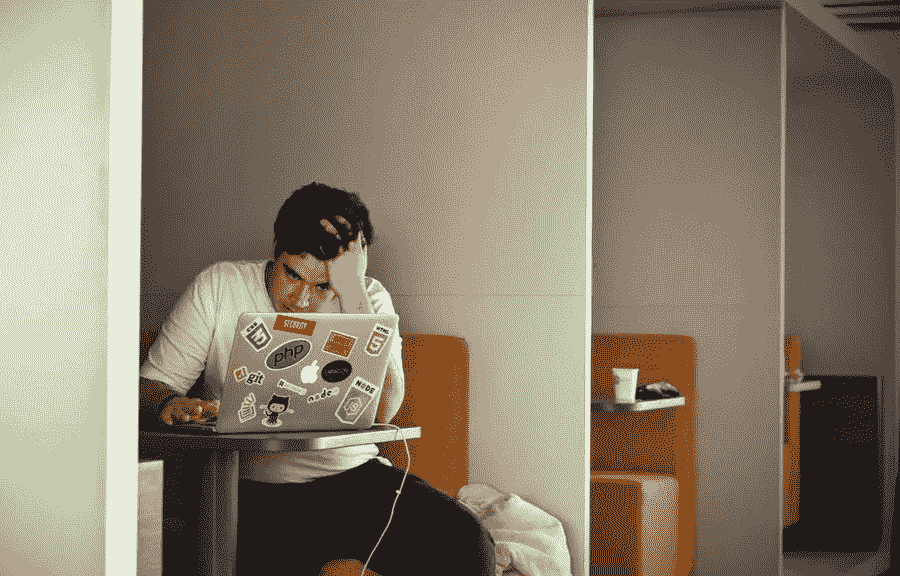
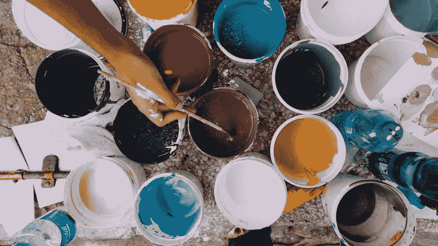

# 现代网页设计背后的心理学

> 原文：<https://medium.com/visualmodo/psychology-behind-a-modern-day-web-design-269bc720c011?source=collection_archive---------0----------------------->

设计师痴迷于他们作品的风格和艺术，这是理所当然的。然而，他们犯了一个严重的错误，那就是不深入。一个好的设计师知道是什么让网页设计的某个元素吸引人。他或她知道如何抓住一个人的注意力。但是你很难找到一个真正理解人们为什么喜欢他们所做的事情的设计师。这就是现代网页设计背后的实际心理学的来源。

心理学不再是临床的、冰冷的、死气沉沉的东西，而是让设计更贴近用户。它为与你的目标受众建立联系创造了空间，让你在更深层次上洞察到什么在起作用，并帮助你理解为什么会这样。这可以作为你武器库中的一个很好的工具，可以真正推动你前进。

# 现代网页设计背后的心理学

# 各个层面的一致性

我们渴望一致性和稳定性。这是一种古老的反射，是允许我们在野外生存的[程序](https://awards.visualmodo.com/)的一部分。奇怪和不同的东西应该谨慎对待。熟悉的东西，应该守护，用来保护我们的安全。这个有点宽泛的概念可以很容易地应用到网页设计中。

也就是说，如果你的公司有很多不同的方面，比如不同的网站、Instagram 营销、脸书页面、twitter 账户……所有这些方面都应该有一个熟悉的模式。仅仅到处都有你的名字和标志是不够的，你想走得更远。例如，让我们说你的标志有尖锐的角度，颜色有红色、黑色和白色。你希望这些方面在你设计网站的过程中得到体现。此外，你的脸书页面上的封面照片，你的 Twitter 个人资料图片…你希望所有这些都遵循相同的角度模式和相同的配色方案。现在，没有必要让它们保持一致，那样甚至会很无聊。这当然是一个棘手的问题。除非你自己是一个网页设计师，否则缺乏一致性可能是你需要一个网页设计师的[信号。](https://visualmodo.com/red-flags-6-signs-you-need-to-hire-a-web-designer-asap/)

# 阅读模式

我们都有一个共同的心理特征，那就是我们阅读网络文章的方式。由于我们不断受到信息的轰炸，研究表明我们发展了一种特定的方式来浏览在线文章。这被称为“F”型。假设你有一篇 20 行文字的文章。读者将首先通过阅读第一行和(例如)第十行来浏览文章。除了这两行，他们还会读所有其他行的前两个单词。本质上，我们的眼睛以“F”的形状移动。

这和你有什么关系？简单。如果读者真的喜欢他或她浏览的内容，他们会阅读整篇文章。所以，你需要把最有趣和最有用的信息放在第一行和中间一行，以及所有其他行的前几个词，来吸引读者。这是一种趋势，即[提高转换率](https://visualmodo.com/top-conversions-boosting-web-design/)，并且已经持续了一段时间。当然，这说起来容易做起来难，如果做得不恰当，会破坏实际的文本。这取决于你如何正确地把握这条微妙的线。

# 图像的正确使用

图像让事情变得更美好，这是显而易见的。它们几乎被用作装饰品，吸引眼球。然而，它们还有另一个功能。也就是说，它们可以强化某个概念或想法。如果你放了一个没有意义的图像，并且与你提供的概念没有联系，你只会让读者困惑。然而，如果你有一个适当的对应图像，你会强化你想强化的任何东西。它给用户创造了一种秩序感，一种平和感。

这里举个例子，只是为了让事情更清楚。假设你受雇设计一个餐饮服务网站，他们想要一个漂亮的背景图片。现在，你会放一张美味牛排的照片吗？还是和一个穿着裙子，戴着花哨珠宝的女孩一起去？当然，你选择牛排。问题是，为什么我们会本能地知道这个问题的答案？因为当我们进入这样的网站时，我们会想到聚会或食物。穿裙子的女孩在最好的情况下只会迷惑人，或者在最坏的情况下，看起来像是抓住用户注意力的廉价举动。

# 避免让信息淹没人们

我们的大脑只能处理这么多信息。在某一点之后，我们会对一个混乱的用户界面感到沮丧和烦恼。这不仅仅是一个糟糕和草率的设计问题。人们通常希望实现真正奇妙的特性。不幸的是，一个页面上的内容太多，最终会让用户感到困惑。当然，[曝光](https://newtheory.com/ways-to-give-your-business-online-exposure-it-deserves/)很棒，但是如果你不能让任何人在你的页面上停留超过 20 秒，那还有什么意义呢？

你要给人们一些喘息的空间，一些能够恰当地接受一切的空间。当然，这一切都是下意识发生的，只需几秒钟。不要害怕在你的页面上有一些空白空间。事实上——使用它。实现它，修改它，这样你就可以把用户的注意力引向别的东西。

# 焦点

每一页都应该有一个清晰的焦点，一个在现代网页设计中非常重要的清晰的想法。人类实际上并不像我们认为的那样擅长多任务处理。让一个页面服务于一个想法，让它完成一个任务，会让所有用户的工作更加自然。

网页的设计应该让网页的实际焦点和目的显而易见。也许一个页面的目的是展示一个产品，或者是提供一个公司的简要历史。也许你想要一个页面，它被设计来保证你的本地搜索引擎优化功能。在一个页面上放太多信息是懒惰和低效的。不要害怕在页面上留下一些空间和空白。如果使用得当，它只能强调你提供的信息。

# 色彩心理学

设计心理学的一个更有趣的方面是颜色背后的情感理论。也就是说，每种颜色对人都有一定的影响，它会激发情感。不过要考虑到色调很重要，颜色的强度也很重要。它们之间也有一些重叠，但总的来说是相当清楚的。

例如，红色是火和激情，它也与[力量](https://shots.visualmodo.com/)和愤怒联系在一起。黄色是舒缓和平静的。另一方面，暗金色是高贵的，就像紫色一样。绿色会让你的用户想起自然和成长。然而暗红是毒，也是土。黑色是优雅和阶级，也是死亡和力量。白色是纯洁的，也让人想起医院。总的来说，较浅的色调提供了一种兴奋和能量的情绪，而较深的色调则是忧郁和踏实的。

# 结论

理解人们如何思考，在使用某种服务或产品时是什么驱动了他们的情绪和动机，是成为一名优秀设计师的关键。如果你在现代网页设计中运用这些技术和想法，你会对事物有更深的理解。利用我们思维的局限性，理解颜色和情绪是如何共存的，并在熟悉和混乱之间找到正确的平衡。