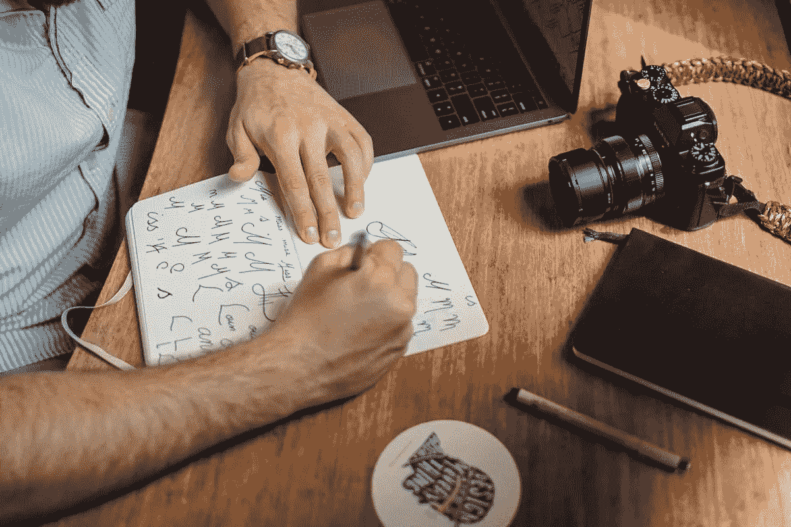
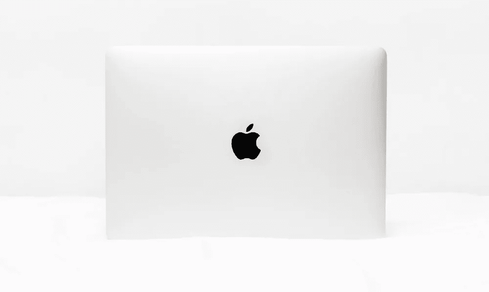
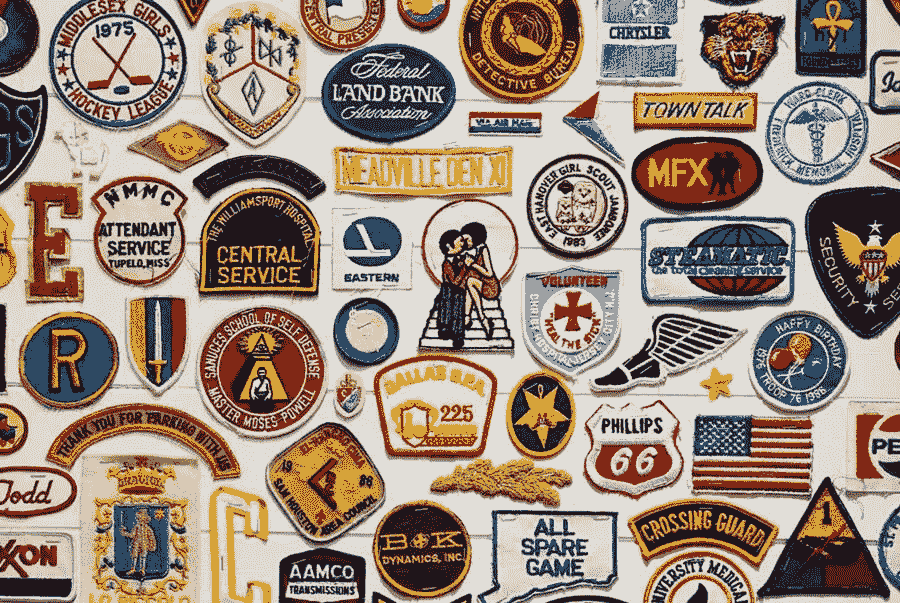

# 心理学融入标志设计过程

> 原文：<https://medium.com/visualmodo/psychology-that-goes-into-logo-designing-process-8eac74fe412d?source=collection_archive---------0----------------------->

你公司的标志说明了你什么？当然，也有可能它并没有真正揭示那么多，在这种情况下，它作为一个标志并不是特别有效，不是吗？然而，还有更糟糕的事情。有些标识设计得很差，以至于会传递错误的信息，甚至直接吓跑你的客户。这背后的原因是，他们是由对标志设计过程中的心理学了解很少或根本不了解的人制作的。为了避免同样的命运，你需要知道以下几件事。

# 心理学融入标志设计过程

# 1.象征和简单

这里值得讨论的第一个问题是象征主义。也就是说，除非你的品牌已经家喻户晓，否则你的受众一遇到你就会开始寻找关于你的线索。因此，你需要一个标志来象征你所做的事情。例如，作为一个医疗保健组织，你想用一个十字架、一颗心、一个创可贴、一次注射、一个温度计或一根阿斯克勒庇俄斯棒作为标志。通过这种方式，你的受众甚至不需要查看“关于我们”部分就能了解你所在的行业。

然而，最常见的[符号](https://visualmodo.com/)的问题在于，每个人都已经在使用它们了。这意味着，为了保持独特，你必须使用变化或改变。这可能会让你误入歧途，因为努力脱颖而出可能会让你改变太多，以至于你的标志变得抽象或完全令人困惑。这就产生了一个完全不同的问题，因为如果你的观众没有意识到这一点，他们会很沮丧。

复杂符号的另一个问题在于人们无法用语言表达它。如果他们不能用文字描述你的标志(至少不能轻易描述)，你可能会发现更难获得口碑推荐。事实上，如果不能用语言表达出标志的主要元素，可能会导致以后完全记不起这个标志。这对品牌认知度来说可能没那么可怕，但从长远来看，这可能会让你的[品牌认知度](http://fabrikbrands.com/brand-recognition-or-brand-awareness/)变得更加困难。

# 2.颜色激发情感

颜色也有其象征意义；一个红色的十字象征一个健康组织，而一个白色或黑色的更可能代表一个宗教组织。然而，这不是颜色的主要作用。从本质上来说，颜色是用来激发某种情绪的。例如，黑色代表力量或成熟，白色代表希望和纯洁，而红色是爱、激情或危险的颜色。根据你想要唤起的情感，你可以从幽灵中选择一种颜色。此外，蓝色是宁静的颜色，黄色象征智慧和温暖，而绿色是幸运、自然和成长的颜色。

某种颜色的棘手之处在于，你可以选择是单独使用它，还是以某种方式组合使用。有了组合，你会更容易成为[独一无二的](https://visualmodo.com/)，然而，这很可能会发出矛盾的，甚至令人困惑的信号。因此，简单地选择一种颜色并坚持下去可能会更干净、更简单、更透明。这样，你不仅解决了商标的颜色问题，也解决了整个品牌的主色调问题。我们谈论的是员工的制服、产品包装(像可口可乐或麦当劳)等等。

# 3.形状心理学

还有一点你要明白，不同的形状也会让我们对事物的感知不同。例如，像耐克或阿迪达斯这样的运动装备品牌有着鲜明的标志，传达出空气动力学和高效外形的信息。不用说，这在健身界是有意义的，然而，这在食品行业并不常见。在这里，人们更满足于曲线，麦当劳(虽然 monogram)是这种工作方式的完美例子。

不用说，当使用符号时，这可能不太相关，但当设计一个抽象的标志时，这可能是值得注意的。这些规则的问题是，它们有时会令人不知所措，为了解决它们，你需要找到在[标志设计服务](http://australialogodesign.com.au/)方面有足够技能和经验的人。

# 4.人们实际上并不阅读

虽然单词和字母可能对一些标志至关重要，但在某些情况下，你需要重新考虑是否需要在你的标志设计中加入一个单词。字母组合和首字母缩写作为杰出的标志，前提是这个想法在你的行业中还没有被采用，但是单词甚至完整的句子呢？当然，有人仔细检查你的标志可能能够阅读和理解的信息，但大多数人不会真的麻烦。所以，坚持一个形象或者一个观念要好得多。如果你不得不使用词语，试着坚持使用一些简短的，容易记住的词语。此外，避免使用有可能出现拼写错误的单词(双字母单词或带有连字符的单词)。

# 5.注意一些无意中不合适的事情

当组合看似简单的形状和符号时，你完全有可能做出一个不合适的[或者一个误导的形状](http://www.smosh.com/smosh-pit/photos/accidentally-naughty-company-logos)。对你来说，这可能会被忽视，因为你已经知道这个标志将要代表什么，但是，不要指望其他人会忘记。为了确保不出现这种情况，尝试引入几个不同的局外人(属于不同的人口统计群体)并询问他们对此的看法。有时候，阻碍你的不仅仅是缺乏远见，还有代沟或文化差异。

正如你所看到的，正确的标志设计的原则并不多，但它们对设计过程的成功都同样重要。忽视它们是一种商业行为，这种行为注定会在未来困扰你。然而，通过一些研究，一些测试和正确的建议，你没有什么可害怕的。