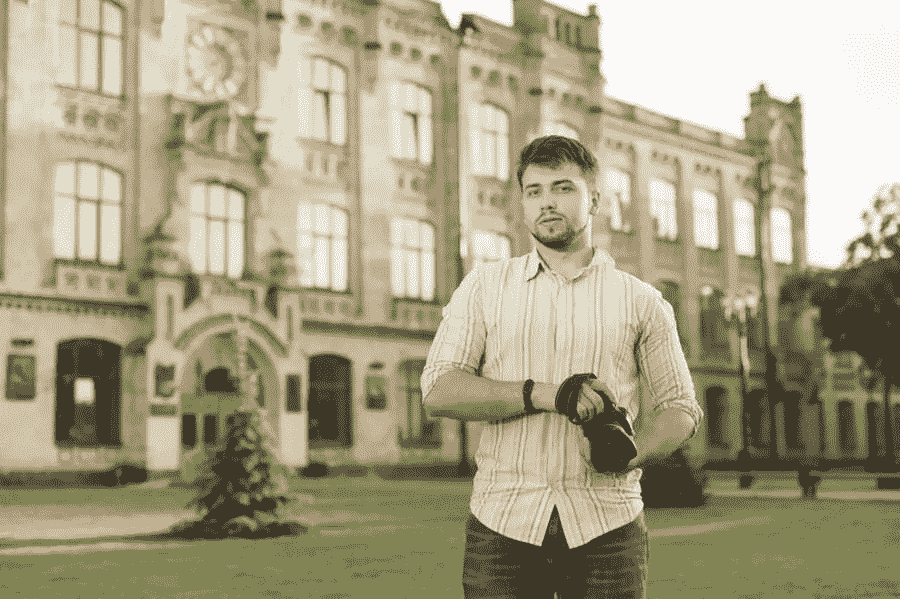

# 雇佣建筑摄影师的理由

> 原文：<https://medium.com/visualmodo/reasons-to-hire-an-architectural-photographer-35a24b625416?source=collection_archive---------0----------------------->

顾名思义，建筑摄影师就是给建筑物和其他类似结构拍照的人，看看为什么要雇佣他。在商业领域创造一个品牌需要一生的努力。随着今天公司数量的增加，你需要花费时间和精力让你的公司脱颖而出。

如果你正在寻找更简单快捷的方法来实现这个目标，雇佣建筑摄影师会有所帮助。这些专业人士使用的工具和获得的经验可以成为你在任何行业的优势。外包专业人士，如建筑摄影师:Teskey Mediaworks，对于小型和初创企业来说是天赐之物。这些专业人士在这个行业的从业时间比你长，和他们一起工作可以加速你的事业成功。

# 什么是建筑摄影师？

建筑摄影师精通不同的摄影技术和摄影设备的使用，以拍摄出准确表现建筑的照片。他们确保他们所有的主题和照片都是审美愉悦的，并有效地突出了一个建筑的最佳和最独特的特征。

一个人要成为一名成功的建筑摄影师，他们最好应该有一个与摄影相关的学位。虽然不是必须的，但是个人在学院里学到的技能和理论会让他们更容易理解摄影和商业行业是如何运作的。

除了摄影相关的学位，一个人还应该有很强的艺术能力，知道如何操作不同的摄影设备和照片编辑软件，并拥有客户服务技能。一个渴望成为建筑摄影师的人也应该关注细节，并具有人际交往和商业技能。

当你决定与一名建筑摄影师合作时，寻找这些资质是至关重要的。你希望他们的服务能帮助你的业务改善，而不是成为你的业务在公众眼中会有负面品牌的原因。

# 你为什么要雇佣建筑摄影师？

当你还是一个商业行业的新手时，你的财务资源将是有限的。你可能已经从不同的银行和贷款公司获得了几笔贷款，以获得足够的金融资本。

雇佣一名建筑摄影师对你的生意来说实际上是一项明智的投资。这些专业人士可以帮助您的企业在多个方面取得成功。

为了说明这一点，以下是一些你应该雇佣建筑摄影师的理由:

# 1.高质量的照片可以提高你的产品和服务的销售

你的业务，不管利基和目标市场，将需要赚取利润才能生存。你需要吸引客户，并说服他们利用你的产品和服务，以确保你的业务长寿。

如果你的企业不产生任何利润，你怎么能继续为你的员工支付工资呢？如果你的企业只花钱，没有任何投资回报，你怎么能赚到利润呢？当你选择与建筑摄影师合作时，你不必担心这些事情。他们制作的高质量照片可以帮助你提高销售额。

通常情况下，为了推销你的业务，你会为印刷广告付费。你可以在你的城市委托一个广告牌，或者付钱给一个出版商在他们的杂志或书籍上为你的企业做广告。当您选择与建筑摄影师合作时，您的企业将能够使用高质量的照片，并且您的照片质量可能会赢得目标客户的积极回应。

如果你的企业涉及房地产，他们会看到一张与你的企业名称相关的精心设计的甲板的照片，他们可能会说，“我想拥有它”，并立即联系你的企业。

当你将高质量的图片用于你的商业营销策略时，你将能够更清晰地描绘出人们的生活将会如何改善，一旦他们利用了你的产品和服务。使用高质量的图像可以吸引你的目标市场与你做生意，让你获得更多的长期销售。好的照片是你的企业可以使用的最重要的营销工具之一。因此，花钱请一名建筑摄影师肯定是值得的。

# 2.第一印象总是很重要

如前所述，在行业中创建品牌非常重要。你创造的品牌可以成为你的顾客光顾你的生意或不惜任何代价避开它的驱动力。如果公众把你描绘成一个不关心顾客、生产低质量产品和服务的品牌，你就很难赢得顾客。如果你也有这种品牌，雇佣人力和与业内其他公司建立合作关系会变得很困难。

如果你想给公众留下积极的第一印象，投资一个建筑摄影师。他们的作品可以为你的企业创造奇迹，创造一个真正说明你的企业价值和产品及服务质量的品牌。

除了印刷品，你的企业还需要创建一个强大的在线存在。世界上的每个人都可以访问互联网，这就是为什么您的企业利用这个平台非常重要。你的网站所用照片的质量将与你的企业品牌相关联。如果你的网站使用专业制作的高质量照片，在线用户会认为你的企业也生产高质量的产品和服务。

使用一张从最佳光线和角度突出你的产品和服务的照片可以传达你的企业努力工作的优雅和美丽。这些照片会在公众眼中产生积极的印象，让你很容易将他们转化为付费客户。使用高质量照片的网站总是会比仅仅使用像素化照片的网站产生更多的线索。

# 3.好的摄影可以引发情感

任何人都能拍出像样的照片。只要有合适的小工具，他们就可以拍摄任何主题的照片。使用智能手机和相机的两个人可以拍摄同一主题的照片。然而，建筑摄影师的工作方式不同。

除了尽可能从最佳角度捕捉主题，建筑摄影师还试图通过拍照来引发观众的情绪。这可能是技术性的，需要专业人员的专业知识。

建筑摄影师有经验和技能捕捉高质量的照片，激发观众采取行动。例如，如果您的企业在特定位置提供租赁物业，建筑摄影师可以使用特定的技术来展示您的物业的最佳功能，并吸引观众实际向您租赁。

一个建筑摄影师可以保证你所有的照片将有效地表达出一种高雅、实用、舒适和安全的感觉。所有这些因素都可能引发任何观众采取行动，尽快接触你的业务。你可以把这些照片当成吸引顾客的诱饵——当这些照片是由经验丰富、多元化的建筑摄影师拍摄时，你很容易就能吸引顾客。

建筑摄影师通常会用一生的时间来学习和掌握这门手艺。不同于那些只拍摄照片发布到社交媒体个人资料上的人，建筑摄影师花费时间和精力来提高他们的技艺。除了这种奉献精神，建筑摄影师还需要有构图的眼光和从照片中复制颜色、形状和价值的技术能力。

一个建筑摄影师总是努力拍摄高质量的图像，引导和引发观众与你做生意。

# 4.帮助您赢得合作

每个企业都想在全球扩张。能够在世界不同的地方经营，并在不同的种族中赢得客户，是企业家一生中的重要里程碑。不是每个创业公司都能享受到这种增长，所以如果你的公司发展到这一步，你应该感到自豪。

如果你正在寻找加快业务增长的方法，尽快开始寻找建筑摄影师。这些专业人士为你的企业拍摄的照片可以成为你赢得全球合作的入场券。

“没有人是孤岛”这句格言在商业领域仍然适用。帮助你的人越多，你就越容易获得成功。与建筑摄影师合作意味着让专业人士拍摄你以前的作品。如果你在翻不同类型的房地产，建筑摄影师可以拍下你过去可以出售的高质量的照片。这些照片可以成为你获得潜在利益相关者时的投资组合。

# 建筑摄影师积极响应

*   而不是花很长时间在会议上通过文字证明你的业务是多么可信和有经验。你可以简单地向他们展示你过去成就的作品集和由建筑摄影师拍摄的照片。因为建筑摄影师是专业的。他们可以展示你过去能够出售的房产的最佳特征。让他们相信你的公司确实做得很好。
*   赢得利益相关者的信任并与他们建立伙伴关系就像申请工作一样。你是申请人，这些商业大亨是一家国际公司的雇主。一份准备充分的作品集可以作为你申请合作时的简历。
*   高质量的照片也能充分说明你作品的质量。它证明了你的企业确实能够满足行业和目标市场的需求。当你能够把这些照片展示给你的潜在利益相关者时。他们会对你的业务有更好的了解。
*   通过这些照片，他们可以适当地设定他们的期望，不会再少考虑你的业务。你可能是商业领域的新手，但因为你的项目质量通过照片表现出来。知名公司可能会被说服与你合作。

# 5.好的照片对任何企业来说都是最有用的工具之一

当你还在创业的时候，节俭是一个重要的品质。你应该只把钱花在有助于企业运营和长期成功的投资上。花任何不能提供这些好处的钱都意味着浪费资源。在最坏的情况下，会缩短你的业务寿命，甚至会导致破产。

当你和一个建筑摄影师合作时，你不用担心浪费任何资源。建筑摄影师提供的服务是你为你的事业付出的最好投资之一。

高质量的照片可以用在很多方面。首先，它可以在你自己的网站上作为营销工具使用。在你网站的正确页面上使用正确的照片意味着更广泛的受众。因此，达到和更好的品牌曝光。高质量的照片可以与企业的声誉和合法性联系在一起。

不管你的产品和服务有多便宜。如果你在你的网站上使用像素化和太少的图片。很难让公众相信你是一家可信的企业。一些在线用户可能会立即查看。当他们看到你的照片在网上的质量和数量有多差的时候。

照片被用在网站上只是一件事。选择与建筑摄影师合作也意味着能够制作高质量的营销材料。例如传单和广告牌。每当你的企业参加本地和国际贸易展时，你也可以使用这些照片。在这些活动中使用代表您品牌的照片可以帮助您在竞争中脱颖而出。与其他玩家交流。

所有这些好处一定能帮助你的企业进步，并在行业中取得成功！

# 只与专业人士合作

总之，你可以从建筑摄影师那里获得的技能和工具肯定能让你的事业兴旺发达。他们的经验可以帮助你在竞争日益激烈的商界脱颖而出。最后，确保你要雇佣的人在这个行业有着良好的记录。所以你所有的商业资源都不会浪费。