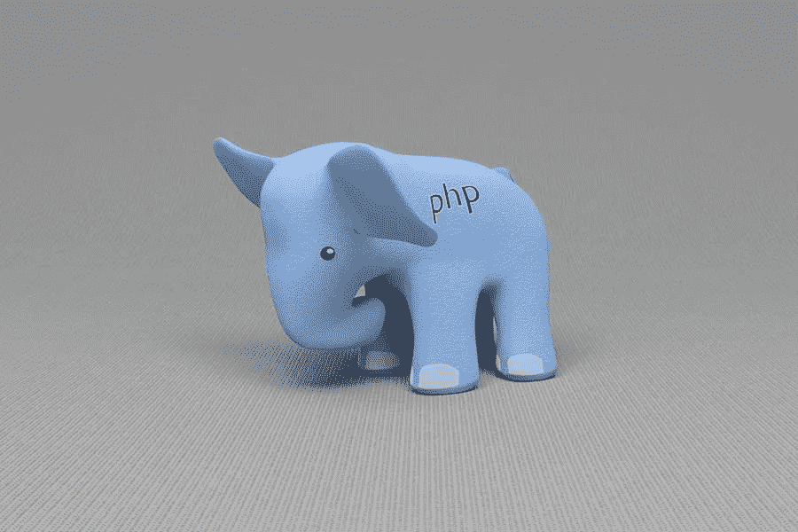

# 立即升级你的 WordPress PHP 的理由

> 原文：<https://medium.com/visualmodo/reasons-to-upgrade-your-wordpress-php-immediately-2f74a04fbcb7?source=collection_archive---------1----------------------->

PHP 是 WordPress 构建的编码语言。它的版本是由你的托管公司在服务器级别设置的。虽然你可能熟悉保留 WordPress 的重要性。最新的主题和插件。让 PHP 保持最新同样重要。

PHP 是一种编码语言。它通常用于在您的站点上创建动态内容。收集和加密数据，发送和接收 cookies，等等。WordPress 的大部分都是用这种语言编写的，无数其他应用程序也是如此。

PHP 7 只是这种广泛使用的开源语言的主要版本。正如更新你的 WordPress 安装程序可以让你获得新的功能一样，将你的服务器升级到 PHP 的最新版本可以极大地提高你的网站的功能。

# PHP 最新版本的优势

*   **新操作员。** PHP 操作符获取某些变量并产生结果。在 PHP 7 中，引入了新的操作符，包括*组合比较(飞船)操作符*和*空合并操作符*。
*   **增加速度。**这是一般 WordPress 用户的首要优势。不仅你网站的访问者会享受到更快的加载速度，而且你也会看到后端速度的提高。
*   **类型声明。当用 PHP 编码时，类型声明使你能够定义你想要的结果，所以当你运行代码时不会有意外。它们也让你的 PHP 更容易阅读。**
*   **错误处理。**以前，PHP 中的致命错误只是停止脚本运行，导致白屏。改进的错误处理使得 PHP 7 在遇到致命错误时抛出异常。

此外，开发人员和其他高级用户可能会对其他优势感兴趣。另外，PHP 7 需要更少的服务器来运行。这意味着在 PHP 7 上，你的网站将需要更少的托管能源，这是一个可以减少你的碳足迹的小方法。

# 更多安全和支持

遵循 [WordPress 安全最佳实践](https://visualmodo.com/wordpress-security-practices/)，结果是你保留了你的安装。插件和主题是最新的。这可以防止由于未打补丁的漏洞而导致的安全问题。

因此，更新您的 PHP 版本也有同样的好处。旧版本的 PHP 中有几个已知的漏洞。未能通过更新来修补它们将使您的网站更容易受到攻击。此外，黑客也意识到了这些问题。

此外，当得知 5.6–7.0 版不再提供支持时，您可能会感到惊讶。没有支持(更不用说质量差的主机)，如果你遇到问题，你只能靠自己了。这可能会让你陷入困境。

这就是为什么我们不仅建议升级到 PHP 7，而且建议升级到 PHP 7.3。因此，它将确保您拥有最新安全修补程序的完全保护。以及在您遇到任何问题时获得专业和直接的支持。

# 现在更新你的 WordPress PHP 版本的原因！

对于许多用户来说，升级无可否认将掌握在你的主机手中。然而，如果您是一名开发人员，并不局限于 PHP 7 的技术增强，那么更新可能不是什么大事。然而，有几个原因可以说明为什么尽快更新 WordPress 网站的 PHP 版本是明智的。我们已经探索了下面四个。

# 用 PHP 最新版本让您的 WordPress 为未来做好准备

正如我们之前提到的，最近在 WordPress 社区中有很多关于 PHP 7 的讨论。这是因为最近宣布，WordPress 将提高其最低要求的 PHP 版本。

这是一个争论了一段时间的话题。许多用户不了解更新 PHP 的优势，或者不想投入工作去做。这导致绝大多数 WordPress 站点运行在过时的 PHP 版本上，这可能会导致性能、支持和安全问题。

随着 WordPress 5.2 的发布，最低要求版本从 PHP 5.2 提高到了 PHP 5.6。开发人员注意到，提高所需版本已经导致更多用户升级。这使得 WordPress 的生态系统更好。

继续改善 WordPress 用户的体验和他们网站的质量。最低要求的 PHP 版本将在 2019 年底再次增加。到那时，所有的 WordPress 用户都需要升级到 PHP 7。

虽然升级在几个月内还不是强制性的。现在升级意味着您将来不必担心这个问题。保留一个过时的 PHP 版本会阻止你更新你的 WordPress 安装。所以你不会想推迟了！

# PHP 7 中的增强功能

我们已经讨论了 PHP 7 中的许多改进。如果您不升级您的 PHP 版本，您将错过这些功能的所有好处。但是，让我们更多地谈谈这对您的网站意味着什么。

特别是，考虑速度。这是 PHP 7 的一个方面，它将为所有 WordPress 用户提供直接的好处，无论其技能水平如何。更好的性能意味着更高的转化率和更有效的搜索引擎优化(SEO)。

Kinsta 最近的一项 PHP 基准比较显示，PHP 7.0 的速度是 PHP 5.6 的两倍多。此外，PHP 7.3 是最新的版本。几乎是目前 WordPress 要求的最低版本速度的三倍:

所以，升级你的 PHP 版本将大大提高你的网站速度。如果你坚持下去，你只会落后于那些决定领先并立即升级的竞争对手。

# 保护您的网站免受插件和主题不兼容问题的影响

兼容性问题是 WordPress 用户面临的一些最常见的错误。当升级你的 PHP 版本时，考虑兼容性是关键。

首先，如果你不采取措施检查你当前的插件与 PHP 7 的兼容性。升级可能会导致您的网站崩溃。好消息是，您可以在升级之前通过测试不兼容性来防止这种情况。例如，如果你的主机是 SiteGround，那么 [SG Optimizer](https://wordpress.org/plugins/sg-cachepress/) 插件会帮你搞定。

不幸的是，专用和高质量的工具很少，或者不再更新。这意味着你需要通过直接联系开发者来做一些工作。查看他们的产品是否与您计划的升级兼容。

尽管在实际更新过程中存在潜在的困难。升级到 PHP 7 应该可以最大限度地减少您将来遇到的兼容性问题。这对 WordPress 专业人士和任何希望开始 WordPress PHP 开发的人来说特别有帮助。

# PHP 7+的更多 WordPress 特性

希望使用 PHP 7 提供的高级特性的插件和主题开发者。此外，他们还花了大量时间来确保老版本 PHP 的向后兼容性。将每个人都提升到 PHP 7 将让开发人员更专注于制作高质量的产品，而不是支持 PHP 5.6。

此外，已经有许多插件和主题降低了与旧版本 PHP 的兼容性。现在升级将意味着您可以使用更多新工具。即使你失去了访问一些旧的和过时的。