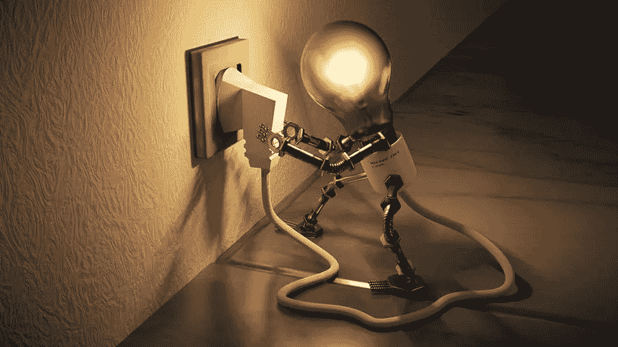

# 降低能耗的高效途径

> 原文：<https://medium.com/visualmodo/reduce-energy-consumption-highly-effective-ways-23cf5dda4432?source=collection_archive---------0----------------------->

节约能源现在成了全城的话题，不仅因为它能帮您省钱，还因为它能最大限度地减少您对环境的影响。谢天谢地，节能并不一定是一项困难的任务，尤其是如果您理解基本概念并积极遵循专家提供的提示。以下内容可帮助您显著降低能耗。

# 降低能耗的有效途径

# 进行能源审计

许多人对此并不以为然，但进行能源审计可以为您提供宝贵的见解，了解您的家庭使用了多少能源。毕竟，除非你知道你的房子有多节能，否则你不能采取措施减少你的能源消耗。一旦您确定了问题领域，您就可以解决它们。例如，您可能从未想过在窗户周围使用填缝材料，尽管您已经为加热或冷却您的房子支付了大量费用。

有时，加热和冷却系统已经过时，需要用更节能的系统来代替，以减少能源消耗。您可能住在一个缺乏现代隔热技术的老房子里，而现代隔热技术的效率要高得多。当然，您可以自己检查您的财产是否存在所有这些问题，但聘请认证专家进行能源审计将为您提供降低能源账单的完整方案。

# 节约天然气、电力和水的措施

即便如此，您也可以通过简单的步骤立即降低能耗和水电费。例如；

*   不要让设备保持接通电源并处于待机状态，也不要在设备充电后让手机充电器保持接通电源。即使不通电，它们也在消耗能量。
*   如果你没有看电视，不要让它开着。如果你喜欢公司的背景噪音，试试收音机。任何收音机比电视消耗的能量少得多。
*   确保您所有的窗户在冬天都能隔绝冷空气。只需修理你的窗户，你会在冬天感觉更暖和，因此取暖用的能量更少。
*   如果你要离开房间，不要让灯亮着。
*   刷牙或洗碗时，不要让水流着。

# 降低能耗结论

因此，这些只是您可以采取的几个简单步骤。每个人都将节省几便士，并在一年多的时间里为[节省现金](https://visualmodo.com/how-much-does-the-average-30-year-old-have-saved/)和能源。它是关于改变你的习惯，而不是把照明、热水、供暖和制冷视为理所当然。总之，即使您是不需要太关注账单的幸运儿之一。您将降低能耗，为更好的环境做出贡献。而且，您可以通过一个负担得起的能源计划来支持这些步骤，让一切看起来更好，这时一个更好的能源比较网站就会来救您。所以，做好研究的准备，从长远来看，降低能耗并增加储蓄。