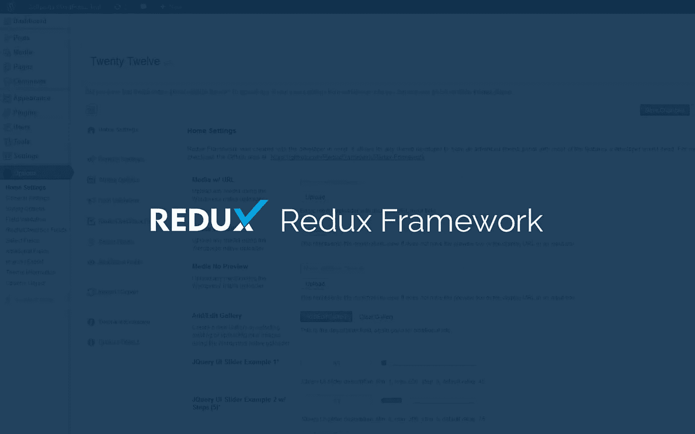
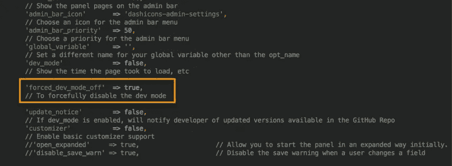
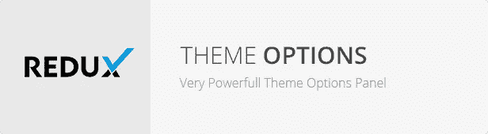

# Redux 框架插件:移除 WordPress 广告横幅

> 原文：<https://medium.com/visualmodo/redux-framework-plugin-remove-wordpress-ads-banner-c6e44ce39f6e?source=collection_archive---------0----------------------->

Redux 框架无疑是一个非常有用的 WordPress 插件。世界上很多 WordPress 主题和插件开发者都在使用这个框架。

然而，当`WP_DEBUG`为`true`时，框架会在框架选项窗口/主题选项面板的顶部显示管理通知和一个**广告横幅**。

移除所有这些东西并不影响你将`dev_mode`设置为`true`还是`false`。实际上，当你在一个开发环境中使用框架时，这有点令人讨厌。



# 如何移除 [Redux](https://github.com/reactjs/redux) 横幅？

下面是你如何摆脱那些**管理通知**和**横幅广告**的方法。

**1。**打开你的**options-config.php**文件，在框架参数数组中设置新的参数`'forced_dev_mode_off' => true`。



一旦你设置了`'forced_dev_mode_off' => true`，它会在框架选项窗口显示一个红色的提示。按照**步骤 2** 移除红色通知。

**2。**如果你已经在你的主题中嵌入了框架代码，那么打开**redux core/templates/panel/head . ert pl . PHP**并在第 54 行找到下面的代码块(取决于框架的版本)

```
<div class="redux-dev-mode-notice-container redux-dev-qtip" qtip-title="<?php echo esc_attr( $tip_title ); ?>" qtip-content="<?php echo esc_attr( $tip_msg ); ?>"> 
    <span class="redux-dev-mode-notice" style="background-color: #FF001D;"><?php _e( 'FORCED DEV MODE OFF ENABLED', 'redux-framework' ); ?></span> 
</div>
```

注释掉整个块，就大功告成了！

然而，如果你使用框架作为插件，那么你可以通过添加下面的代码到你的任何管理 CSS 文件中来隐藏红色的提示。

`.redux-dev-mode-notice-container.redux-dev-qtip { display: none; }`

为了更好的用户体验，所有的 Visualmodo 主题都提供了这个伟大的插件。



# 这个框架是什么？

是一个简单的、真正可扩展的、完全响应的 WordPress 主题和插件选项框架。建立在 WordPress 设置 API 上，支持多种字段类型，以及:自定义错误处理，自定义字段和验证类型，以及导入/导出功能。但是实际上做了什么呢？我们不认为主题和插件开发者应该在每次开始一个项目时都要重新发明轮子。它旨在通过为开发人员提供一个简化的、可扩展的框架来简化开发周期。通过一个简单的、记录良好的配置文件，第三方开发人员可以构建一个选项面板，只需他们自己的想象，只需从头构建所需时间的一小部分！