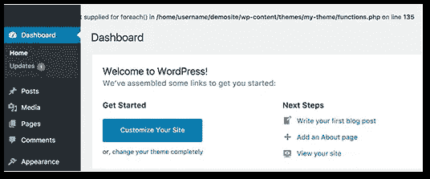
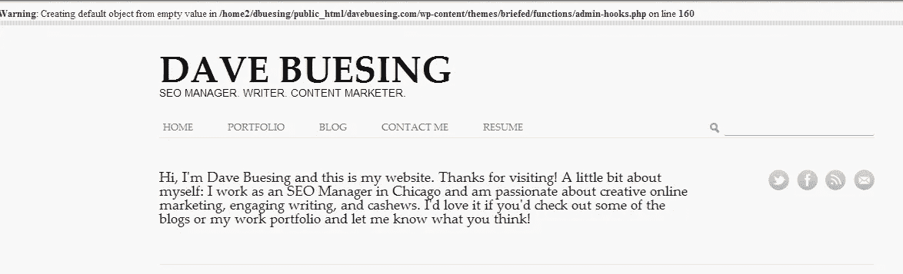
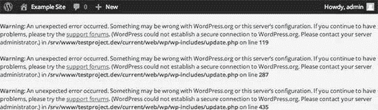

# 删除 WordPress PHP 错误行

> 原文：<https://medium.com/visualmodo/remove-wordpress-php-error-lines-45edd329ecf5?source=collection_archive---------0----------------------->

如果你在你的 WordPress 上遇到与 PHP 文件夹相关的错误行，或者在你的管理面板或网站前端的其他错误日志，现在看看如何从你的网站上删除这些错误行

PHP 警告和通知帮助开发人员调试代码中的问题。然而，当你的网站访问者都可以看到它们时，这看起来非常不专业。在本文中，我们将向您展示如何在 WordPress 中轻松关闭 PHP 错误。

## 为什么以及何时应该关闭 WordPress 中的 PHP 错误？

你在 WordPress 站点上看到的 PHP 错误通常是警告和通知。这些不像内部服务器错误，语法错误，或致命错误，停止你的网站加载。通知和警告是那种不会阻止 WordPress 加载你的网站的错误。

这些错误的目的是帮助开发人员调试代码中的问题。插件和主题开发者需要这些信息来检查兼容性和最佳实践。

然而，如果你没有开发一个主题、插件或者自定义网站，那么这些错误应该被隐藏。因为如果他们出现在你网站的前端给你所有的访问者看，这看起来非常不专业。

如果你在你的网站上看到一个类似上面的错误，那么你可能需要通知相应的主题或插件开发者。他们可能会发布一个修复程序来消除错误。同时，您也可以关闭这些错误。

让我们来看看如何在 WordPress 中轻松关闭 PHP 错误、通知和警告。

# 删除 WordPress PHP 错误行

## 在 WordPress 中关闭 PHP 错误

对于这一部分，您需要编辑 public_html 上的[wp-config.php](https://codex.wordpress.org/Debugging_in_WordPress)文件。

在您的 wp-config.php 文件中，查找以下行:

`define('WP_DEBUG', true);`

也有可能，这一行已经设置为假。在这种情况下，您将看到以下代码:

`define('WP_DEBUG', false);`

无论哪种情况，都需要用下面的代码替换这一行:

`ini_set('display_errors','Off');`

`ini_set('error_reporting', E_ALL );`

`define('WP_DEBUG', false);`

`define('WP_DEBUG_DISPLAY', false);`

不要忘记保存您的更改，并将您的 wp-config.php 文件上传回服务器。

您现在可以访问您的网站，确认 PHP 错误、通知和警告已经从您的网站上消失。

## 在 WordPress 中打开 PHP 错误

如果您在本地服务器或临时区域的网站上工作，那么您可能希望打开错误报告。在这种情况下，您需要编辑您的 wp-config.php 文件，并用以下代码替换您之前添加的代码:

`define('WP_DEBUG', true);`

`define('WP_DEBUG_DISPLAY', true);`

这段代码将允许 WordPress 再次显示 PHP 错误、警告和通知。