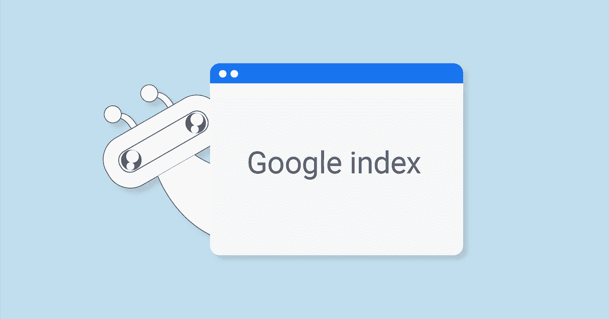

# 删除 Google 上的索引页面

> 原文：<https://medium.com/visualmodo/removing-indexed-pages-on-google-63a5c2842b76?source=collection_archive---------0----------------------->

有很多原因可以让你从谷歌搜索索引中删除一个页面。你如何从谷歌搜索中移除索引页面？

我曾经认为，我在谷歌索引上的页面越多，我将获得越多的流量。但这不是真的。当我第一次查看 RTB 的谷歌索引页面时，我意识到了这一点。我发现很尴尬。许多无用的网页被谷歌索引，甚至有些网页没有内容。

# 删除 Google 上的索引页面

这些低质量的页面也会损害你的搜索引擎优化。另外，谷歌索引上没有理由有这些无用的页面。在这篇文章中，我将分享如何阻止抓取网址，以及如何从谷歌索引中删除网址。

在继续之前，我想分享一下什么时候删除索引页，什么时候不删除。

**什么时候删除索引页？**

删除网址的原因可能有很多，但这里有一些最常见的。

*   一个包含机密数据的页面被谷歌编入索引，你想把它从索引中取出来。
*   你很久以前已经删除了一个帖子，但它仍然显示在搜索结果中。
*   你的网站因为低质量的内容被熊猫攻击了。
*   您不希望某些特定页面(如隐私政策页面)显示在搜索结果中。
*   谷歌网站管理员工具通知违反谷歌准则的页面。

**什么时候不删除索引页？**

尽管你有权从谷歌搜索结果中删除任何网址，但在某些情况下你不应该这样做。谷歌提供了一些关于这个问题的指导方针。情况是这样的。

*   Google 的爬虫自然会从索引中删除过时的网址。因此，您不需要为这些旧页面请求紧急更新。
*   您不需要因为爬网错误而删除 URL。随着时间的推移，他们会自然退出。
*   如果你认为你的网站可能有一个手动操作，不要删除网址，从头开始。取而代之的是，在解决问题后提出[复议请求](https://support.google.com/webmasters/answer/35843?vid=1-635795889973486078-3775289588)。
*   如果你的网站被黑了，一些不好的网址被谷歌索引了，不要屏蔽整个网站。屏蔽那些不良网址就行了。但首先，清理你的网站，让谷歌重新抓取你的网站。
*   不要使用 URL 阻止工具删除不同版本的页面。相反，使用 URL 的规范化。

**如何在 Google 中查看索引页面**

在采取任何行动之前，你需要知道你网站的哪些页面已经被谷歌索引了。要知道这个，去[谷歌](http://google.com/)。并搜索。

到目前为止，你只能看到你的网站中被谷歌索引过的页面。现在你需要确定哪些网址，你将被阻止，并继续删除索引页的过程。

# 阻止谷歌索引中的网址

在从搜索结果中删除网址之前，我建议你屏蔽掉谷歌抓取的网址。通过屏蔽网址，你可以阻止谷歌索引网页显示在搜索结果中。这里有 3 种方法来停止谷歌爬行。

# Nnoindex 元标记

你可以通过在页面的 HTML 代码中添加 *noindex* meta 标签来告诉 Googlebot 不要索引特定的页面。当 Googlebot 找到 *noindex* meta 标签时，它会从谷歌搜索结果中删除该页面。

添加 noindex meta 标记非常简单。只需将下面的 meta 标签放入页面的部分。

如果你正在使用 WordPress，你可以通过使用 Yoast 插件很容易地做到。一旦你安装了 Yoast 插件，进入你想要添加 noindex meta 标签的页面，编辑页面/文章。向下滚动到' **Yoast SEO** '并点击“高级”选项卡。从“元机器人索引”中选择“noindex”并更新帖子/页面。要更快删除你的页面，使用[获取为谷歌](https://support.google.com/webmasters/answer/6066468?rd=2)。

# Robots.txt

Robots.txt 文件表示您的网站中您不想被谷歌机器人抓取的页面或文件夹。老实说，在 Robot.txt 的“禁止”列表中添加一个文件或页面并不会将其从谷歌索引中删除。但它将帮助谷歌机器人抓取正确的内容并将其编入索引。

如果您还没有配置 Robots.txt 文件，请阅读如何创建和配置 [Robots](https://visualmodo.com/optimize-wordpress-robots-txt-file-seo/) 。txt 文件。

[https://support.google.com/webmasters/answer/6062608?vid = 1-635796757441517520-3775289588](https://support.google.com/webmasters/answer/6062608?vid=1-635796757441517520-3775289588)

# 删除并重定向

如果页面对读者和搜索引擎机器人没有价值，那么就把页面从你的网站上删除。但是您必须将被删除页面的 URL 重定向到一个现有的 URL。每当 Google bot 发现页面被重定向到一个新的 URL，它就会丢弃旧的 URL 并索引新的 URL。

你可以使用[重定向](https://wordpress.org/plugins/redirection/)插件来重定向 URL。一旦你安装了插件，进入 WordPress 仪表盘>工具>重定向。然后你会得到**添加新的重定向“**”选项重定向旧的网址到新的网址。

在**源 URL** 上输入您想要重定向到新 URL 的 URL，并在**目标 URL** 上输入您的目的地 URL。然后点击“添加重定向”按钮。

# 删除谷歌网站管理员的网址

屏蔽网址后，你应该等待几天，让谷歌自动删除网页。如果谷歌过一段时间没有删除这些网址，就使用谷歌网站管理员工具。

现在让我们看看如何使用谷歌网站管理员工具删除网址。在进入教程之前，我建议你小心使用这个工具。只有当你知道你在做什么的时候才使用这个工具。如果做得不正确，你的网站会被谷歌索引除名。

以下是步骤。首先，去你的[网站管理员工具](https://www.google.com/webmasters/tools/)仪表板，选择合适的网站。

从左侧导航点击“谷歌索引”。你会发现那里有四个选项。从那里选择“删除网址”。(跟随下图)

现在点击“暂时隐藏”并输入你想隐藏的网址。然后点击“继续”。

在下一个屏幕上，您将看到您的 URL 和另一个名为“**请求类型**”的字段。这里你会发现三个选项。选择第一个选项，即“暂时隐藏搜索结果中的页面并删除以进行缓存”。然后点击“提交请求”。

您隐藏 [URL](https://visualmodo.com/) 的请求已提交给 Google。您将看到“待处理请求”状态。当 URL 被删除时，状态将更改为“已删除”。您也可以通过单击“取消”按钮来取消请求。

一般来说，谷歌不会花太多时间来处理这些请求。我的花了不到一天。我提交了一些其他的网址，所有的网址都在几个小时内被删除了。

# 结论

希望这篇文章能帮助你从谷歌搜索结果中移除索引页面。如果您对此有任何疑问，请随时通过评论向我们提问。

再次强调，使用这个工具要非常小心。让谷歌通过屏蔽网址来自动删除网页总是一个好主意。然而，如果你觉得这篇文章有用，请在脸书、Twitter 或 Goole+上分享这篇文章。