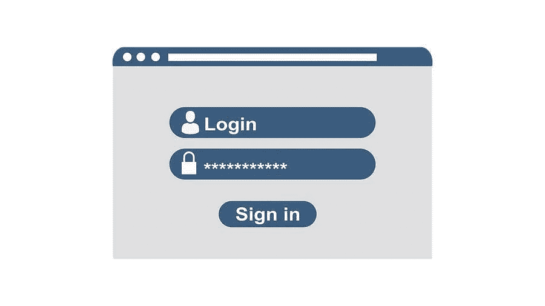

# 重置 WordPress 管理员密码教程

> 原文：<https://medium.com/visualmodo/reset-wordpress-admin-password-tutorial-35f3f29084a1?source=collection_archive---------1----------------------->

通常情况下，当有人忘记了他们的密码，他们无法访问他们的电子邮件进行标准的密码重置，或者他们的 WordPress 没有正确发送电子邮件时，就会发生这种情况。在这篇文章中，我们将通过一些快速简单的步骤来指导你如何为你可能遇到的所有不同类型的情况重置 WordPress 管理员密码。

# 访问电子邮件:重置 WordPress 管理员密码

首先，重置 WordPress 密码是通过标准的登录页面。这假设您可以访问您的电子邮件。

1.  浏览到你的 WordPress 登录页面，通常这是位于/wp-admin，比如 domain.com/wp-admin.然后点击“丢失了你的密码？”底部链接。
2.  在下一个屏幕上，输入你的用户名或你的 WordPress 管理员帐户的电子邮件地址。点击“获取新密码”，您将通过电子邮件收到一个创建新密码的链接。

通过 phpMyAdmin 重置 WordPress 管理员密码:当你不能访问电子邮件时

其次，作为使用 cPanel 中的 [WordPress Toolkit](https://visualmodo.com/make-secure-wordpress-sites/) 工具重置 WordPress 密码的替代方法。您可以通过直接在应用程序的数据库中更改密码来重置所需用户的密码。因此，要做到这一点，请转到 cPanel 并单击 Databases 部分中的 phpMyAdmin 图标。接下来，从左边的列表中找到你的 WordPress 数据库。然而，如果你不确定是哪一个，你可以在你的 WordPress 安装的根文件夹中检查 wp-config.php 文件的下面一行:

> define('DB_NAME '，' user _ WP 743 ')；

# SQL 用法

接下来，点击顶部菜单中的 SQL 链接来重置 WordPress 管理员密码。在打开的新页面上。您需要在页面的文本字段中输入以下 MySQL 查询:

> UPDATE ` WP _ users ` SET ` user _ pass `= MD5(' new password ')，其中` WP _ users ` . ` user _ log in `= " admin _ username "；

因此，在上面的查询中，用 WordPress 的实际表前缀替换 *wp_* ，用期望的密码替换 *NEWPASSWORD* ，用实际的 WordPress 用户名替换 *admin_username* 。完成后，单击屏幕右下角的 Go 按钮执行查询。

最后，您现在可以使用新密码登录了。总之，如果你想改变你的管理员用户名。你可以按照我们的教程中的指导来改变你的 WordPress 用户名。