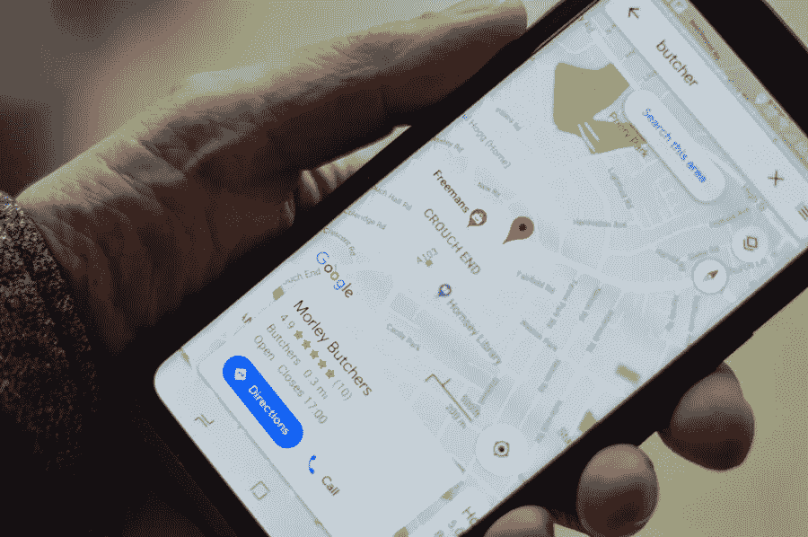

# 回复评论最终指南

> 原文：<https://medium.com/visualmodo/responding-reviews-definitive-guide-7a0da55d2385?source=collection_archive---------0----------------------->

倾听和回应客户的评论为您提供了一个绝佳的机会来联系、展示出色的客户服务并解决任何问题。

# 回应评论:为什么？

对于顾客来说，在线评论是至关重要的。我们每个人在预订法国南部那栋昂贵的度假别墅之前都会查看评论。评论告诉你其他人，你的顾客，对你的产品的看法。如果你回复[评论](https://visualmodo.com/blog/)，你向你的(潜在)客户表明你在乎他们的意见。这是你的客户会欣赏的。除此之外，回复评论会让你的公司从其他公司中脱颖而出，因为他们中的许多人并没有努力回复他们的评论。

如果你写评论的回复，你不仅仅是写给写评论的人。所有潜在客户都会看到你的回答。带着优雅、感激和一点点感激来处理评论，会对人们感知你的品牌的方式产生巨大的影响。

对评论做出反应似乎是明智之举。这并不意味着你应该回应每一个评论。在我看来，你应该对负面评论做出反应。回应负面评论将向潜在客户展示你如何处理问题，并为不满意的客户提供解决方案。

我也会对非常积极的评论做出反应，尤其是如果评论是详尽的。回应积极的评价将会给你机会推广你的品牌，展示你对公司的热情。回复正面评论并不难。消极的人需要一个策略。

# 回复评论:清单

你如何回应那些负面评论？你应该做什么，应该避免哪些陷阱？我将分享如何处理这些负面评论的七个技巧！

# 路线图

负面的评论和评论总会在某个时间点出现。做好心理准备是好事。你可以准备一些标准的回复。注意不要重复使用同一个答案。总是根据情况的具体要求做出回答。准备好一些精心起草的句子可以帮助你在最激动的时候做出回应。

# 冷静

得到负面评价从来都不容易。在某些情况下，它可能会觉得不公平。也许评论的语气是严厉的，个人的或者居高临下的。你的第一反应很可能是情绪化的。也许你会生气或非常沮丧。在这种情况下，明智的做法是在你写回复之前花点时间。

# 离线部分

有人对你的业务有不好的体验，你能解决吗？尝试在评论频道之外联系他们。请他们联系你的销售部门，或者邀请他们到你的餐厅。人们没拿到甜点吗？邀请他们来你的餐馆。人家联系不上你的支持部门？帮助他们进行[连接](https://shots.visualmodo.com/)。

# 了解问题

否定的回答意味着有人对你的生意有负面的体验。也许他们不喜欢你餐馆里的食物。当然，这可能是因为他们缺乏品味，但这样的回应不会让你的潜在观众满意。在大多数情况下，从为他们的负面经历道歉开始，即使这不完全是你的错。你很抱歉他们有过不好的经历。你很抱歉食物不好吃。

如果因为你网站上的一个错误而出了问题，告诉人们，承认你的错误并为此道歉。如果有人没有得到他们的甜点，对此很生气，调查这种情况的具体情况。你真的忘了他们的甜点吗？承认你的错误，道歉并努力解决问题。在这种情况下，邀请他们下次再来吃甜点。每个人都会犯错，如果你愿意展现你人性的一面，人们真的会原谅你。承认你的错误，道歉，并努力想出一个解决办法。

# 要求第三人称

你从来都不是回复[评论](https://awards.visualmodo.com/)的客观作者。你参与了。对你来说听起来合理的事情，对其他人来说可能听起来疯狂好斗。如果你不确定你的回答，让别人先读一遍(客观的人)可能是个好主意。

# 简单点

不要写太长的回复。让他们简短而甜蜜。没有人想通读一封 13 段的回信。即使有人在评论中对你进行人身攻击，你也不应该针对个人。任何时候都要保持专业和礼貌。

永远不要陷入冗长的讨论。回复一次，必要的话可能两次，但之后就不要再回复了。没有人想阅读一个不满意的客户和企业之间的完整讨论。或者也许有些人确实喜欢读这样的东西，但它并不能很好地反映你的业务。

# 结论

如果你有一些消极的回应，你可能会想把它们埋在一大堆积极的回应下面。也许你会遇到有正面体验的顾客。无论如何，邀请他们留下评论。[研究显示](https://searchengineland.com/70-consumers-will-leave-review-business-asked-262802)很多人都愿意这么做！

如果您可以解决不满意的客户的问题，您也可以询问他们是否可以编辑或删除他们的评论。只有在客户和你的企业之间的关系已经明朗的情况下，你才应该这么做。