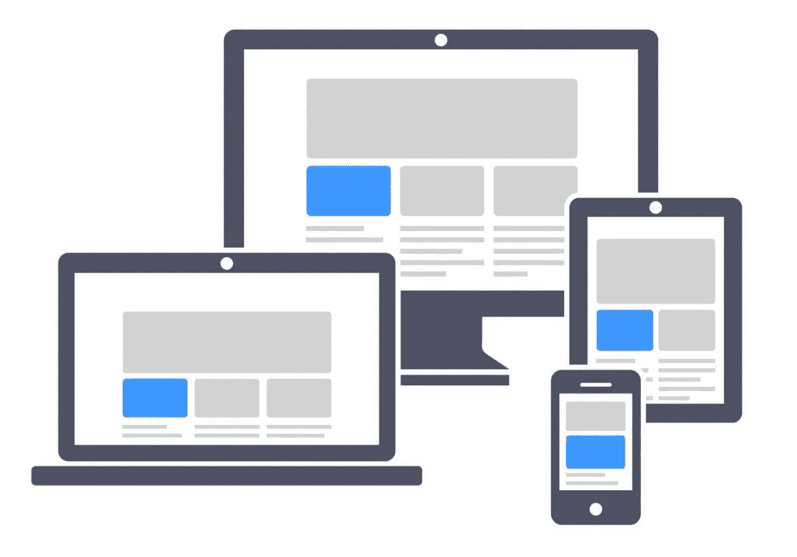
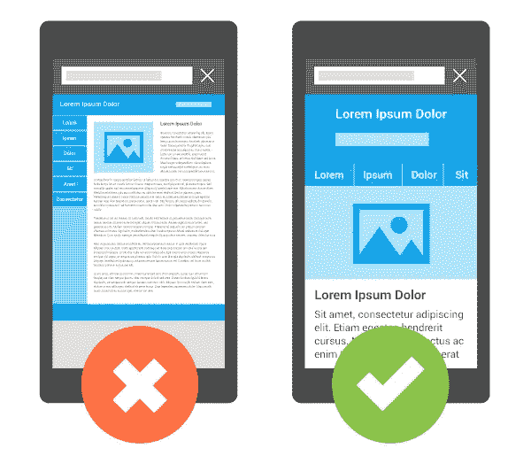

# 响应 WordPress 主题解释

> 原文：<https://medium.com/visualmodo/responsive-wordpress-theme-explained-57ed01c9f002?source=collection_archive---------0----------------------->

一个反应灵敏的 WordPress 主题根据屏幕大小和分辨率平滑地调整它的布局。响应式主题在智能手机等较小的屏幕上提供了更好的可读性和可用性。它还阻止您创建特定于设备的移动版本。

如果你正在做你的网站，你可能已经被告知要确保它是作为一个“响应式主题”或“移动响应式”来构建的，并且想知道什么是响应式主题？

在这篇文章中，我将介绍什么是响应式 WordPress 主题，以及为什么你想在你的网站上使用它。

# 理解一个响应的 WordPress 主题

响应式 WordPress 主题是一个在所有屏幕上都好看的主题。也就是说，如果你的网站响应[迅速](https://visualmodo.com/wordpress-themes/)，那么在你的移动设备上浏览网站的访问者就可以很容易地阅读网站信息，毫无困难地浏览网站。

WordPress 主题开发者使用的代码允许网站随着屏幕大小的调整而调整大小。这包括动态调整图像大小以及增加用户可读性。

响应式 WordPress 主题非常重要，我们已经确保所有 Visualmodo WordPress 主题对您的商业网站、博客或商店都是响应式的。

# 这很重要

随着越来越多的人使用智能手机和平板电脑来搜索网络，在这些较小的屏幕上拥有一个正常运行的网站非常重要。如果访问者无法在他们的移动设备上阅读你的内容或浏览你的网站，他们更有可能退出你的网站，访问互联网上数百万个其他网站中的一个来获得他们的答案。

如果你在你的网站上安装了谷歌分析，你可以查看桌面访客的移动访客数量，看看移动网站如何影响你的业务。如果你的网站有很高的移动访客率，那么从移动设备访问你自己的网站，看看对你来说是什么样的体验。这将告诉你用户访问你的网站时的感受。

如果你的[网站](https://visualmodo.com/blog/)有很高的跳出率，那么你也会想看看你的移动访客，看看移动访客跳出率是不是导致这个的原因。根据 GoRocket 的说法，移动设备的平均跳出率约为 60%，比其他类型的设备高出约 20%。如果你的网站是移动友好的，有一个响应的 WordPress 主题，你的跳出率可能会降低。

# 检查您的站点响应度

如果你现在建立了一个网站，但不确定它是否有响应，你可以用你的浏览器来检查。

使用全幅浏览器并更改其大小。如果你的网站的段落和文字移动到缩小的宽度之内，它可能会有反应。

谷歌最近开始测试网站的移动友好性，并奖励在搜索结果中有移动响应网站的网站所有者。你可以在他们的[手机友好测试](https://www.google.com/webmasters/tools/mobile-friendly/)页面上查看你的网站，看看上面写了什么，并按照建议进行改进。

有几种方法可以提高你的网站的移动友好得分，这也可能有助于移动用户的搜索结果。

当你努力确保你的网站对访问者的移动响应时，也要考虑整体用户体验和使你的网站易于使用和简单导航的重要性。我希望这篇文章能帮助你理解什么是[响应式 WordPress 主题](https://visualmodo.com/wordpress-membership/)。