# WordPress 的餐馆菜单插件

> 原文：<https://medium.com/visualmodo/restaurant-menu-plugins-for-wordpress-90599cc97881?source=collection_archive---------0----------------------->

优秀的免费餐馆插件

查看最好的免费餐馆 WordPress 插件列表，上传到你的网站上，以一种漂亮的方式展示你的餐馆菜单。

近年来，我们目睹了信息技术的不断发展，几乎没有哪个行业不受其影响。酒店和餐饮业也不例外。顾客几乎不会亲自去任何酒店或餐厅，相反，他们会在谷歌上搜索他们要找的餐厅类型，看餐厅菜单，甚至在网上点菜和付款。

因此，决定你生意成功的最重要的因素之一就是你的在线形象。如果你有一个优雅的酒店/餐厅网站，一切管理良好，设计得当，你一定会击败你的竞争对手。餐馆菜单插件使得为你的网站创建令人垂涎的食物/餐馆菜单变得非常简单。

事实上，网上有很多餐馆 WordPress 插件，所以为你的餐馆网站选择一个并不容易。因此，在这篇文章中，我整理了 5 个最好的免费 WordPress 餐厅菜单插件来帮助你更好地导航你的插件搜索。

# 最佳免费餐厅插件

**让我们来探索一下:所有的**[**visual modo**](https://visualmodo.com/wordpress-themes/)**WordPress 主题都兼容并针对所有的餐厅 WordPress 插件进行了全面优化。**

# 1.餐馆压力

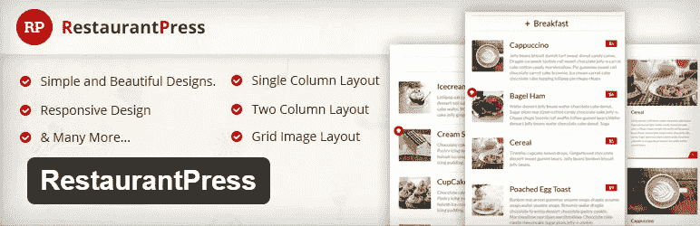

RestaurantPress 是一个免费的 WordPress 餐馆菜单插件，可以让你在你的餐馆、美食、酒店和咖啡馆网站上添加很棒的餐馆菜单。这个插件确实很棒，它提供了在你的 WordPress 网站上创建诱人美味的食物菜单的最简单的方法。此外，它的响应能力非常强，可以很好地适应任何设备、台式机或手机。

该插件主要提供三种餐厅菜单布局:

*   **单列布局** —在单列直列中展示您的餐厅菜单，每一项都有特色图片、菜品简介和价格。当你点击 lightbox 时，你也可以在 light box 上显示菜单项图像。
*   **两栏布局** —分两栏显示您的餐厅菜单。
*   **网格布局** —如果你是网格设计爱好者，你可以把你的餐厅菜单设置成网格风格。

请看下图，这是你的餐馆菜单在两栏布局中的样子。如果你想有完整的现场预览，这里是餐厅的 [**完整演示按**](https://demo.themegrill.com/restaurantpress/) 免费插件。

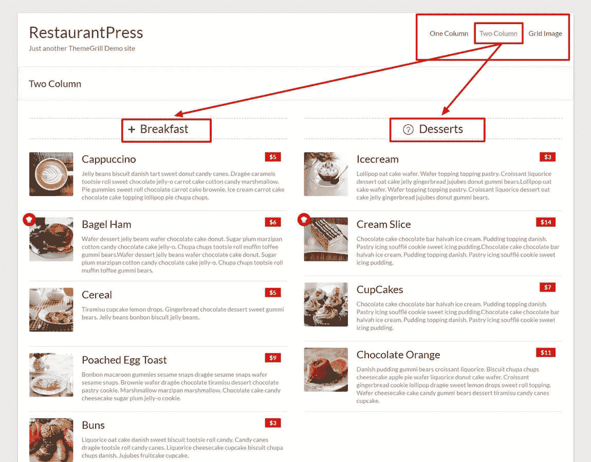

RestaurantPress 插件—两列餐厅菜单布局

插件后端是简单和用户友好的。您可以轻松添加带有特色图像、价格的菜单项，还可以定义其类别。此外，您可以更改菜单布局、类别图标、特色图像，并从组中启用/禁用灯箱效果。

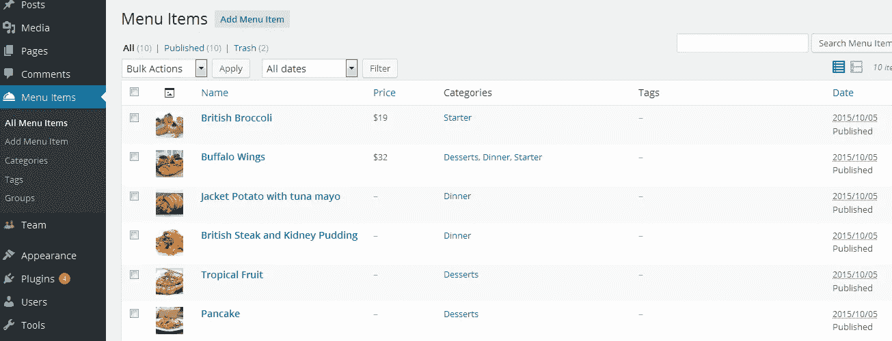

总之，RestaurantPress 是制作简单优雅的食物/餐厅菜单的完美解决方案。使用这个插件，甚至使用短代码，你可以很容易地添加多个菜单。

下载餐厅如果您想要一个**免费、简单、方便的食物菜单解决方案**，请点击此处。

[了解更多关于插件的信息并下载](https://themegrill.com/plugins/restaurantpress/)

# 2.食物和饮料菜单

食物和饮料菜单是另一个在线创建食物和餐馆菜单的插件。很容易使用免费插件来创建和管理菜单，在每个设备上看起来都很棒。是的，我的意思是它完全响应。您可以轻松创建无限的食物和饮料菜单，并向其中添加无限的菜单项。

该插件允许你在网站的多个地方显示餐馆菜单:*在模板、帖子、页面和小部件*中。它使用经典的菜单风格来漂亮地展示您的菜单项/可用的菜肴。主要有两种菜单布局: **1。单列布局的经典菜单样式**和 **2。两栏布局的经典菜单风格**。

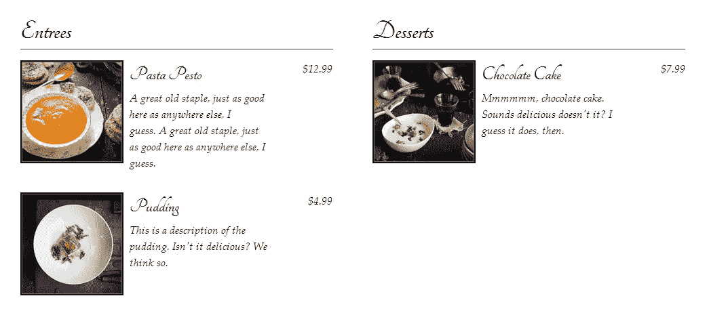

食物和饮料菜单插件——两栏布局的经典菜单样式

这个插件创建了两种帖子类型:**菜单项**和**菜单**。它为添加菜单项提供了一个简单的界面，看起来像 WordPress post editor。然后，创建一个菜单，选择菜单布局，添加部分，从“添加新菜单”添加菜单页脚，如下图所示。

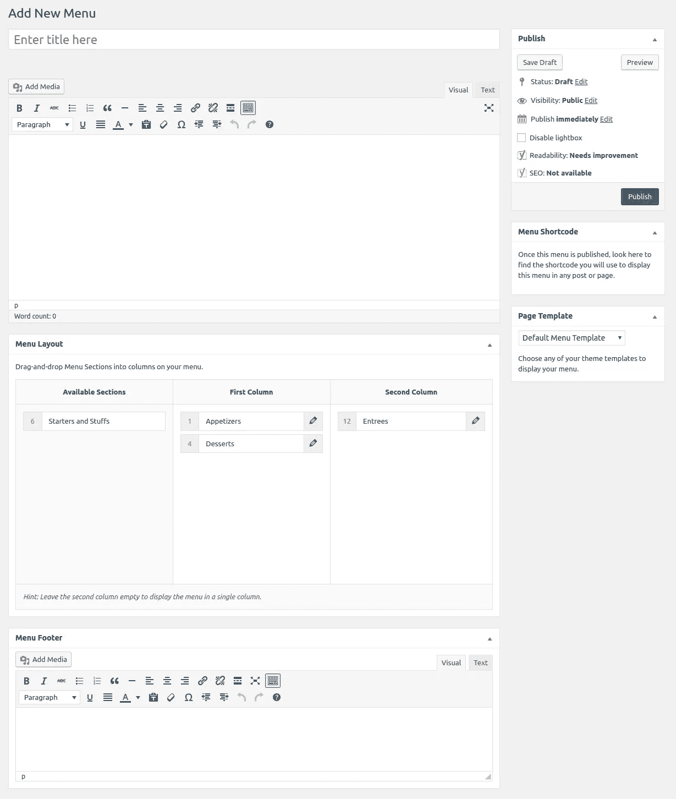

食物和饮料菜单插件设置

总之，食物和饮料菜单是迄今为止最好的 WordPress 餐馆菜单插件之一，它有着令人敬畏的特性。如果你想要更多的功能，比如折扣、特价、饮食图标等等，你可以购买插件的插件。

如果你认为**免费插件现在没问题，将来可能会升级**，就用餐饮菜单插件。

[了解更多关于该插件的信息并下载](https://wordpress.org/plugins/food-and-drink-menu/)

# 3.MotoPress 餐厅菜单

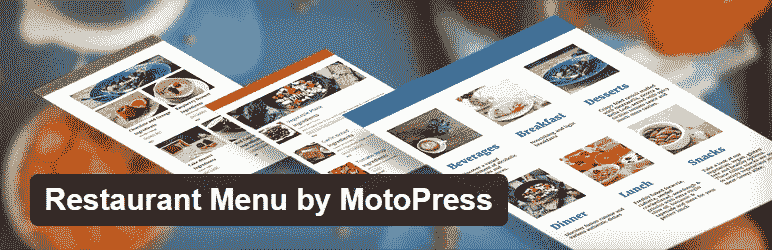

这是 MotoPress 的另一个精彩的 WordPress 餐馆菜单插件。餐馆菜单插件是创建和维护现代在线菜单的理想选择。这还不是全部。该插件带有电子商务的可能性，所以你也可以在网上出售食品和饮料。这不仅仅是一个餐厅菜单插件，而是一个电子商务餐厅菜单插件。

这个插件允许你使用短代码在页面、帖子和边栏中显示你的酒店/餐厅菜单。它主要有三种菜单风格:

*   **简单列表** —按类别显示菜单项列表。
*   **列表视图** —您可以在列表视图中显示带有项目图像、简短描述、价格和“添加到购物车”按钮的菜单项列表。您还可以显示该类别的类别特色图像。
*   **网格视图** —以网格布局展示菜单项以及该类别的特色图像。

如果你想看完整的现场预览，这里是 MotoPress 插件制作的餐厅菜单的[完整演示。](http://mprmdemo.getmotopress.com/)

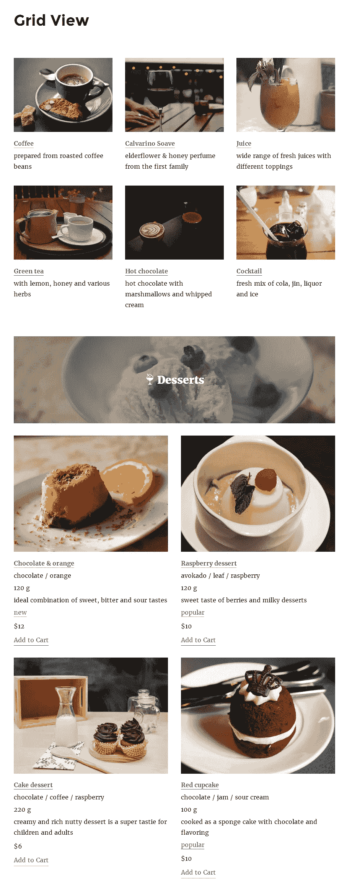

MotoPress 餐厅菜单-网格视图

插件仪表板简单且易于管理。您可以简单地添加菜单项、添加价格、设置类别以及添加标签，这样您的顾客就可以轻松找到他们想要的菜肴。

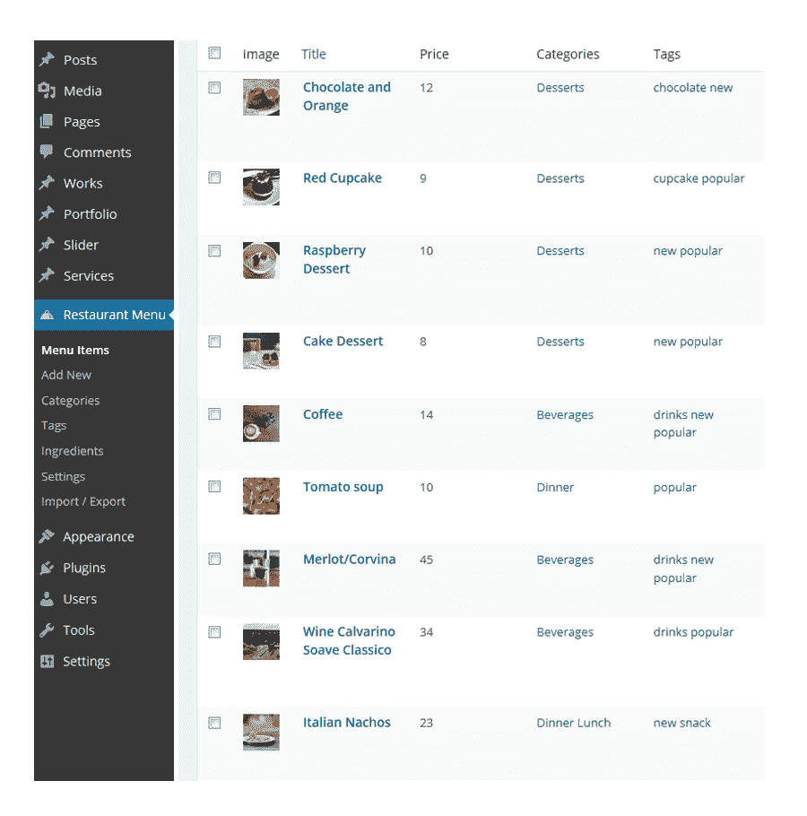

总之，餐馆菜单插件对于想要电子商务功能的现代餐馆老板来说是一个完美的选择。这个插件是免费下载和使用的，同时它也有高级插件。

如果你想要**漂亮的食物菜单和电子商务的可能性**，使用 MotoPress 插件的餐馆菜单。

[了解更多关于插件的信息并下载](https://wordpress.org/plugins/mp-restaurant-menu/)

# 4.快捷餐厅菜单

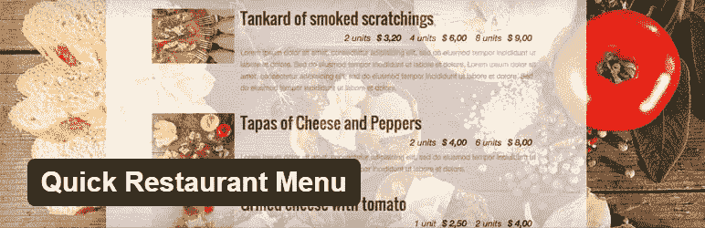

顾名思义，快速餐厅菜单是一个免费的 WordPress 插件，用于快速创建漂亮的餐厅菜单。这个插件允许你通过拖放来创建好看的餐馆菜单。此外，您可以为一周中的每一天显示不同的菜单，也可以在同一天的不同时间显示不同的菜单。它提供了一个简单而全面的界面，您可以在这里为不同的日子或时间设置不同的菜单。

每个菜单项可以有标题、照片、描述和几个价格。这就是你在网上一份完美的餐馆菜单中所需要的一切。

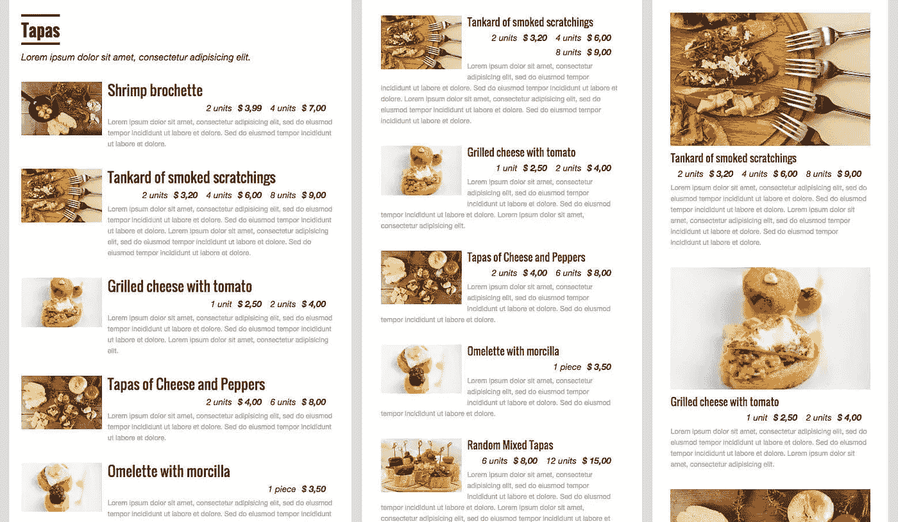

快速餐厅菜单插件演示

该插件提供了简单的拖放界面来快速重新排列菜单项。此外，只需轻轻一点，您就可以实时预览、编辑或删除它们。其实很容易很简单。

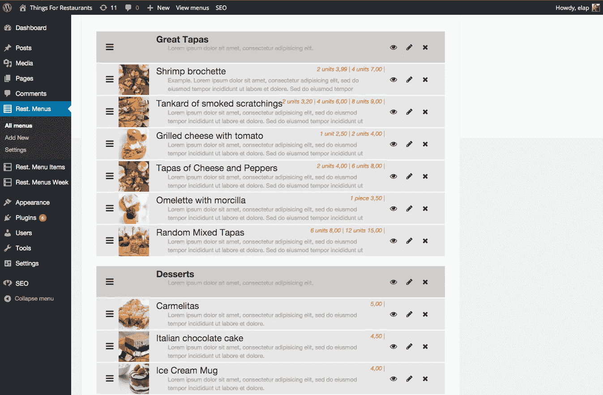

总之，快速餐厅菜单是大餐厅的完美选择，在不同的日子/时间提供各种菜肴和特别菜肴。该插件还有一个高级版本，具有高级功能和选项。

使用快捷餐厅菜单插件**通过拖放选项**快速创建食物菜单。

[了解更多关于插件的信息并下载](https://wordpress.org/plugins/quick-restaurant-menu/)

# 5.WP 披萨

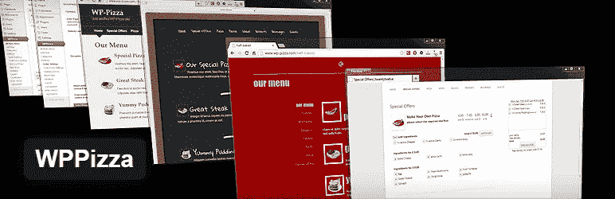

WPPizza 是一个创建和维护餐厅菜单的餐厅插件。您可以轻松地添加菜单项，设置类别，每个项目的多个价格和每个项目的描述。该插件完全响应，在任何设备上看起来都很棒，包括台式机、平板电脑和手机。它有一个多语言前端，因为它完全兼容 WPML。

该插件是 widget ready，这就是为什么你可以简单地通过拖放在不同的 widget 区域创建餐馆菜单。您还可以使用短码来即时创建餐厅菜单。此外，它还扩展了电子商务功能，以便您的客户可以在线订购他们想要的菜肴。

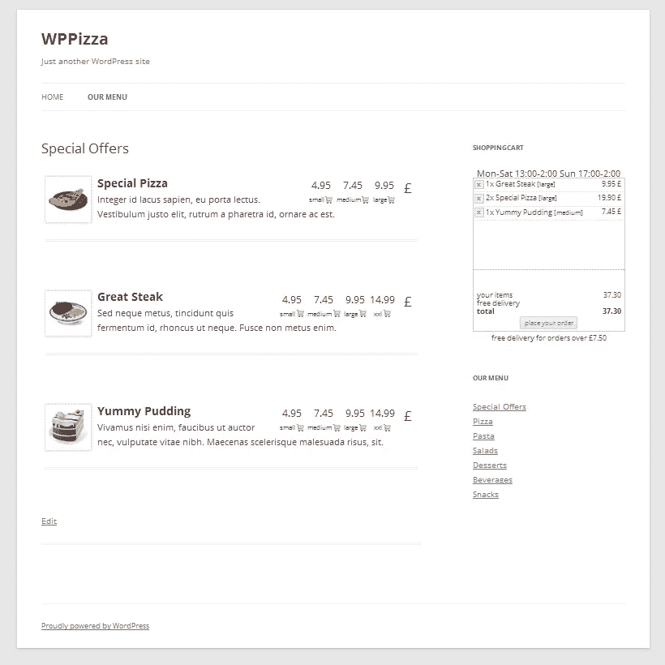

总之，WPPizza 是上面提到的 4 个插件的一个很好的替代品。它也有一个额外的额外成分的溢价扩展。

如果你经营一家**比萨为主的酒店和餐厅**，并为其创建一个新网站，请使用 WPPizza 插件。

[了解更多关于该插件的信息并下载](https://wordpress.org/plugins/wppizza/)

# 包扎

无论你为你的餐馆网站选择什么主题，你都可以使用这些免费的 WordPress 餐馆插件创建美味诱人的餐馆菜单。或者你可以使用任何一个[餐馆 WordPress 主题](https://visualmodo.com/theme/food-wordpress-theme/)，在你的餐馆/食品网站上提供你可能需要的一切。这样的餐厅主题集成了许多有用的插件和小部件，如 **WordPress 餐厅菜单插件**、 **WooCommerce** 、**预订和预约插件**等。