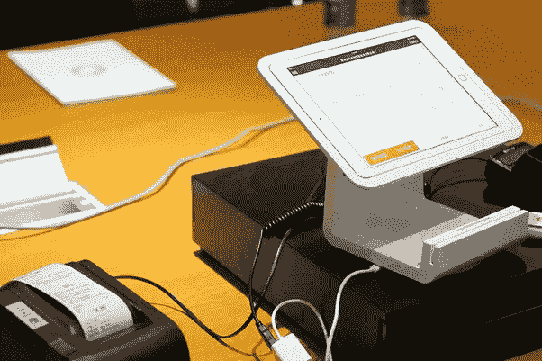

# 2019 年值得关注的零售趋势

> 原文：<https://medium.com/visualmodo/retail-trends-to-watch-out-in-2019-801fb643e375?source=collection_archive---------0----------------------->

零售业的未来很难预测。虽然很难说接下来会发生什么，但我们仍然可以通过观察今天为自己命名的零售技术趋势，对未来可能发生的事情有一个很好的想法。这就是为什么今天我们将关注已经出现的顶级零售技术趋势:无论是商店、电子商务网站还是消费者的家中。把这些趋势记在你的脑子里，也许有一天你会决定投资其中一个。

# 销售点和库存控制软件

今天，没有一个好的理由让顾客排队等候。大多数零售商和品牌已经意识到，许多严重的不便都与传统的销售点(POS)有关，并且正在花费他们的企业大量的金钱，更不用说它会导致非常糟糕的客户体验。如今，添加到现有的 POS 系统以解决排队问题并提供各种其他服务来大幅提升客户的购物体验，既不困难也不昂贵。从头开始构建的 [POS 开发](https://www.elinext.com/industries/financial/)的成本也在合理的预算范围内。如果零售商想要解决常见的零售用例，如无尽的过道和 BOPIS，他们应该考虑应用基于云的现代销售点系统。同时，零售商还应该能够在网络中断的情况下发挥最大能力。现代移动 POS 离线模式选项可以确保您的销售人员能够管理他们的通用工作流程，如应用折扣和特别促销、处理销售和退货，甚至在没有互联网连接的繁忙时期也能做到这一切。

让我们再次概述 POS 能给你带来的所有主要可能性:

*   提高营销工作的有效性
*   显著改善您的客户服务
*   简化和改进库存管理
*   通过自动记账和无数其他零售任务为你节省大量时间
*   轻松显示您在哪里赚钱和赔钱，以便您可以进行调整和增加利润

# UPC 代码和条形码扫描

条形码扫描允许您的企业在销售点检查产品，比使用键盘更准确、更快速。这不仅会节省你的时间，而且会对你的库存产生巨大的影响。例如，想象一下输入错误的产品编号，然后将其从库存中注销的潜在后果。每个[成功的](https://visualmodo.com/blog/)企业都知道，库存是你的命脉，保持适当的检查是至关重要的。诸如此类的错误会导致您的业务时间、销售和库存成本。

如果您的商品上有 UPC 代码，您可以轻松扫描其标签，而无需打印自己的条形码。想象一下，这对您的企业来说是多么节省时间。

# 高度个性化选项

最近，直接面向消费者、基于订阅的时尚服务数量出现了上升。在完成一项关于你对风格和时尚的偏好的调查后，这些类型的公司可以给他们的客户发送各种各样的服装、配饰和美容产品。为了符合这一议程，各种品牌现在也在为其客户的购物体验增加额外的个性化水平。我们不仅仅是在邮件主题上附上你的名字。零售商正在尽力跟踪你的购物历史，并围绕你的口味塑造内容。以内衣零售商 ThirdLove 为例，该公司根据顾客之前的购买情况，向顾客发送专为他们挑选的内衣。

零售商试图在商店内外保持这种个性化水平。利用商场本地应用程序的聊天功能，这些商场的员工可以直接与顾客交流，以策划他们的个人装扮和服装选择。像这样的建议可以通过之前提到的应用程序分享给顾客，甚至可以通过店内试衣间分享。例如，美国零售公司 Nordstrom 甚至为顾客提供适合各种场合的私人造型师。

一些零售商甚至更进一步，让顾客自己生产产品。看看德累斯顿吧，这是一家来自澳大利亚的眼镜零售商。他们从澳大利亚的海滩上收集塑料垃圾以及废弃的渔网，并将其回收到人们可以负担得起的框架中。然后，他们让顾客通过互换镜架部件和镜片来制作他们自己的太阳镜。因此，无论你是大型零售商还是中小型企业，都不要忘记个性化你的客户的体验。

# 物联网

物联网是近年来的主要趋势之一，它有助于将物理事物连接到互联网，以提供无缝的购物体验。毫无疑问，这样的技术已经彻底改变了全球顾客的店内体验。这是弥合数字和实体购物体验之间差距的完美解决方案。最近的一份报告[显示](http://images.email.forrester.com/Web/Forrester/%7B62b0c555-cddd-4bf0-bb3b-09161369b65f%7D_Forrester-Predictions-2019.pdf)预计到 2019 年，近 85%的零售商将采用物联网技术，而目前只有 57%的零售商在使用这项技术。物联网将为各种应用打开空间，例如:

电子货架边缘标签——目前，零售商需要更新店内销售的带有印刷标签的产品的价格。随着越来越多的零售商采用电子标签，帮助他们通过互联网更新产品信息，这一过程将会改变。

支持购物手推车的 GPS 允许顾客上传购物清单，然后手推车使用这些清单作为指南，帮助他们在店内导航，找到合适的产品。顾客也可以自己通过手推车付款，完全消除了排队和浪费时间的需要。