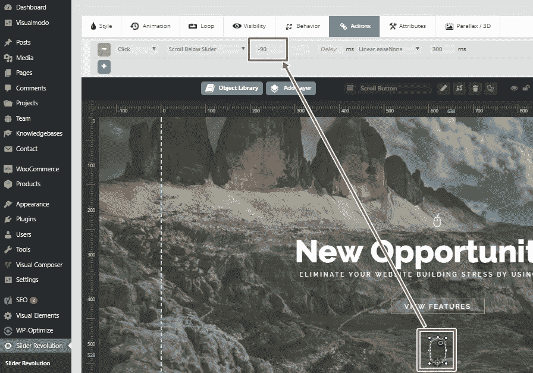
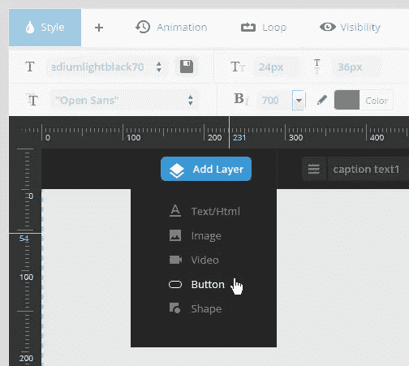
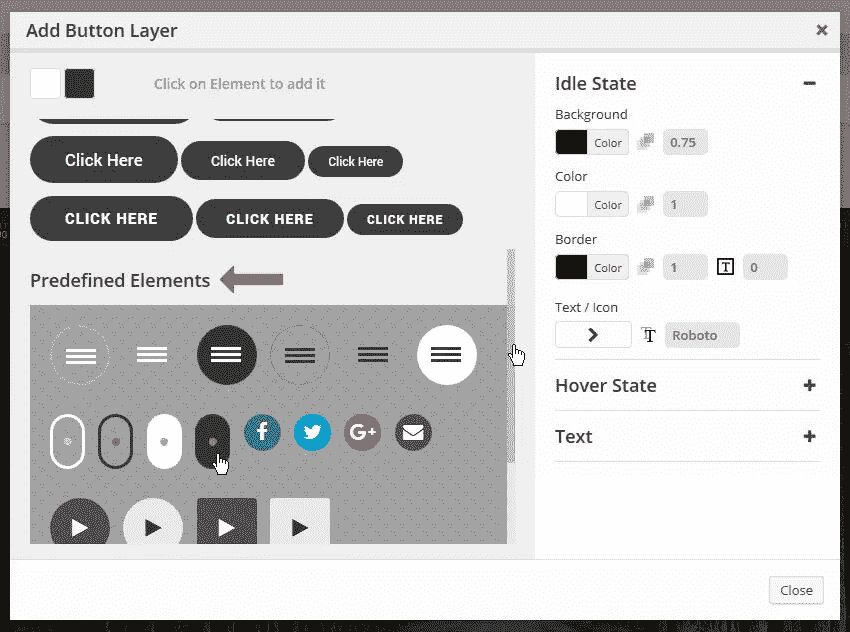
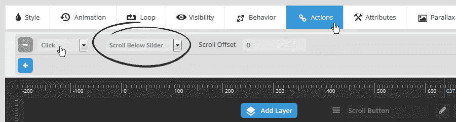

# 旋转滑块 WordPress 插件向下滚动按钮

> 原文：<https://medium.com/visualmodo/revolution-slider-wordpress-plugin-scroll-down-button-818a5a19f4e5?source=collection_archive---------0----------------------->

按钮是向滑块添加可点击元素的好方法。下面是根据你使用的滑块插件添加它们的方法。向旋转滑块添加按钮的最简单方法是使用内置的层常规参数创建一个按钮，滑块中的向下滚动按钮可以使它看起来很棒，也有助于导航。

# 向下滚动按钮面板

进入你的 WordPress dashboard > Revolution Slider< area and open the slider show editor.

## 1\. Select the Add Layer, and then select from the menu button.

## 2\. In the window, select the type of button “scroll”

## 3\. Action Style “Scroll Below Slider” to the Layer.

And set the scroll offset and everything.

> All Visualmodo [WordPress](https://visualmodo.com/wordpress-themes/)themes 不仅支持，而且包括免费的高级 Slider Revolution 插件(价值 25 美元)以及你购买的主题。轻松创建和管理独特的幻灯片放映，具有引人入胜的过渡和动画，并且完全响应。有了漫威，你可以用最好的滑块插件轻松地在任何页面中包含一个滑块。

你可以在这里免费下载滑块。

向下滚动和旋转滑块上的按钮。