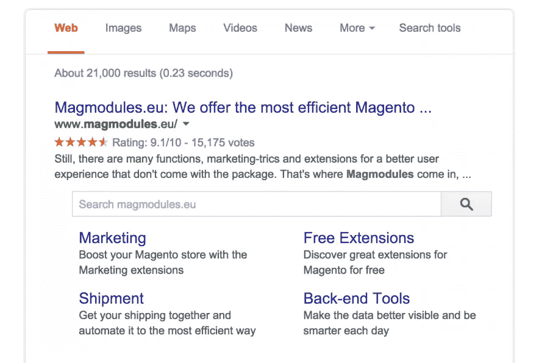
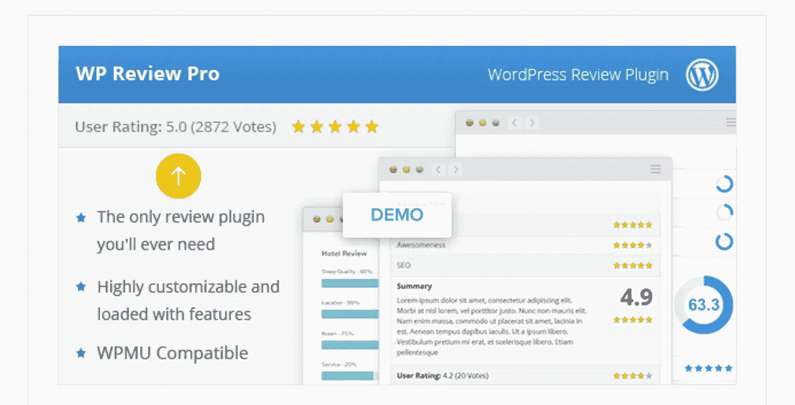
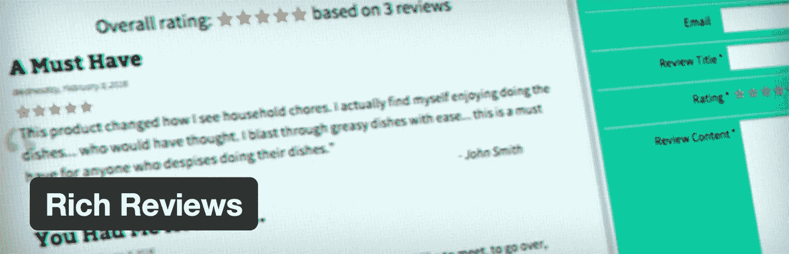
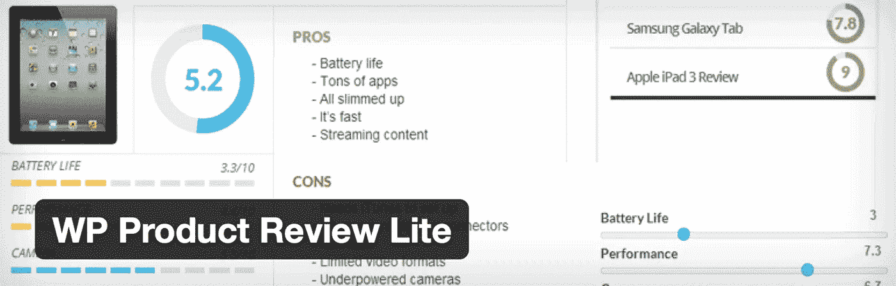

# 丰富片段 WordPress 插件

> 原文：<https://medium.com/visualmodo/rich-snippets-wordpress-plugins-fa0c626f731b?source=collection_archive---------0----------------------->

也许你听说过丰富片段的概念。SEO 专家似乎认为每个人都知道什么是丰富的片段。但是，对于 SEO 新手来说，丰富片段是一个非常模糊的术语。到底什么是丰富的片段？是时候解释什么是 rich snippets 了，为什么它们对 SEO 很重要，你如何在你的网站上得到它们，以及最好的 WordPress 插件。

在 SEO 领域，Rich-snippet 已经成为一个有趣且经常谈论的话题。虽然根据谷歌的说法，它们实际上对搜索排名没有直接影响，但它们几乎肯定有助于网站脱颖而出，因此可以显著增加有人点击你页面的机会。

那么，到底什么是[丰富片段](https://visualmodo.com/)？添加丰富的片段有什么好处？你如何在 WordPress 中使用它们，哪些是最好的插件？

# 什么是丰富的片段？

Rich Snippets 是一个总括术语，指的是一系列[结构化数据](https://developers.google.com/search/docs/guides/intro-structured-data)标记，创建这些标记是为了帮助搜索引擎更好地理解网页包含什么样的内容。

让我们看一个例子。假设你在运营一个电影评论网站。在正常情况下，您对某部电影的评论会在搜索引擎结果中显示页面标题、页面描述、日期和页面 URL。然而，在结构化数据标记的帮助下，您还可以添加诸如撰写评论的人/作者的姓名和星级等内容。

这样做自然有助于让你的网站在搜索外观上脱颖而出。简而言之:一个热衷于阅读比如《阿甘正传》的评论的用户，比你的竞争对手更有可能被你的网站吸引。

丰富的代码片段可以支持不同类型的标记，比如 Schema.org、[微格式](https://en.wikipedia.org/wiki/Microformat)，甚至 [RDFa](https://en.wikipedia.org/wiki/RDFa) 。

您还可以使用丰富的片段来显示不同的内容类型。你有没有用谷歌搜索一个人，除了正常的搜索结果，还找到了他的 LinkedIn 页面？是的，这是数据标记的一个例子。有没有搜索菜谱，发现准备时间之类的细节？或者一个特殊的事件，并发现 RSVP 细节呢？同样，两者都是丰富片段的例子！

# 丰富片段的好处

重申一下，丰富片段的存在不是谷歌直接考虑的主要指标。换句话说，搜索引擎不会仅仅因为你的网站没有利用丰富的片段就直接惩罚它。然而，丰富片段的间接重要性不应该被低估，因为它对服务许多不那么明显的好处大有帮助。例如:

*   丰富的片段可以帮助用户快速确定特定搜索结果的相关性。
*   丰富的片段可以大大降低网站的跳出率。你更有可能点击哪个？一个纯文本的应用程序或电影评论的结果，或者一个提供额外信息的结果，如评级和进一步的细节？这就是丰富的片段非常有用的地方。
*   丰富的片段可以帮助搜索引擎更好地理解您的内容，并向特定用户返回额外的有用结果。

那么，如何给你的 WordPress 网站添加丰富的片段呢？嗯，有许多有用的插件可以完成几乎所有的艰苦工作！

# WordPress 最好的丰富片段插件

让我们来看看六个最好的 WordPress Rich Snippet 插件(包括免费和高级的)。

# WP 富片段

WP Rich Snippets 是一个优秀的优质产品，它可以让你轻松地将 Rich-Snippets 添加到你的站点上——并且可以添加各种不同的内容。您可以为评论、食谱、文章、视频甚至作者/编辑评级添加结构化数据。它还受到各种定制插件的支持，以帮助那些需要诸如 [WooCommerce](https://visualmodo.com/) 集成、定制短代码、位置和地图片段等东西的人。

## 主要特点:

*   **简易设置** —易于安装、实施和配置。
*   **丰富的文档** —为所有用户提供丰富详细的文档。
*   **出色的支持** —易于访问、有用的支持。
*   **翻译就绪** — WP Rich Snippets 已准备好翻译成任何语言。
*   **扩展附加组件** —一个有用的附加组件集合，为需要更多功能的用户提供功能。
*   **模式类型** —支持所有流行的 schema.org 标记类型。
*   **编辑/用户评论** —对内容进行评级和评论的多种方式(包括百分比、投票和用户综合评级)。

个人计划每年花费 69 美元，允许你在一个域名上使用插件。对于其他计划，包括针对多个域和特定附加组件的计划，请查看官方定价页面。

# WP 评论版

受欢迎的 WordPress 主题提供商 MyThemeShop 的 WP Review Pro 被宣传为在 WordPress 支持的网站上创建评论的一体化解决方案。它速度快，采用响应式设计，有许多不同的风格，包括点评级系统、循环评级系统、星评级系统和百分比评级系统，以及为给定评论添加利弊的能力。

WP Review Pro 还可以用来生成用户提交的评级和评论，并带有自己的自定义小部件和短代码。

单个许可证的起价为 39 美元，令人惊讶的是，它允许你在无限的网站上使用插件！

# 所有在一个 SCHEMA.ORG 丰富的片段(免费)

[All in One Schema.org Rich Snippets](https://wordpress.org/plugins/all-in-one-schemaorg-rich-snippets/)是向 WordPress 添加丰富片段的绝佳选择，尤其是如果你不愿意(或不能)选择高级选项的话。很像 WP Rich Snippets(如上所述)，它特别适合向各种不同的内容添加特定的 Rich snippet，如评论、事件、应用、人、产品、食谱、视频、文章等。

更重要的是，All in One Schema.org Rich Snippets 也是[开源](https://en.wikipedia.org/wiki/Open-source_software)——拥有高达 40，000 多个活跃安装！

# 丰富的评论(免费)

[丰富评论](https://en-gb.wordpress.org/plugins/rich-reviews/)的重点是让你以用户评级和评论的形式向你的页面添加丰富的片段，这意味着用户可以提交他们自己对你的产品和服务的评论，然后你可以选择根据你的意愿进行调节和显示。

做得好的话，允许用户提交他们自己的评论(然后会在搜索结果中显示为丰富的片段)对你的品牌来说是一个真正的福音——当然，前提是这些评论都是好的。然而，用户提交的评论及其审核并不是每个人都喜欢的，这使得这个特定的[插件](https://visualmodo.com/)比这里提到的其他插件更加合适。

# WP 产品评论(免费)

如果你在运营一个纯产品评论类的网站，WP 产品评论肯定是你要考虑的。它可以让您添加详细信息，例如正在审查的产品的优点和缺点，以及根据不同的细分市场对它们进行评级的能力。

例如，假设你正在运行一个智能手机评论网站。WP 产品评论将让你能够添加有问题的智能手机的具体优点，以及它的缺点或缺点。然后，您可以从不同的角度对其进行评价，如电池寿命、处理器和硬件、支持、相机质量等等。

更重要的是，与丰富的评论(如上所述)一样，WP 产品评论也支持用户提交的评论，迄今为止已有超过 50，000 次活跃安装——使其成为该列表中最受欢迎的插件！

# 额外收获:也值得一看

以下(免费)WordPress 插件也将帮助你在你的网站上添加和使用丰富的片段。它们的特性和功能几乎与上面提到的许多插件不相上下，尽管它们还没有那么多活跃的下载。

*   Author hReview :允许您添加作者或编辑评级，并将其显示为丰富的片段。目前有超过 4，000 个活动安装。
*   [Schema App 结构化数据](https://wordpress.org/plugins/schema-app-structured-data-for-schemaorg/):让你添加 Schema.org 结构化数据作为丰富的片段。目前有超过 2，000 个活动安装。
*   [WP SEO 结构化数据模式](https://wordpress.org/plugins/wp-seo-structured-data-schema/):让你为不同类型的内容添加丰富的片段。目前有超过 3，000 个活动安装。

# 最后的想法

虽然你显然不想在你网站的每一篇文章和每一页上都使用它，但是当有保证的时候(比如写评论的时候)，丰富的片段可以成为你网站的一个很好的补充——幸运的是，在 WordPress 中使用它几乎不可能更容易！只要选择一个合适的 Rich Snippet 插件(取决于你自己的需求和预算),你就可以开始了！

哦，最后:无论你选择哪个插件，一定要用 Google 的官方结构化数据测试工具检查结果，以确保你已经正确地实现了所有东西！

**在你的网站上用过/使用过丰富的片段？想法？**